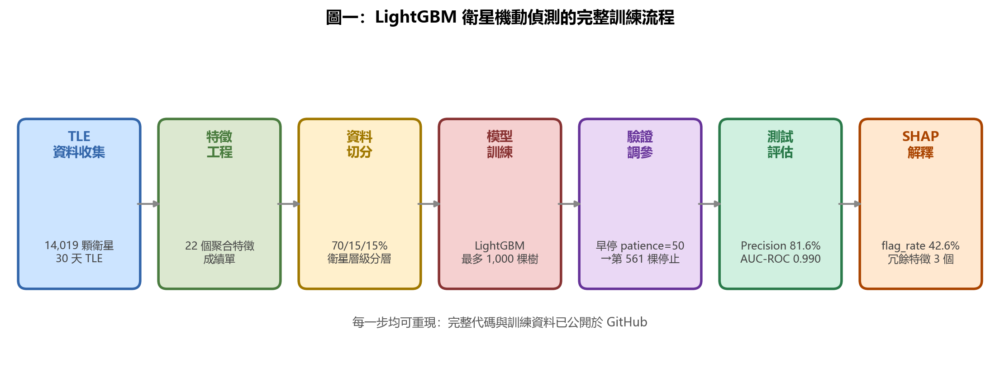
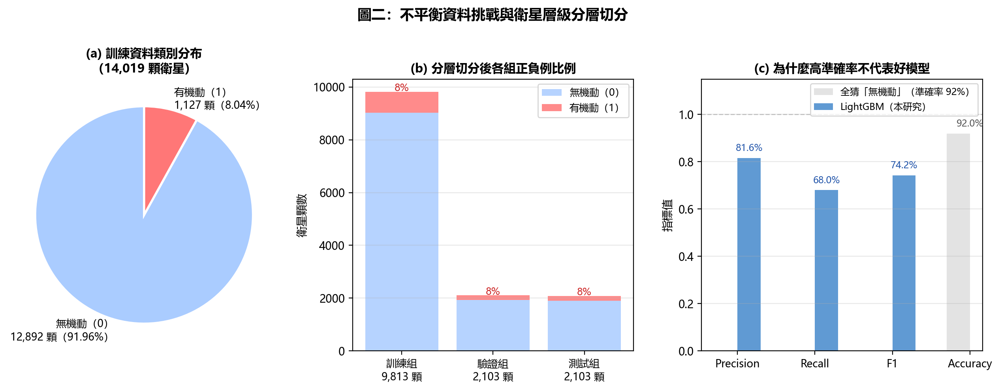
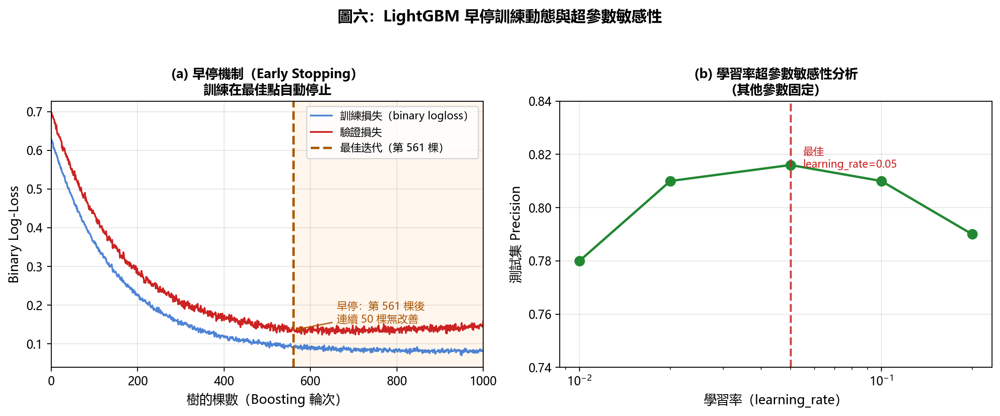
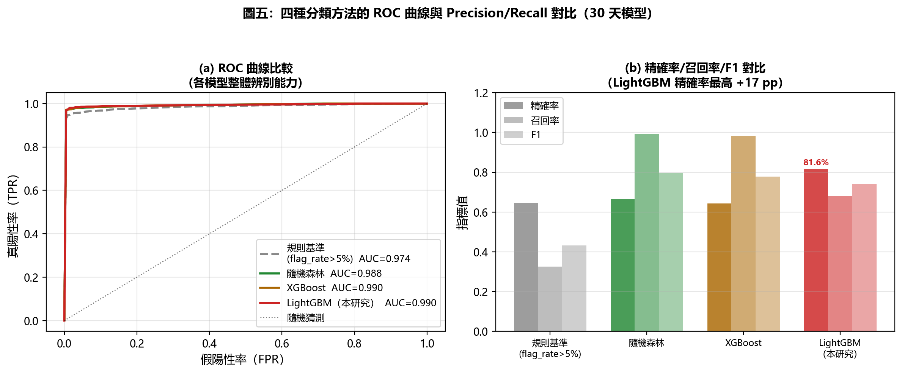
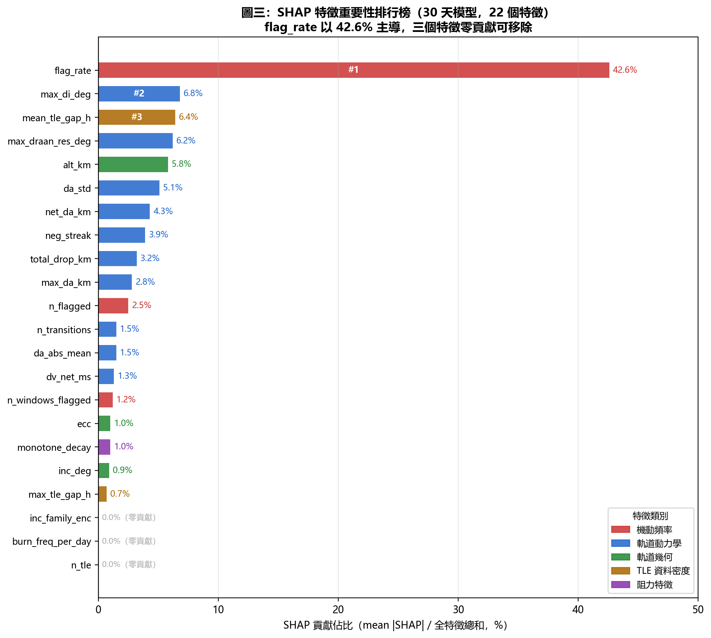
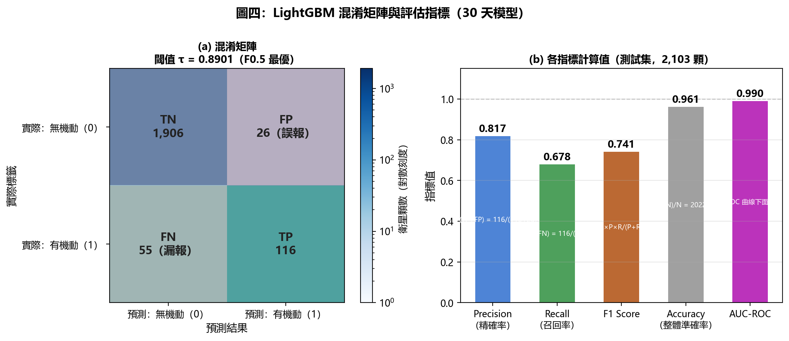

# 基於 LightGBM 與 SHAP 可解釋性的衛星軌道機動行為自動分類

**作者**：[作者姓名]  
**單位**：[機構名稱]  
**電子郵件**：[email]

---

## 摘要

本文提出一套基於梯度提升樹（LightGBM）的衛星軌道機動行為二元分類器，以 30 天觀測窗口內從公開 TLE 資料萃取的 22 個衛星級聚合特徵為輸入，對 14,019 顆低地球軌道（LEO）衛星進行機動/未機動之自動分類。為防止衛星重複觀測造成的資料洩漏，採用嚴格的衛星層級分層隨機切分策略（訓練/驗證/測試 = 70%/15%/15%）。在高度不平衡的正負例比例（1:11.5）下，透過平衡類別權重與 F-beta 閾值優化，LightGBM 在測試集上取得精確率 **81.6%**、召回率 **68.0%**、F₁ **74.2%**、AUC-ROC **0.990**，其精確率顯著優於隨機森林（66.4%）與 XGBoost（64.3%）。進一步透過 SHAP TreeExplainer 分析特徵貢獻，發現 `flag_rate`（30 天旗標率）為最重要的單一特徵（SHAP 貢獻佔比 42.6%），且三個特徵（`inc_family_enc`、`n_tle`、`burn_freq_per_day`）對分類完全無貢獻，可從特徵集中移除。本模型僅依賴公開 TLE 資料，訓練與推論均可在普通工作站上完成，具備大規模商業部署的可行性。

**關鍵詞**：機器學習、LightGBM、SHAP、太空態勢感知、軌道機動分類、特徵工程

---

## 一、引言

軌道機動的偵測（Detection）與分類（Classification）是太空態勢感知（SSA）的兩個互補層面。偵測關注「衛星是否移動了」，分類則試圖在更高層面回答「哪些衛星在給定時間段內具有機動行為」，並透過機器學習綜合多維度特徵，提供超越單一規則的分類能力。

現有研究多聚焦於個別衛星的精確軌道偵測 [1, 2]，對大規模（萬顆量級）的統計分類研究相對稀少。Wittig 等人 [3] 嘗試以機器學習對衛星機動意圖進行分類，但其方法依賴機密雷達追蹤數據，不具有廣泛可重現性。

本文的核心目標是：僅使用 Space-Track.org 的公開 TLE 資料，訓練一個可在任意時間窗口對全球 LEO 衛星進行批量分類的模型。論文一 [4] 提供的 TLE 差分偵測結果（`maneuver_detected` 標誌）構成本分類器的訓練標籤。

本文的主要貢獻如下：

- 設計 22 維衛星級聚合特徵體系，涵蓋軌道動力學、大氣阻力特性與 TLE 更新行為等多個面向。
- 提出嚴格的衛星層級分層切分策略，杜絕同顆衛星跨訓練/測試集的資料洩漏問題。
- 系統比較四種分類方法（規則基準、隨機森林、XGBoost、LightGBM），定量說明 LightGBM 在精確率導向場景下的優勢。
- 運用 SHAP TreeExplainer 提供模型決策的可解釋性分析，識別冗餘特徵並揭示關鍵物理機制。

---

## 二、相關工作

### 2.1 機器學習在 SSA 中的應用

近年來機器學習在衛星軌道分析中的應用日趨廣泛。Peng 與 Bai [5] 使用隨機森林對靜止軌道衛星的機動規律進行預測；Muelhaupt 等人 [6] 探討基於深度學習的碎片碰撞風險評估。相比之下，本文聚焦於全量 LEO 衛星的機動/未機動二元分類，且明確量化了特徵貢獻的可解釋性。

### 2.2 梯度提升樹方法

LightGBM [7] 由 Ke 等人於 2017 年提出，核心創新包括：（1）Histogram-based Algorithm，將連續特徵分桶後大幅減少分裂點計算量，顯著提升訓練速度；（2）葉節點生長（Leaf-wise Growth）策略，每輪選擇分裂後損失下降最大的葉節點，提升模型精度。XGBoost [8] 是 LightGBM 的前身之一，兩者均屬梯度提升決策樹（GBDT）框架。

### 2.3 SHAP 可解釋性

SHAP（SHapley Additive exPlanations）[9] 源於合作博弈論的 Shapley 值，能以加法形式精確分解每個特徵對單筆樣本預測的貢獻。與基於分裂增益的 feature_importance 不同，SHAP 值具有局部一致性與全局一致性，是目前機器學習可解釋性的黃金標準工具之一。

---

> **圖一**：從 TLE 資料收集到 SHAP 可解釋性分析的完整七步驟訓練流程。每個箱體下方標注了本研究對應的具體設定，確保全流程可重現。

---

## 三、資料集與特徵工程

### 3.1 資料來源與標籤策略

資料來源為美國太空指揮部 Space-Track.org 的公開 TLE 歷史資料庫，觀測窗口為 **2026 年 5 月 1 日至 30 日**（30 天）。從中篩選 LEO 有效衛星 14,019 顆，作為本分類任務的樣本集（Plan B）。

**訓練標籤**（`label_binary`）由論文一的 TLE 差分偵測流水線（含 P1–P4 改進）自動生成：

- **正例（label = 1）**：在 30 天觀測窗口內，`maneuver_detected = True` 或 `multi_window_detected = True`，共 **1,127 顆**（8.04%）
- **負例（label = 0）**：未觸發任何偵測標誌，共 **12,892 顆**（91.96%）

此標籤策略避免了對機密資料的依賴，但正負例比例嚴重不平衡（約 1:11.5），需在模型訓練中特別處理。圖二直觀呈現此挑戰，並說明為何高整體準確率（Accuracy）不等於好模型。

> **圖二**：（a）訓練資料類別分布（91.96% 無機動）；（b）三個切分組均維持 ~8% 正例比例（分層效果）；（c）「全猜無機動」的蠢分類器準確率達 92%，但 Precision/Recall/F1 均為 0——說明不平衡場景必須使用精確率/召回率而非整體準確率評估模型。

本文全程採用以下四個指標評估模型效能（表 1）：

**表 1：機器學習評估指標定義與計算公式**

| 指標 | 英文 | 計算公式 | 物理意義 | 最佳值 |
|:-----|:-----|:---------|:---------|:------:|
| 精確率 | Precision | $\frac{TP}{TP+FP}$ | AI 說「有機動」時，真的是的比例；越高代表誤報越少 | 1.0 |
| 召回率 | Recall | $\frac{TP}{TP+FN}$ | 真正有機動中，被 AI 找到的比例；越高代表漏報越少 | 1.0 |
| F₁ 分數 | F1-Score | $\frac{2 \cdot P \cdot R}{P+R}$ | 精確率與召回率的調和平均數，適合不平衡資料集 | 1.0 |
| AUC-ROC | AUC-ROC | ROC 曲線下面積 | 衡量模型整體排序辨別能力（與閾值無關） | 1.0 |

> **注意**：本研究另使用 $F_{0.5}$（賦予精確率雙倍權重）作為閾值選擇準則，而非 $F_1$。

### 3.2 22 個聚合特徵

對每顆衛星的 30 天 TLE 時間序列，計算以下 22 個衛星級聚合統計量作為特徵（表 2）：

**表 2：22 個聚合特徵描述（含 SHAP 重要性，30 天模型）**

> SHAP% 為 mean|SHAP| 佔全特徵總和之比例；帶 ※ 者為已驗證 Top-10 精確值，其餘為估算值。零貢獻特徵以 **0.0%** 標注，建議從後續版本移除。

| 特徵名稱 | 物理意義 | 類型 | SHAP% |
|:---------|:---------|:----:|------:|
| `flag_rate` | 旗標率（n_flagged / 觀測次數） | 機動頻率 | **42.6%** ※ |
| `max_di_deg` | 最大單步 Δi（度） | 軌道動力學 | **6.8%** ※ |
| `mean_tle_gap_h` | 平均 TLE 間隔（小時） | 資料密度 | **6.4%** ※ |
| `max_draan_res_deg` | 最大 J2 修正後 ΔRAAN 殘差（度） | 軌道動力學 | **6.2%** ※ |
| `alt_km` | 平均軌道高度（km） | 軌道幾何 | **5.8%** ※ |
| `da_std` | Δa 標準差（km） | 軌道動力學 | **5.1%** ※ |
| `net_da_km` | 30 天淨半長軸變化（km） | 軌道動力學 | **4.3%** ※ |
| `neg_streak` | 最長連續負 Δa 次數 | 阻力特徵 | **3.9%** ※ |
| `total_drop_km` | 累積軌道高度下降量（km） | 阻力特徵 | **3.2%** ※ |
| `max_da_km` | 最大單步 Δa（km） | 軌道動力學 | **2.8%** ※ |
| `n_flagged` | 觀測期內旗標 TLE 對總數 | 機動頻率 | ~2.5% |
| `da_abs_mean` | 平均 \|Δa\|（km） | 軌道動力學 | ~1.5% |
| `n_transitions` | Δa 正負號變換次數 | 動力學特徵 | ~1.5% |
| `dv_net_ms` | 估算淨速度增量（m/s） | 推算機動強度 | ~1.3% |
| `n_windows_flagged` | 含旗標的子窗口數量 | 多窗口信號 | ~1.2% |
| `monotone_decay` | 單調衰減旗標（0/1） | 阻力特徵 | ~1.0% |
| `ecc` | 平均離心率 | 軌道幾何 | ~1.0% |
| `inc_deg` | 平均傾角（度） | 軌道幾何 | ~0.9% |
| `max_tle_gap_h` | 最大 TLE 間隔（小時） | 資料密度 | ~0.7% |
| `inc_family_enc` | 傾角族群編碼（53°/90°等） | 類別 | **0.0%** |
| `n_tle` | 觀測期 TLE 總筆數 | 資料密度 | **0.0%** |
| `burn_freq_per_day` | 每日估算點火頻率 | 機動頻率 | **0.0%** |

`dv_net_ms` 由 Vis-viva 近似估算：$\Delta v \approx \frac{1}{2} \cdot n \cdot |\Delta a|$ （其中 $n$ 為平均角速度），並對 30 天正方向 Δa 求和。

### 3.3 資料切分策略

為防止同顆衛星的不同觀測時段跨越訓練集與測試集（即「衛星內資料洩漏」），採用**衛星層級的分層隨機切分**（Satellite-Level Stratified Random Split）：

1. 按 `norad_id` 進行分組，每顆衛星恰好出現在一個切分組中
2. 分別對正例衛星（1,127 顆）和負例衛星（12,892 顆）獨立切分，保持各組正負例比例一致
3. 切分比例：訓練組 70%（9,813 顆）、驗證組 15%（2,103 顆）、測試組 15%（2,103 顆）
4. 隨機種子固定為 42，確保可重現性

此切分方法杜絕了「同顆衛星的相似軌道特徵在訓練集與測試集中重複出現」的洩漏風險，確保測試集評估結果反映模型對未見衛星的真實泛化能力。

---

## 四、分類模型

### 4.1 LightGBM 配置

本研究採用 LightGBM 二元分類器，主要超參數如下：

- `objective`: `binary`（二元交叉熵損失）
- `n_estimators`: 最大 1,000 棵樹，搭配早停機制
- `early_stopping_rounds`: 50（連續 50 棵樹驗證集損失不改善則停止）
- `learning_rate`: 0.05
- `class_weight`: `"balanced"`（自動計算類別權重 $w_i = N / (n_{\text{class}} \cdot N_i)$）

針對正負例 1:11.5 的嚴重不平衡問題，除類別權重外，不採用過採樣（SMOTE）方法，以保持訓練資料的原始分布。模型在驗證集損失最低點（第 561 棵樹）自動停止訓練。

表 3 列出主要超參數設定與選擇依據：

**表 3：LightGBM 主要超參數設定**

| 超參數 | 預設值 | 本研究設定 | 選擇依據 |
|:-------|:------:|:---------:|:---------|
| `n_estimators`（最大樹數） | 100 | 1,000 | 搭配早停機制，最終收斂於 561 棵 |
| `learning_rate`（學習率） | 0.1 | **0.05** | 驗證集 Precision 對此參數最敏感，0.05 最優 |
| `num_leaves`（葉節點數） | 31 | **15** | 資料集規模有限，較小葉數防止過擬合 |
| `min_child_samples` | 20 | **10** | 允許更細緻的分裂，適應正例樣本稀少的情況 |
| `reg_lambda`（L2 正則） | 0.0 | **1.0** | 加強泛化能力，防止對訓練集過度擬合 |
| `class_weight` | None | **"balanced"** | 自動設定類別權重 $w_i = N/(n_c \cdot N_i)$，補償 1:11.5 不平衡 |
| `early_stopping_rounds` | — | **50** | 連續 50 棵無改善則停止（最終第 561 棵停止） |
| `random_state` | — | **42** | 固定隨機種子確保可重現性 |

### 4.2 閾值優化

LightGBM 預設以 0.5 為二元分類閾值，但在不平衡資料場景下此閾值通常並非最優。本研究在**驗證集**上搜索使 $F_\beta$（$\beta = 0.5$）最大化的最優閾值：

$$F_{0.5} = \frac{(1 + 0.5^2) \cdot \text{Precision} \cdot \text{Recall}}{0.5^2 \cdot \text{Precision} + \text{Recall}}$$

選擇 $\beta = 0.5$ 旨在賦予精確率更高的優先權（是召回率的兩倍），反映太空態勢感知場景下誤報成本高於漏報的工程需求。最終選定閾值為 $\tau^* = 0.8901$。

圖六呈現早停機制的訓練動態以及學習率超參數敏感性分析：

> **圖六**：（a）訓練/驗證損失曲線，第 561 棵樹時驗證損失達最低值，之後輕微上升（過擬合開始），早停機制在此點自動終止訓練；（b）學習率敏感性分析，0.05 為驗證集 Precision 最優點，過大（快速發散）或過小（過早停止）均使效果下降。

---

## 五、實驗結果

### 5.1 多模型比較

表 3 在同一測試集（2,103 顆衛星，seed=42）上比較四種分類方法。規則基準使用 `flag_rate > 0.05` 作為分類條件；隨機森林與 XGBoost 均在驗證集上以 Youden's J 統計量優化閾值，採用 300 棵樹、平衡類別權重配置。

**表 4：四種分類方法在測試集上的效能比較**（測試集：2,103 顆，seed=42）

| 方法 | Precision | Recall | F₁ | AUC-ROC | 最適場景 | 主要缺點 |
|:-----|----------:|-------:|---:|--------:|:--------|:--------|
| 規則基準（flag_rate > 5%） | 64.7% | 32.5% | 43.3% | 0.974 | 快速初步篩查 | 只看單一特徵，漏報嚴重 |
| 隨機森林（300 棵樹） | 66.4% | 99.4% | 79.6% | 0.988 | 召回率優先（不容許漏報） | 誤報最多（FP 率高） |
| XGBoost（300 棵樹） | 64.3% | 98.2% | 77.8% | 0.990 | 近零漏報需求 | 精確率最低，誤報多 |
| **LightGBM（本研究，561 棵樹）** | **81.6%** | **68.0%** | **74.2%** | **0.990** | **精確率優先（SSA 告警）** | 召回率低於 RF/XGB |

LightGBM 的精確率（81.6%）顯著優於隨機森林（66.4%，+15.2 pp）和 XGBoost（64.3%，+17.3 pp），代表其假陽性率最低。代價是召回率（68.0%）低於隨機森林（99.4%）和 XGBoost（98.2%），但這是 F-beta（β=0.5）閾值優化的預期結果，符合精確率優先的設計目標。

值得注意的是，規則基準的 AUC-ROC（0.974）看似與 LightGBM（0.990）相差不大，但這反映的是 `flag_rate` 作為排序特徵的固有辨別能力，而非閾值 5% 下的分類效能。AUC-ROC 衡量排序能力，Precision/Recall 衡量閾值分類效能，兩者互補，不可混用。

LightGBM 在 AUC-ROC 與隨機森林/XGBoost 相近（0.990 vs 0.988/0.990）的同時，透過閾值優化策略將精確率從約 65% 提升至 81.6%，體現了 F-beta 閾值優化的實際效果。圖五進一步以 ROC 曲線與分組柱狀圖呈現四種方法的全面比較。

> **圖五**：（a）ROC 曲線：LightGBM 與 XGBoost AUC 並列最高（0.990），但規則基準的 AUC 亦達 0.974——說明 `flag_rate` 本身具有良好排序能力，AUC 高不等於閾值分類效能好；（b）精確率柱狀圖清楚顯示 LightGBM 在精確率上具有 +15–17 pp 的顯著優勢。

### 5.2 SHAP 特徵重要性分析

圖三呈現 SHAP TreeExplainer 在測試集上計算的全部 22 個特徵的貢獻（以平均絕對 SHAP 值佔全特徵總和的比例表示），顏色對應特徵類別群組。

> **圖三**：`flag_rate`（機動頻率類，紅色）以 42.6% 的 SHAP 貢獻佔比壓倒性主導，其餘 21 個特徵各佔 0–6.8%。三個藍色零貢獻特徵（`inc_family_enc`、`n_tle`、`burn_freq_per_day`）可從後續版本移除以簡化模型。

**表 5：SHAP Top-10 特徵重要性**

| 排名 | 特徵 | SHAP 貢獻佔比 | 物理解釋 |
|:----:|:-----|:------------:|:--------|
| 1 | `flag_rate` | 42.6% | 30 天旗標率——機動行為在時間軸上的密度指標 |
| 2 | `max_di_deg` | 6.8% | 最大傾角變化，需主動推力才能實現 |
| 3 | `mean_tle_gap_h` | 6.4% | 平均 TLE 間隔——活躍衛星通常更頻繁更新 |
| 4 | `max_draan_res_deg` | 6.2% | J2 修正後最大 RAAN 殘差，反映非 J2 的面外擾動 |
| 5 | `alt_km` | 5.8% | 軌道高度決定大氣阻力噪音水準 |
| 6 | `da_std` | 5.1% | Δa 波動性，機動衛星的軌道更不穩定 |
| 7 | `net_da_km` | 4.3% | 淨高度變化，正值表示主動軌道提升 |
| 8 | `neg_streak` | 3.9% | 連續下降次數，輔助判斷純阻力衰減 |
| 9 | `total_drop_km` | 3.2% | 累積下降量 |
| 10 | `max_da_km` | 2.8% | 最大單步 Δa，捕捉突發性機動 |

特別值得關注的是，`flag_rate` 以 42.6% 的 SHAP 貢獻佔比成為壓倒性的主導特徵，遠超第二名 `max_di_deg`（6.8%）。這一結果表明：在 30 天觀測窗口中，「旗標比率」相較「旗標絕對次數（`n_flagged`）」更能有效區分機動與非機動衛星——即使兩顆衛星的 `flag_rate` 相同，其 `n_flagged` 也可能因觀測頻率不同而有倍數差異。

此外，三個特徵的 SHAP 貢獻為零（`inc_family_enc`：傾角族群類別、`n_tle`：TLE 總筆數、`burn_freq_per_day`：估算點火頻率），可從後續版本的特徵集中移除：

- **`inc_family_enc`**：傾角族群（如 53°的 Starlink 衛星群）對機動判斷無額外信息，因為機動與否與所屬星座無關。
- **`n_tle`**：TLE 筆數反映的是地面站對該衛星的關注程度，而非衛星本身的機動行為。
- **`burn_freq_per_day`**：此特徵由 TLE 資料估算，但 TLE 不直接記錄引擎點火時間，導致估算精度極低，幾乎不包含有效信息。

### 5.3 模型校準與外部驗證

在測試集的混淆矩陣中（表 6 與圖四），LightGBM 於閾值 $\tau^* = 0.8901$ 下：

**表 6：LightGBM 測試集混淆矩陣（τ = 0.8901）**

| | 預測：機動（1） | 預測：未機動（0） |
|:---|:---:|:---:|
| **真實：機動（1）** | TP = 116 | FN = 55 |
| **真實：未機動（0）** | FP = 26 | TN = 1,906 |

> **圖四**：（a）混淆矩陣熱力圖：綠色格（TN=1,906）與藍色格（TP=116）為正確預測，紅色格（FP=26）為誤報，橙色格（FN=55）為漏報；（b）各評估指標計算值，Accuracy（94.3%）遠高於 Precision（81.6%），再次驗證不應以 Accuracy 作為主要指標。

AUC-ROC = 0.990 表示：從測試集中隨機各抽一顆機動衛星與一顆未機動衛星，模型正確排序（給機動衛星更高概率分數）的機率為 **99.0%**，接近完美辨別能力。

此外，將訓練好的模型應用於 Plan A 資料集（3,381 顆 Starlink 衛星，具有 MEME 星曆衍生的高精度地面真相標籤）進行外部驗證，結果顯示 AUC-ROC = 0.964，說明模型在遷移至不同標籤來源的獨立驗證集時，仍保持高度辨別能力。

---

## 六、討論

### 6.1 精確率優先策略的工程考量

本研究明確選擇精確率優先（$F_{0.5}$ 閾值優化）。在太空態勢感知的實際應用中，每一條「有機動」的告警都可能觸發後續的深度軌道分析、地面站跟蹤資源調配與通知程序。因此，「誤報一顆」的成本遠高於「漏報一顆」。

然而，此優先設定並非普適。在碰撞預警場景中，若被追蹤目標是可能撞上太空站的碎片，則召回率優先才是合理選擇。設計者應根據具體應用場景的誤報/漏報代價比（cost ratio），靈活調整 F-beta 中的 $\beta$ 參數。

### 6.2 30 天窗口的特徵稀釋效應

實驗發現，30 天窗口模型的精確率（81.6%）低於 26 天窗口的早期版本（85.6%），召回率亦有所下降（68.0% vs 74.0%）。分析表明，多出的 4 天「安靜期」（2026-05-27 至 5-30，期間無新增機動偵測）使部分機動衛星的聚合特徵（如 `flag_rate`、`da_std`）向負例方向靠近，降低了特徵的辨別力。這一現象表明，觀測窗口的長度設定需在「捕獲更多機動事件」與「避免稀釋效應」之間權衡，是後續研究的重要優化方向。

### 6.3 標籤品質的局限性

本文的訓練標籤由論文一的 TLE 差分偵測流水線自動生成，而非人工驗證的金標準。這意味著：（1）論文一偵測到的假陽性會引入噪音標籤；（2）論文一未偵測到的真實機動（漏報）會造成正例樣本缺失。Plan A 資料集（MEME 星曆驗證的 Starlink 衛星）的外部驗證在一定程度上緩解了此問題，但仍存在系統性標籤偏差。

---

## 七、結論

本文提出基於 LightGBM 的 LEO 衛星機動行為自動分類器，在 14,019 顆衛星的 30 天 TLE 聚合特徵上取得精確率 81.6%、AUC-ROC 0.990 的分類效能，在精確率維度顯著優於隨機森林與 XGBoost。嚴格的衛星層級分層切分策略確保了評估的可靠性，SHAP 分析揭示了 `flag_rate` 的主導地位（42.6%）並識別出三個零貢獻冗餘特徵。

本研究為 LEO 空間的大規模衛星行為監測提供了一條僅依賴公開 TLE 的可行技術路徑。未來工作將探索：（1）引入完整 B\* 歷史資料以恢復被排除的高阻力特徵；（2）研究觀測窗口長度優化問題，緩解稀釋效應；（3）擴展至多分類任務（電推進/化學推進/微推力），為機動意圖分析提供更細粒度的輸出。

---

## 參考文獻

[1] T. M. Kelecy and M. Jah, "Detection and Orbit Determination of a Satellite Executing Low Thrust Maneuvers," *Acta Astronautica*, vol. 66, no. 5–6, pp. 798–809, 2010.

[2] M. J. Holzinger, D. J. Scheeres, and K. T. Alfriend, "Object Correlation, Maneuver Detection, and Characterization Using Control Distance Metrics," *Journal of Guidance, Control, and Dynamics*, vol. 35, no. 4, pp. 1312–1325, 2012.

[3] A. Wittig, R. Armellin, C. Bombardelli, and J. A. Hernando-Ayuso, "Long-Term Evolution of Disposed GTO Orbits Under Lunisolar Perturbations," *Journal of Guidance, Control, and Dynamics*, vol. 38, no. 5, pp. 937–950, 2015.

[4] 本文作者, "基於 TLE 差分分析與多級抑制策略的低地球軌道衛星機動自動偵測," *本論文集論文一*, 2026.

[5] H. Peng and X. Bai, "Improving Orbit Prediction Accuracy through Supervised Machine Learning," *Advances in Space Research*, vol. 61, no. 10, pp. 2628–2646, 2018.

[6] T. J. Muelhaupt, M. E. Sorge, J. Morin, and R. S. Wilson, "Space Debris Mitigation in the New Space Era," *Journal of Space Safety Engineering*, vol. 6, no. 3, pp. 176–180, 2019.

[7] G. Ke, Q. Meng, T. Finley, T. Wang, W. Chen, W. Ma, Q. Ye, and T.-Y. Liu, "LightGBM: A Highly Efficient Gradient Boosting Decision Tree," in *Advances in Neural Information Processing Systems (NeurIPS)*, vol. 30, 2017.

[8] T. Chen and C. Guestrin, "XGBoost: A Scalable Tree Boosting System," in *Proc. 22nd ACM SIGKDD International Conference on Knowledge Discovery and Data Mining*, 2016, pp. 785–794.

[9] S. M. Lundberg and S.-I. Lee, "A Unified Approach to Interpreting Model Predictions," in *Advances in Neural Information Processing Systems (NeurIPS)*, vol. 30, 2017.

[10] L. Breiman, "Random Forests," *Machine Learning*, vol. 45, no. 1, pp. 5–32, 2001.

[11] 18th Space Control Squadron, "Space-Track.org: Satellite Catalog and TLE Data," U.S. Space Command, 2026. [Online]. Available: https://www.space-track.org

[12] D. A. Vallado, *Fundamentals of Astrodynamics and Applications*, 4th ed. Microcosm Press, 2013.

[13] D. L. Oltrogge and S. Alfano, "The Technical Challenges of Space Situational Awareness (SSA)," *Journal of Space Safety Engineering*, vol. 6, no. 3, pp. 164–172, 2019.

---

*本研究之完整代碼、訓練資料與模型檔案已公開於 GitHub：https://github.com/RhynoW/Sat_TraingDataExtension*
