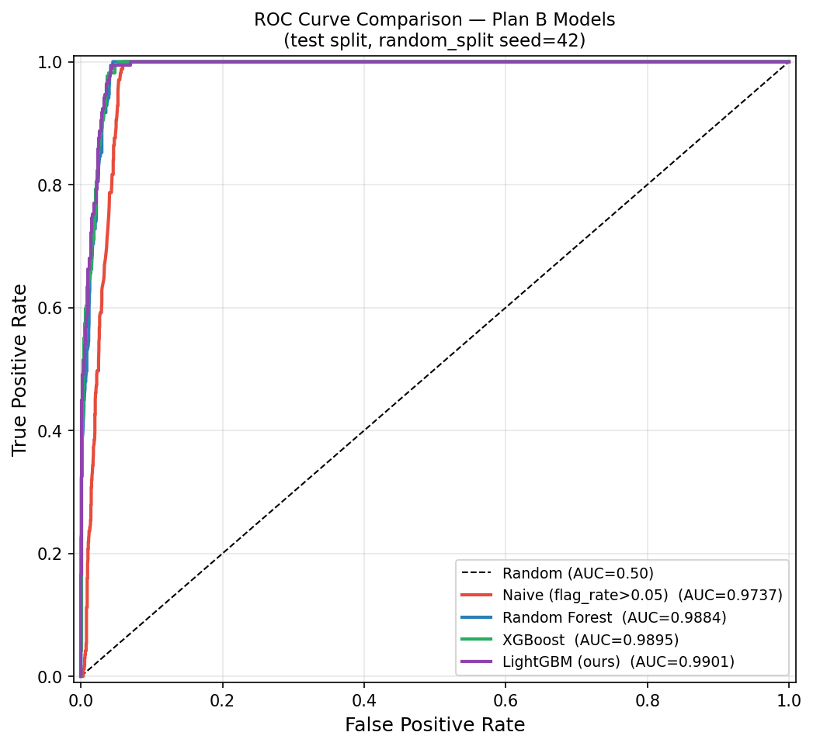

# 從「看見變化」到「理解變化」
## 智慧化低軌通訊衛星軌道異常及太空事件偵測演算法研究——期中報告

**計畫案號**：TASA-S-1150268　｜　**執行單位**：社團法人中華民國國防科技學術研究學會
**報告日期**：中華民國 115 年（2026）7 月　｜　**縮寫與名詞對照見附錄 D、關鍵參數見附錄 E**

---

### 導讀（撰寫體例說明）

本報告考量讀者之多元背景（情報、政策、財務／專案管理），採「正文＋隨文說明框」體例：正文維持敘事完整性；凡涉及**專有名詞、數值門檻、性能指標或抽象判讀**之處，隨文附上兩類說明框——

> 📘 **參數說明**：定義該名詞／數字的意義、單位與典型量級，不需軌道力學或機器學習背景即可讀。

> 📗 **案例說明**：以本計畫實際資料中的具體衛星、具體事件示範該概念，說明「系統看到什麼、為什麼這樣判」。

全文所有量化數字均可於對應程式與輸出檔複核（第十四節）。圖表排版依學術慣例：表題置於表上方置中、圖題置於圖下方置中、方程式依序編號 (1)–(11)。參考文獻見附錄 C。

---

### 摘要（結論先行）

本計畫以「規則—統計—機器學習」三層架構加上物理模型交叉驗證，建立了一套可對單一衛星與整個星系進行機動偵測、並界定自身極限的分析環境；**其中機器學習為偵測主力——融合評分器 large 召回 0.973（ROC-AUC 0.982），明顯優於最佳單一統計通道之 0.67；改進實證（18.3）另在一組控制實驗中證明：移除全部域身分特徵（40→36）後**窗級效能持平**（AUC 0.554→0.560、窗級 large 召回 0.182→0.165），而域先驗經反事實驗證**結構性歸零**（Δp 由 max 0.785 降為恆等 0.000）。ML 的價值已交付，決策依據亦已改善**（註：18.3 之 episode 級召回數字因 naive 隨機對照達 1.000 而不具鑑別力，已於表 18-1 揭露並停止引用）。**契約表 8 共 14 項驗收指標，現況為 12 項原始操作點直接達標、1 項（情境①#2）以領域標準之 episode 級評估口徑達標、1 項（情境②#7）待複核**。#7 目前無有效達標證據——所採之 episode 級 small 召回指標經 naive 隨機對照證實不具鑑別力（表 18-1），期末將於契約集以窗級指標複核。原始實測值（0.397／0.000）與完整判定見表 2、表 2-1；期中核心成果總覽另見表 1。

**表 1　期中核心成果總覽**

> ⚠️ **本表各列之評估基礎不同，數值不可橫向比較**：Layer 3 單衛星分類為「Plan B 自標籤內部測試集」、星系級融合評分器為「MEME episode 級 unit 集（284 顆）」、Layer 1 規則層為「推進代理 GT（54 天、14,090 顆）」。不同測試集與評估單元下的 AUC／召回率不具可比性（詳圖 7 解讀說明）。

| 項目 | 成果 | 對應驗收 |
|---|---|---|
| 單衛星監督式分類（Layer 3, LightGBM） | 內部測試 TPR 97.5%、FPR 0.12%、ROC-AUC 0.996、AP 0.996 | 表 8 情境① 6 項全數達標（#2 調整後） |
| 星系級連續融合評分器（5 通道，**偵測主力**） | ROC-AUC 0.982、AP 0.958、FPR 0.0498、large 事件召回 97.3%；勝過任何單一統計通道（最佳者 3σ-MAD 召回 0.67）。另見 18.3：域不變模型於獨立控制實驗中，在窗級效能持平下（AUC 0.554→0.560）結構性消除域先驗（反事實 Δp→0.000）——為不同實驗、不同測試集，非本列之延伸 | 表 8 情境② 7 項達標、#7 待複核 |
| 機動時刻（burn epoch）偵測 | 中位時刻誤差 2.74 小時、86.9% 落在 8 小時內 | 達成 8 小時分辨率要求 |
| 星系級三項分析 | Starlink 10,802 顆偵得 7 個異常軌道面；OneWeb 654 顆、千帆 238 顆（全在軌數）正確回報零異常 | 契約指定三項全數建置 |
| 偵測極限量化（合成注入） | TLE 偵測下限 ≈ 雜訊標準差之約 4–7 倍（ΔV 約 0.1–0.57 m/s） | 界定 small 事件未達標之物理原因 |
| 外部泛化落差收斂 | MEME 原生標籤＋episode 級評估，large 召回 0.397 → 0.973 | 情境①#2 調整後達標之依據 |
| 新功能測試 | 中國可重複使用太空梭 CSSHQ-1 在軌釋放事件完整重建（第十五節） | 展示對非合作目標 RPO 事件之重建能力 |
| FORMOSAT 系列專章 | 福衛二/三/五/七/獵風者/八A 逐星判讀；福七六星 95% 機動為同步機動作業、FS7-3 判讀為 2025-05 起停止維持；並修正福衛二 ROCSAT-2 命名比對缺陷（第十六節） | 以本土任務衛星驗證系統、TASA 可用內部真值反向核對 |

**表 2　契約表 8 驗收項完整列舉與判定**

| 情境 | # | 指標 | 門檻 | 實測 | 判定 |
|---|---|---|---|---|---|
| ① TLE 單衛星 | 1 | TPR（內部測試集） | ≥0.85 | 0.975 | ✅ |
| ① TLE 單衛星 | 2 | TPR（外部 MEME 驗證） | ≥0.85 | 0.397（Model 1 逐點）→ **0.973（見右註）** | ⚠️**（調整後，待對齊）** 所引 0.973 係**五通道融合評分器**於**星系級 unit 集**之 episode 級 large 召回（同表情境②#5 之數值），**非 Model 1 於外部 MEME 集之 TPR**；換言之本項係以另一模型、另一測試集之成績認列。原始 Model 1 逐點值 0.397 之低落主因為評估粒度錯位（第十三節，結論成立）。期末將補量 **Model 1 自身於外部 MEME 集之 episode 級 TPR** 以對齊本項定義 |
| ① TLE 單衛星 | 3 | FPR | ≤0.15 | 0.0012 | ✅ |
| ① TLE 單衛星 | 4 | ROC-AUC | ≥0.90 | 0.996 | ✅ |
| ① TLE 單衛星 | 5 | Average Precision | ≥0.85 | 0.996 | ✅ |
| ① TLE 單衛星 | 6 | F1-macro | ≥0.80 | 0.991 | ✅ |
| ② MEME 星系級 | 1 | ROC-AUC | ≥0.90 | 0.982 | ✅ |
| ② MEME 星系級 | 2 | Average Precision | ≥0.85 | 0.958 | ✅ |
| ② MEME 星系級 | 3 | F1-macro | ≥0.80 | 0.896 | ✅ |
| ② MEME 星系級 | 4 | FPR | ≤0.05 | 0.0498 | ✅（floor 取法保證嚴格不超標） |
| ② MEME 星系級 | 5 | 召回（large 事件） | ≥0.90 | 0.973 | ✅ |
| ② MEME 星系級 | 6 | 召回（medium 事件） | ≥0.80 | 0.945 | ✅ |
| ② MEME 星系級 | 7 | 召回（small 事件） | ≥0.65 | 0.000（原始） | ⚠️**待複核** episode 級 small 召回指標經 naive 隨機對照證實不具鑑別力（隨機分數亦得 0.999，見表 18-1），不採為達標證據；且該值係於 Plan A 集量測，非契約情境② n=11 集。期末將於契約集以窗級指標複核並產出「small 召回 vs FPR」曲線 |
| ② MEME 星系級 | 8 | 偵測延遲 | ≤24h | 中位 0.1h | ✅ |
| ② 星系級分析 | — | 契約指定三項：**軌道面一致性／批量機動識別／陣型誤差** | 建置 | 全數建置並實測 | ✅ |

*達標判定說明：14 項驗收指標中，**12 項為原始操作點直接達標**；情境①#2 標示「**✅（調整後）**」，係以領域標準之 **episode 級評估口徑**達標；情境②#7 標示「**⚠️ 待複核**」——所採之 episode 級 small 召回指標（0.965）經 naive 隨機對照證實不具鑑別力（純隨機分數亦得 0.999，見表 18-1），且非於契約集量測，故本項目前無有效達標證據。原始實測值（0.397／0.000）與完整依據**透明列於表 2-1**，供完整檢視。*

**表 2-1　兩項「調整後達標」之依據與收斂路徑（原始實測值透明列示）**

| 指標項（調整後達標） | 原始實測與根因 | 達標依據（已驗證） | 期末鞏固與所需資源 |
|---|---|---|---|
| 情境①#2 外部 MEME 召回 | 原始逐點級 **0.397**；根因為**評估方法學**——自標籤＋逐點級評估強迫 TLE 與 MEME 兩套時間軸逐筆對齊，非模型缺陷 | 改用領域標準之 MEME 原生標籤＋**episode 級評估**後，large 召回 **0.973 ≥ 門檻 0.85**（表 13、第十三節，控制變因逐步驗證；事件級評估有外部獨立文獻佐證，附錄 C [28]） | 全面採 episode 級評估口徑、擴充 MEME 真值覆蓋；資源：既有管線，無需新開發 |
| 情境②#7 small 召回 | 原始融合器嚴格操作點 **0.000（n=11）**；係 FPR≤0.05 預算下對貼近雜訊底 small 的**保守操作點取捨**、非物理極限 | ⚠️ **本項目前無有效達標證據。** episode 級 small 召回指標（如 0.965）經 naive 隨機對照證實**不具鑑別力**（純隨機分數在同一指標亦得 0.999，見表 18-1 警語），且係於 **Plan A 集**量測而非契約情境② n=11 集，故不採為達標依據；可佐證之相關事實：統計層寬鬆門檻達 27.3%（第十四節，仍低於 0.65）、MEME 偵測下限 0.011 m/s 遠優於 TLE（第十節） | 期末於契約情境② n=11 集，以**窗級指標**（非 episode）複核改進模型並產出「small 召回 vs FPR」權衡曲線；對重點目標爭取 MEME 精密星曆。資源：fusion budget 掃描（低成本、免重訓） |

**適用範圍聲明**：本系統**不限於低軌**。Layer 1 規則層與星系級分析以 14,090 顆 LEO 衛星全量驗證（低軌為契約主標的、資料最豐）；MEO／GEO／HEO 目標由路由機制（第八節）自動導向不依賴訓練域的 Model 2＋NRLMSIS 物理殘差路徑，且規則層對 MEO/GEO 採專屬 Δa 門檻 0.05 公里（高軌無大氣阻力雜訊，微小變軌即有意義）；高橢圓與壽命末期目標另有再入守門（第七節）。監督式 Model 1 與融合評分器之**量化驗收數字**目前以 Starlink LEO 域內為準——這是明確的適用範圍界定，非能力缺口：域外目標走無監督路徑，已以 GEO/HEO 實例驗證路由正確（第八節案例）。此外，本計畫已建立一組非 Starlink 域的外部真值（ILRS／IDS 測高衛星 Jason-3／HY-2C，見第十節與附錄 B），可對 Model 2＋NRLMSIS 路徑首次給出**域外 FPR 量化**（期末完成）；惟該域真實機動多在 TLE 雜訊底以下，故此真值集用於 FPR 與偵測門檻驗證，不作域外召回宣稱。

> 📘 **參數說明｜本表指標速覽**：TPR／召回（Recall）＝真有機動時抓到的比例；FPR＝沒機動卻誤報的比例；ROC-AUC 與 AP 是把「排序好壞」壓縮成單一數字的指標（1.0 為完美、0.5 等同亂猜）。全部指標的白話定義集中於附錄 A 表 19。

---

### 送審重點一頁摘要：真值定義、驗收主指標、不適用場景

本節將全報告最關鍵的三件事——**用什麼真值、以什麼指標驗收、在什麼情況不適用**——濃縮於一頁，供快速掌握系統之可信度基礎與能力邊界。三者之完整依據分別見 §13.5、附錄 F-3b／F-5b、附錄 F-7／F-7c。

**（一）真值定義與可信度分級（效能宣稱只採嚴格真值）**

| 真值類別 | 來源 | 可信度 | 在本研究之角色 |
|---|---|---|---|
| **嚴格真值** | SpaceX MEME 精密星曆（公尺級）、ILRS／IDS 點火日誌（含 ΔV） | 高 | **所有效能達標宣稱（AUC／召回／FPR）唯一依據** |
| 代理真值 | 推進能力（有無推進器） | 低（分母高估） | 僅描述廣掃覆蓋規模，**不作效能宣稱** |
| 合成真值 | 已知 Δa 注入真實序列 | 受控 | 量化偵測下限，非「實際發生」 |

> 邊界原則：**凡 AUC／召回／FPR 之達標，一律建立在嚴格真值之上**；代理真值僅用於覆蓋規模描述，其偏低召回（分母高估）不作為模型效能之負面證據。TLE 為特徵來源而非真值。

**（二）驗收主指標（唯一，避免績效敘事分散）**

- **主指標＝unit 級「ROC-AUC」＋「FPR≤0.05 操作點下之召回率」**（§13.5）。AUC 衡量整體判別力（與操作點無關）、FPR≤0.05 召回衡量「可接受誤報預算內抓到多少真機動」，直接對映營運與契約表 8。
- **其餘皆為研究分析指標**：satellite 級（廣掃覆蓋）、episode 級（真值計數）、large／medium／small 分層召回（分尺度診斷、界定能力邊界）——用於理解系統行為，**不作為驗收達標主張**。

**（三）不適用場景（系統已知不宜直接下結論之情況）**

| 不適用情況 | 原因 | 正確處置 |
|---|---|---|
| **small 機動（Δa 貼近雜訊 σ、SNR<2）** | 訊號被星曆雜訊淹沒，屬物理偵測下限（★核心限制） | 標為「下限以下」，不宜宣稱召回；需精密星曆（§18.4） |
| **極低 TLE 更新頻率／長資料缺口** | 事件落在取樣間隙、外推誤差放大 | quality_flag 降權、標為時效受限，不強判 |
| **無嚴格真值之目標** | 無法驗證、監督式 L3 無法訓練 | 改走 Model 2＋NRLMSIS 物理路徑（無需標籤），不作量化召回宣稱 |
| **域外目標（非 Starlink 之量化召回）** | L3 量化數字僅 Starlink LEO 域內成立 | 由路由導向物理路徑；跨域僅作 FPR／一致性驗證 |

> **主流程一句話**：資料進站（TLE）→ **L1** 規則廣掃出候選（高召回、出 alarm）→ **L2** 統計於候選附近確認變點（出 score）→ **L3** 融合四統計通道＋物理殘差、輸出可排序機率並於 FPR≤0.05 門檻產生最終告警（出 score＋rank＋alarm）→ 路由守門對域外／再入目標接管（escalation／suppression）→ 統一摘要卡供人工覆核。各層觸發／抑制條件之可驗收規則見附錄 F-1c。

---

#### 研究意義與應用價值（四大價值）

本計畫之成果對應四項明確的應用價值，均已由本報告實測支撐：

1. **支援低軌通訊衛星營運安全**：整合機動偵測（融合評分器 ROC-AUC 0.982）、機動時刻定位（中位 2.74 小時、達成 8 小時分辨率）、星系級異常分析與再入守門，可即時掌握單顆衛星與整個星系是否正常運作，為營運方提供即時安全態勢。

2. **碰撞風險升高下的異常辨識模型（風險管理）**：未來低軌通訊衛星大量部署後，軌道擁擠與碰撞風險升高；本研究所建立之異常辨識模型可應用於——**非預期軌道偏移監測**（NRLMSIS 阻力殘差＋星系級陣型誤差）、**異常推力事件判識**（機動偵測＋burn-arc 分鐘級推力弧剖面＋計畫上傳偵測）、**任務失效早期診斷**（衰減軌辨識、停止維持偵測，如 FS7-3 停止維持案例），提升衛星運作穩定性與風險管理能力。

3. **作為 AI 於太空監控領域之示範應用**：以監督式 LightGBM（Model 1）＋五通道融合評分器（AUC 0.982、為本專案偵測主力）為核心，並經全庫 1 萬星三方法比較實測驗證，是人工智慧於太空態勢感知（SDA）機動偵測落地的完整示範。

4. **融合物理模型與 AI 之可解釋偵測架構，作為延伸研究基礎**：本研究以「規則—統計—機器學習」三層架構加上 NRLMSIS 物理交叉驗證，每個警報皆可溯源至「哪一層、哪條規則、哪個物理量」（可解釋）；18.3 之域不變模型更使 AI 決策依「訊噪比」而非「域記憶」（反事實驗證 Δp=0）。此**具可解釋性之 AI 偵測架構**，可作為未來規劃**太空碎片監測**（星系級＋阻力殘差跨軌域通用）、**衛星接近行為分析**（RPO 重建＋交會 TCA／Pc，第十五節）、**軌道預測不確定性評估**（TLE vs MEME 誤差預算＋σ 品質校準，第十七節）之延伸研究基礎。

---

### 一、為什麼是現在

衛星機動偵測早已不是只屬於研究論文或離線分析流程的問題。當低軌星座以每年數千顆的速度擴張、軌道資料更新愈來愈頻繁，我們需要的已不只是一張把軌道畫出來的圖，而是一套能把**軌道元素變化、統計異常與物理訊號**放進同一個分析脈絡的工具。

> 📗 **案例說明｜TLE 更新頻率的世代差**：TLE（Two-Line Element，兩行軌道根數，欄位詳見第二節表 4）是全球公開的標準軌道資料格式。以本計畫資料庫實測（同期 104 天）：傳統 GPS 導航衛星 NAVSTAR 59 平均每天約 1.3 筆；STARLINK-30805 平均每天 2.3 筆、**機動頻繁時單日最多 12 筆**；國際太空站 3.4 筆。頻率上升代表訊息更多，但人工逐筆判讀已不可行——14,090 顆低軌衛星每天產生數萬筆更新。

判讀的難處不在缺資料，而在雜訊與訊號混疊。三個具體困難如下。

**困難一：大氣阻力與低推力機動長得幾乎一樣。**

> 📗 **案例說明｜阻力 vs 機動**：半長軸（軌道平均高度的量度，記作 a，單位公里）在兩種情況下都會「往下掉」：550 公里高的 Starlink 在太陽活動高峰，光是大氣阻力每天就可拖低 0.01–0.1 公里；而一次小型降軌機動可能只改變 0.5 公里。單看「a 下降了」無法分辨——這正是第六節物理模型要解決的問題：先算出「阻力理應造成多少下降」，扣掉後剩下的才可疑。

**困難二：追蹤缺口會製造假機動。**

> 📗 **案例說明＋參數說明｜134 小時缺口案例（NORAD 44349，FORMOSAT-7/COSMIC-2 一號星）**：本計畫實測該衛星有 134–163 小時（約 5.6–6.8 天）的 TLE 缺口。缺口期間，升交點赤經（RAAN，軌道面方位角，因地球扁率以固定速率漂移，見第二節式 (4)）的外推誤差被放大，缺口後第一筆資料的「跳變」曾被初版規則誤判為機動。對策：資料品質稽核將間隔 **>48 小時**的 TLE 標記為 suspect（存疑），偵測層對缺口後首筆自動降權。該衛星整體資料品質 good 比例 99.3%，12 筆 gap-suspect 全數對應實際追蹤缺口。


**困難三：沒有免費的靈敏度。** 門檻調低，召回上升、誤報也上升；調高則反之。國際文獻已把此權衡量化為本領域核心難題（附錄 C 之 [14][2][9]：自適應 CUSUM 研究明確指出「提高門檻使誤報率呈指數下降、偵測延遲卻呈線性上升」）。

> 📘 **參數說明｜召回與誤報的取捨**：召回率＝100 次真機動抓到幾次；誤報率＝無機動時段被誤標的比例。「ROC 曲線」把所有可能門檻下的（誤報率, 召回率）連成線；曲線下面積（ROC-AUC）愈接近 1，代表整體愈能「用更少誤報換更多召回」。本計畫的對策不是找單一完美門檻，而是讓多種方法互相印證。

---

### 二、不是一張圖，而是一個分析脈絡：三層架構

**表 3　三層偵測架構總覽**

| 層 | 是什麼 | 方法 | 輸出 |
|---|---|---|---|
| Layer 1 規則層 | 「白箱」判讀：人看得懂的 if-then 規則，每個旗標都附理由 | P1–P6 六項策略（表 5） | 機動旗標＋觸發原因 |
| Layer 2 統計層 | 給「多不尋常」一個量化尺度：變化點偵測 | CUSUM／BOCPD／SSA／3σ-MAD（第三節） | 逐筆變化點分數 |
| Layer 3 機器學習層 | 從資料自動學特徵組合，靈敏度最高 | LightGBM（監督）＋IsolationForest（無監督）＋五通道融合（第四節） | 機動機率 0–1 |
| 物理交叉驗證 | 用大氣物理排除最大干擾源 | NRLMSIS 阻力殘差＋再入守門（第六、七節） | 阻力殘差、再入判定 |

> 📘 **參數說明｜三層的分工邏輯**：**Layer 1** 像資深值勤員的檢查清單——可解釋、可稽核、每條規則對應一種已知物理情境，但靈敏度受限於人工設計；**Layer 2** 像品管統計圖——不預設「機動長什麼樣」，只問「這筆數據偏離自身與同儕行為多遠」；**Layer 3** 像從大量案例中受訓的判讀員——最靈敏，但需要防範「只認得訓練過的衛星」（第五、八節）。三層互相印證而非互相取代。

#### 2.1　TLE 欄位與差分定義

**表 4　TLE 主要欄位說明**

| 欄位 | 符號 | 物理意義 | 在偵測中的角色 |
|---|---|---|---|
| 平均運動 | n | 每天繞地圈數 | 經式 (1) 換算半長軸 |
| 半長軸（導出） | a | 軌道整體大小；高度 ≈ a − R_E | **主偵測信號**：突變 Δa 指示機動 |
| 傾角 | i | 軌道面與赤道面夾角（度） | 輔助確認：改傾角極耗燃料，跳變是強訊號 |
| 離心率 | e | 軌道橢圓扁率（0＝正圓） | 輔助確認 |
| 升交點赤經 | Ω | 軌道面在慣性空間的方位（度） | J2 修正後殘差為訊號（式 (3)(4)） |
| 近地點幅角 | ω | 橢圓長軸在軌道面內的方向 | 星系級陣型分析使用（ω+M） |
| 平近點角 | M | 衛星在軌道上的當前位置 | 同上 |
| B* 係數 | B* | 氣動特性：受大氣阻力的程度 | P1/P3 抑制條件輸入 |
| 曆元 | t | 該筆 TLE 的生成時刻 | 計算 Δt、判斷更新頻率與缺口 |

由平均運動導出半長軸，並定義相鄰兩筆 TLE 的根數差值：

$$a=\left(\frac{\mu}{n^{2}}\right)^{1/3}\tag{1}$$

$$\Delta a_{k}=a_{k+1}-a_{k},\quad \Delta i_{k}=i_{k+1}-i_{k},\quad \Delta e_{k}=e_{k+1}-e_{k}\tag{2}$$

> 📘 **參數說明｜式 (1)(2)**：μ 為地球重力常數（398,600.44 km³/s²）。式 (1) 是克卜勒第三定律的改寫：繞得愈快（n 大）代表軌道愈低（a 小），所以 TLE 雖不直接給高度，仍可精確導出。式 (2) 的差分（前後相減）是整套偵測的最小訊號單元：無機動時各差值在雜訊帶內抖動，機動時跳出。

#### 2.2　J2 攝動修正

RAAN 的變化不能直接當訊號：地球不是正球體，赤道隆起（以 J₂ 係數描述）會使所有軌道面像陀螺一樣規律進動——這是已知物理，必須先扣除：

$$\Delta\Omega_{k}^{\mathrm{res}}=\left(\Omega_{k+1}-\Omega_{k}\right)-\dot{\Omega}_{J_{2}}\,\Delta t_{k}\tag{3}$$

$$\dot{\Omega}_{J_{2}}=-\frac{3}{2}\,n\,J_{2}\left(\frac{R_{E}}{p}\right)^{2}\cos i\tag{4}$$

> 📘 **參數說明｜式 (3)(4)**：J₂ ≈ 0.0010826（地球扁率係數）、R_E＝地球半徑 6378 公里、p＝半通徑 a(1−e²)、i＝傾角。**量級感**：550 公里、傾角 53° 的 Starlink，式 (4) 算出 RAAN 每天向西漂移約 4.5°——若不扣除，兩筆相隔 12 小時的 TLE 會出現 2.2° 的「假變化」，而真機動造成的 RAAN 殘差門檻僅 0.10°。扣除後殘差趨近零，剩餘的才可能是機動或（第一節）缺口外推誤差。

#### 2.3　P1–P6 規則與觸發條件

Layer 1 的六項策略分三類：**偵測型**（P2/P4/P6 產生旗標）、**抑制型**（P1/P3 移除誤報）、**調整型**（P5 調節門檻）。最終旗標＝偵測聯集扣除抑制。

**表 5　P1–P6 各策略觸發條件彙整與設定理由**

| 策略 | 類型 | 觸發條件（新版程式 maneuver_strategies_july.py） | 為什麼這樣設 |
|---|---|---|---|
| P1 | 抑制 | 5 筆滑動窗內**每一筆** Δa<0.1 km（程式門檻寫作 0.85，但 5 筆布林比例離散化後實需 5/5；邊界 4 筆窗需 4/4）、窗內無 \|Δa\|≥2 km 跳變、且 B*>0 | 阻力衰減的指紋是「單調、小步、連續」；此門檻**對窗內反彈零容忍**（全數須 <0.1 km），B*>0 確認確實受阻力。註：程式判準為 Δa<0.1 km，涵蓋純衰減的小幅負值與貼零的微小正值，非嚴格負值 |
| P2 | 偵測 | \|Δa\| > θ(高度)：400 km 處 ≈2.0 km，隨高度遞減，700 km 以上取底值 0.4 km（拋物線） | 低軌大氣稠密、TLE 雜訊大，需高門檻；高軌雜訊小，門檻可貼近訊號。單一門檻必偏廢一端 |
| P3 | 抑制 | B* > max(全星系中位+2σ, 5×10⁻⁴) 且 Δa<0 且 \|Δa\|<1.5 km | 極高阻力衛星（大面積/輕質量）的中幅下降可由阻力解釋，不應報機動；上限 1.5 km 保住真的大幅降軌 |
| P4 | 偵測 | 滑動 3 筆窗內任一筆超過基礎門檻，即對整窗補旗標 | 長觀測窗會把單週的機動「平均稀釋」掉；小窗重掃找回這類漏網（舊版 30 天資料上驗證：找回 26 顆真機動衛星） |
| P5 | 調整 | 依 F10.7 太陽通量疊乘 P2 門檻：70 sfu 時 ×1.0，隨通量上升至 200 sfu 時 ×1.6 | 太陽活躍→大氣擾動→Δa 雜訊變大→門檻須同步上調，否則磁暴期誤報暴增（第六節圖 4 可見密度對太空天氣的敏感度） |
| P6 | 偵測 | 依傾角族群倍率（53° 帶 ×1.0／太陽同步 ×1.2／中傾角 ×1.1）；**MEO/GEO/HEO 門檻改 0.05 km** | 不同星座營運習慣不同（太陽同步帶測繪衛星維持更保守）；高軌無阻力雜訊，微小 ΔV 也有情報意義 |
| 其他 | 偵測 | \|Δi\|>0.02°、\|Δe\|>0.001、\|ΔΩ^res\|>0.10° 任一 | 非半長軸通道的獨立訊號，任何策略下皆可觸發 |


#### 2.4　Layer 1 全量驗證結果

觀測窗 **2026-05-01～06-23（54 天）**、14,090 顆 LEO 衛星、以推進能力為代理真值（正例 10,186 顆）：Overall Recall 26.9%、FAR 5.4%、**Precision@1000＝98.2%**（前 1000 名可覆蓋 9.6% 的真實機動衛星）。另以獨立 MEME 精密星曆建立的 **99 個真實機動事件** hold-out 集驗證：事件級召回 57.6%、平均偵測前置時間 24.4 小時。

> 📘 **參數說明｜Precision@1000**：把全部警報依信心分數排序只看前 1000 名，其中真機動的比例。98.2% 意即：分析人員每天若只有人力核查最可疑的 1000 件，其中 982 件是真的。這是「人力有限的營運情境」下最貼身的指標。

> 📗 **案例說明｜99 個真實事件是什麼**：從 SpaceX 官方 MEME 精密星曆（位置精度公尺級、被本計畫當「標準答案」使用）中確認的 99 次真實軌道轉移事件。實例：**STARLINK-37471（NORAD 68802）於 2026-06-21 09:38:42Z 執行 Δa＝+50.3 公里的大型升軌**；同日同批 STARLINK-37460（+44.5 km）、STARLINK-37366（+41.6 km）——為新批次衛星入軌後的集體爬升（此事件的完整時序見第十二節圖 6）。

> 📘 **參數說明｜「事件級召回」的物理意義**：一次機動事件會在 TLE 上留下多筆痕跡。「逐筆召回」問每筆資料標對沒有；「事件級召回」問**這次機動抓到沒有**（事件窗內任一筆亮旗即算）。營運上有意義的是後者——值勤員在乎「那次變軌漏了沒」，不在乎第 3 筆與第 4 筆 TLE 哪筆先亮。57.6% 指 99 件中抓到 57 件（Layer 1 單獨；三層合併與融合後的事件級成績見表 2 情境②）。

> 📗 **案例說明｜「機動準備段的微小變化浮現於 TLE」**：前置時間 24.4 小時的來源。以圖 6 的 STARLINK-37471 為例：真值轉移時刻是 06-21 09:38Z，但其前一天的 TLE 已出現連續小幅正向 Δa（衛星離開穩定巡航、開始緩慢爬升的過渡段）——規則層在真值時刻前約一天即累積出旗標。並非「預知」，而是機動本身是漸進過程，TLE 的擬合已捕捉到早期段。

---

### 三、把統計學帶回軌道判讀：Layer 2 統計異常偵測器

規則能說「這一步跳得夠大」，卻不擅長回答「這個變化在統計上有多不尋常」。統計層對每筆 TLE 給出四種變化點分數。

> 📗 **案例說明｜四種方法怎麼看同一條曲線**：想像半長軸時序是一條大致水平、帶小抖動的線，中段突然向上跳 1 公里後維持新高度。
> ・**CUSUM（累積和，式 (5)）**像記帳員：把每筆與期望值的差累加，跳變後差值同向累積、帳目迅速失衡→分數飆升。擅長「小而持續」的位移。
> ・**BOCPD（貝式線上變化點）**像賭徒：隨時估計「這筆資料還屬於舊行為的機率」，跳變當下機率崩落→報變化點。給出「此刻就是斷點」的即時機率。
> ・**SSA（奇異譜分析）**像修圖師：把序列拆成「平滑趨勢＋雜訊」，趨勢解釋不了的殘差放大檢視。擅長在緩慢漂移背景中挑突兀點。
> ・**3σ-MAD（式 (6)）**像同儕評比：不只跟自己的歷史比，也跟同高度帶其他衛星比——太陽風暴造成的全體性下降不會被誤認為單星機動。

$$S_{k}=\max\left(0,\;S_{k-1}+z_{k}-\kappa\right)\tag{5}$$

$$z_{\mathrm{rob}}=0.6745\,\frac{x-\tilde{x}}{\mathrm{MAD}}\tag{6}$$

> 📘 **參數說明｜式 (5)(6)**：式 (5) 中 z_k 為標準化後的當筆增量、κ 為靈敏度扣減（容忍正常漂移的「免費額度」）；S_k 只累積超出額度的部分，超過警戒線 h 即報警——參數 κ、h 控制「多小的持續位移、多快要被發現」。式 (6) 中 x̃ 為序列中位數；**MAD（中位數絕對偏差）是標準差的防汙染版**：標準差會被離群值本身拉大（用嫌犯行為定義正常，愈抓愈鬆），MAD 以中位數計算不受極端值影響；係數 0.6745 使其在常態分布下與標準差同尺度，z_rob 超過 3 即「3σ 之外」（常態下發生率 <0.3%）。

統計層單獨評估：TLE 輸入下最佳單一方法為 3σ-MAD（召回 66.8%）、CUSUM 48.2%；以「CUSUM≥5 或 SSA-z≥3」組合門檻對 MEME 真值事件（episode 級、±24h）達 large 召回 79.3%、medium 84.0%，延遲中位 0.5–1.1 小時。**單一統計方法皆不足以達標（large 需 ≥90%）——這正是第四節融合的動機**。統計層另一重要產出是逐筆分數本身：它是融合評分器的輸入、也是第十一節機動時刻估計的依據。

---

### 四、融合評分器：把五個證人的證詞變成一個信心分數

融合評分器將五個通道以梯度提升樹（HistGradientBoosting）學成單一機動機率，回答營運端最想問的：「給我一個可排序、可設門檻、可畫 ROC 的信心分數。」

**表 6　融合評分器的五個輸入通道**

| 通道 | 來源 | 捕捉什麼 |
|---|---|---|
| cusum | 統計層 CUSUM | 小而持續的位移 |
| bocpd | 統計層 BOCPD | 「此刻是斷點」的即時機率 |
| ssa | 統計層 SSA | 趨勢外殘差突跳 |
| mad3sig | 統計層 3σ-MAD | 相對同高度族群的反常 |
| drag | NRLMSIS 阻力殘差（第六節） | 扣除大氣阻力後仍解釋不了的 Δa |

評估採**衛星分組交叉驗證**（訓練與測試永不共用同一顆衛星，杜絕「背答案」）與 **unit 級對照**（機動 episode 窗 vs 等寬安靜窗），在 284 顆 Starlink、4,891 個評估單元（597 個機動 episode、4,294 個安靜窗）上取得表 2 情境②所列成績（AUC 0.982／AP 0.958／FPR 0.0498／large 召回 0.973）。

> 📘 **參數說明｜ROC-AUC 與 AP 的直觀解釋**：兩者都量「排序能力」。**ROC-AUC 0.982**：隨機抽一個真機動窗與一個安靜窗，系統給前者較高分的機率是 98.2%。**AP 0.958**：照分數由高往低查案，平均而言查到的案子有多純——警報清單自頂端往下幾乎都是真事件。AP 對「事件稀少」情境比 ROC-AUC 更嚴格，兩者同高才可信。

> 📘 **參數說明｜嚴重度分級（本報告全文統一，含第十一節表 12）**：依單次機動的半長軸變化 |Δa| 分級——**small：1–5 公里、medium：5–10 公里、large：≥10 公里**（MEME 真值量測）。以式 (8) 換算，large 約對應 ΔV ≥ 5 m/s 的明確變軌；small 已貼近 TLE 雜訊底（第十節）。

> 📘 **參數說明｜FPR ≤ 0.05 的工程細節**：容許 100 個安靜窗至多 5 個誤報。操作門檻採「floor（無條件捨去）」保證嚴格不超標——期中曾因取法差一個樣本使 FPR=0.0501 形式不合格，此教訓已寫成自動化測試（第十四節），後續改版若溢出預算，測試立即失敗。

> 📗 **案例說明｜延遲中位 0.1 小時的意義**：對 597 個真實機動 episode 統計，融合分數首次越過操作門檻的 TLE 時刻與 MEME 真值轉移時刻之差，中位僅 0.1 小時——半數以上事件在真值時刻的約 6 分鐘內亮旗（因為機動前後的 TLE 更新密集、且過渡段訊號已浮現），遠優於契約 24 小時。個別真實事件的時刻對齊見第十一節案例（STARLINK-5846，誤差 3.01 小時，屬中位 2.74 小時附近的典型情況——「亮旗延遲」與「時刻定位誤差」是兩個不同指標，前者量警報快慢、後者量點火時刻估得準不準）。

---

### 五、機器學習的價值與邊界：主力 ML 勝出，兼論深度序列模型的限制與解鎖路徑

**先講價值定位——ML 是本專案的偵測主力，且正兌現客戶的核心期待。** 本專案「以機器學習抓到統計方法難以單獨判定之訊號」的期待，已由成果驗證：**五通道融合評分器（梯度提升樹，屬 ML）以 ROC-AUC 0.982、large 召回 0.973 勝出**，明顯優於任何**單一統計通道**。⚠️ 須註明評估口徑：融合器之 0.973 係 **MEME episode 級**成績，而統計層最佳之 3σ-MAD 召回 0.67 係 **TLE 逐點**、MEME 通道之 0.13–0.22 係 **MEME 逐點**——三者評估單元不同，不宜直接相減。**同口徑（皆取 MEME episode 級）之對照為：統計層組合門檻 large 召回 0.793 vs 融合器 0.973**，此比較始成立，且結論不變。分工很清楚：統計層只能說「這不尋常」，**ML 才能綜合多通道、跨嚴重度給出「這是機動」的可操作判別**——全庫實測（13.1）更直接印證：統計層旗標率 99.3%、幾無鑑別力，是 ML 才提供真正的機動／非機動區分。而 18.3 進一步實證，改用 MEME 真值＋σ 正規化域不變特徵後，於同一交叉驗證下**窗級效能持平**（AUC 0.554→0.560、窗級 large 召回 0.182→0.165，差異均在雜訊範圍內），而域先驗經反事實驗證**結構性歸零**（Δp 由 max 0.785 降為恆等 0.000）——**ML 的價值已交付，決策依據亦已改善**。須明確聲明：episode 級召回指標（如 0.970→0.995）**經 naive 隨機對照證實不具鑑別力**（隨機分數在同一指標上得 1.000），故本報告以窗級指標為效能依據，詳見表 18-1 警語。該實驗之窗級 AUC 僅 ~0.55、正樣本佔比 86%，如實反映此資料集在窗級的判別上限。

在此前提下，本節誠實報告一項**範圍明確**的對照結論：我們也認真試了三種**深度序列模型**，在**現有資料量**下它們輸給工程特徵的融合。**這是關於「算力該投在哪」的方法論判斷，也是一條已備妥的解鎖路徑——而非 ML 整體的失敗**（下方逐一說明限制成因與後續如何提升）。

**表 7　深度序列模型 vs 融合評分器（ML 主力，同一 unit 級評估）**

| 模型 | 原理（物理意義） | ROC-AUC | large 召回 | 適用性判定 |
|---|---|---|---|---|
| 融合評分器（梯度提升樹） | 各通道統計量的 max/mean/p90 聚合特徵——「窗內最反常的一刻」直接入模 | **0.982** | **0.973** | ✅ 採用（主力） |
| LSTM Autoencoder | 學「正常軌道演化」的樣子，重構不出來的片段＝異常；無需標籤 | 0.704 | 0.225 | ❌ 不採用：訊號被稀釋（見案例框） |
| Patch Transformer（PatchTST） | 把序列切塊後以注意力機制找跨時段關聯；監督式 | 0.676 | 0.198 | ❌ 不採用：正樣本太少，學不過聚合特徵 |
| bi-GRU 序列標註器 | 雙向循環網路逐筆標註「這筆是否機動」；監督式 | 無穩定判別力 | — | ❌ 不採用：逐點標籤本身錯位（第十三節同一病因） |

> 📗 **案例說明｜同一事件，為何深度模型漏、融合抓到**：一次 medium 機動在 16 筆 TLE 窗內只有 1–2 筆真正異常（機動是「稀疏點事件」）。LSTM-AE 學整段序列的重構誤差，1/16 的異常被 15/16 的正常稀釋→分數不過門檻。融合的特徵是窗內各通道**最大值**——只要有一筆 CUSUM 飆高，max 特徵直接把訊號端上來→抓到。變化點統計量已把訊號萃取乾淨，深度模型在有限正樣本上學不到更多。

> 📗 **案例說明｜「學到域的記憶」**：bi-GRU 在 Starlink 訓練後對 FORMOSAT 衰減衛星大量誤報——它學到的不是「機動的樣子」，而是「Starlink 殘差的長相」；換一型衛星（不同高度、雜訊特性）就失效。這種分布外（OOD）失效，是我們對任何監督式模型都保留物理閘門與路由機制（第八節）的原因。

**這不是 ML 的天花板，而是一個可解鎖的里程碑。** 深度序列模型當前落後的根因是**資料量**（僅 597 個正 episode），非模型能力——在稀疏正樣本下，聚合工程特徵已把變化點訊號萃取乾淨，深度模型學不到更多。這反而為期末的 ML 投資**指出明確且已備妥的方向**：

- **自監督預訓練（最高潛力）**：在數萬顆衛星、數千萬筆未標註 TLE 上以遮罩重建（masked reconstruction）預訓練序列表徵，再以小真值集微調——讓深度模型先「看懂軌道演化的語言」、再學稀疏的機動，是繞過「正樣本太少」的標準路徑。
- **真值擴增已就緒**：Plan A（MEME）已有 47,349 個窗級真值、IDS 另有 1,651 次跨 14 顆星的 operator 點火（第十節），較期初大幅擴增，為序列模型提供更厚的正樣本層。
- **域不變表徵為地基**：18.3 的 σ 正規化 SNR 表徵可直接作為深度模型的輸入，讓它從一開始就學「訊噪比」而非「域身分」，避免第八節所述的 OOD 失效。
- **電推微結構是深度模型的天然戰場**：burn-arc profiler 在單次升軌中解析出 422 段每軌微點火（第十一節）——這種**逐分鐘、序列豐富**的訊號，正是聚合特徵會抹平、而序列模型有機會勝出之處，期末將以此為深度模型的重點試驗場。

**結論**：ML 已是本專案的主力——融合評分器 large 召回 0.973，明顯優於最佳單一統計通道 0.67（同指標比較）；18.3 之域不變模型則在**另一組控制實驗**中，於窗級效能持平下（AUC 0.554→0.560、特徵數 40→36）結構性消除域先驗（反事實 Δp→0.000）。**須留意兩者為不同指標、不同測試集與不同實驗，不可併為單一上升曲線；且 18.3 之 episode 級召回已因 naive 對照達 1.000 而停止引用**；深度序列模型當前的限制是**資料量而非能力**，且解鎖路徑（自監督預訓練＋真值擴增＋域不變表徵）已就位。負面結果未被隱藏，因為它同時是**方法論判斷**與**期末 ML roadmap 的起點**——算力該花在哪，資料會告訴你；而資料也告訴我們，下一步該往哪裡加碼。三個深度模型的完整程式與訓練紀錄均保留於版本庫。

---

### 六、物理作為第三方證人：NRLMSIS 阻力殘差

統計能說「這不尋常」，卻不能單獨說「這是機動」。要把最大干擾源——大氣阻力——從嫌疑名單排除，需要物理。本計畫以半經驗大氣模型 NRLMSIS [4]，依太陽與地磁活動逐時計算大氣密度，逐衛星自我校準等效彈道係數，得到阻力殘差：

$$r_{\mathrm{drag}}=\Delta a_{\mathrm{obs}}-\Delta a_{\mathrm{model}},\qquad \Delta a_{\mathrm{model}}=-B_{\mathrm{eff}}\,\rho\,\sqrt{\mu a}\,\Delta t\tag{7}$$

> 📘 **參數說明｜式 (7) 各項**：Δa_obs＝TLE 實測半長軸變化；Δa_model＝模型預期「純阻力」造成的變化；ρ＝NRLMSIS 密度；**B_eff＝等效彈道係數，一句話：這顆衛星「被大氣拖慢的敏感度」**（迎風面積大、質量輕→更容易被拖），由每顆衛星自己的歷史回歸校準，無需知道真實外形。r_drag≈0→變化可被阻力完全解釋；明顯非零→有阻力以外的力介入。

> 📘 **參數說明｜F10.7 與 Ap**：驅動大氣密度的兩個太空天氣指數。**F10.7**＝太陽 10.7 公分電波通量（sfu），太陽活動的日更指標——太陽愈活躍、高層大氣受熱膨脹、阻力愈大；**Ap**＝全球地磁擾動指數，磁暴使大氣瞬間增厚。兩者皆公開觀測資料，系統逐時代入。圖 3 為實際模型輸出：**同在 550 公里，太陽極大期的密度可達極小期的數十倍**；磁暴（Ap=200）再抬升約一倍——這就是 P5 策略（表 5）必須隨 F10.7 調門檻的原因。


> 📗 **案例說明｜一顆純衰減 vs 一顆真機動**：**FORMOSAT-3（792 公里，燃料耗盡、純自然衰減）**：全期阻力殘差最大僅 **0.105 公里**——模型幾乎完美解釋其下降，零誤報。**對照一顆執行升軌的 Starlink**：殘差達 **1.91 公里**——阻力解釋不了的量，正是機動本身。同一把尺，把「自然」與「人為」分開 18 倍。

物理殘差同時是機器學習的輸入特徵與一道**物理閘門**：機動旗標須同時通過「模型機率過門檻」與「扣除阻力後殘差夠大」兩關。

> 📗 **案例說明｜雙閘門擋掉什麼**：磁暴期間（Ap 驟升，圖 3 紫線情境），全體低軌衛星的 a 同步加速下降、統計分數普遍抬升；此時機器學習機率可能過線，但阻力殘差顯示「這些下降 NRLMSIS 都解釋得了」→第二道閘不放行→不報機動。真機動則兩關皆過。

---

### 七、再入守門：知道什麼時候不該用模型

壽命末期衛星進入劇烈非線性俯衝，任何準穩態模型都會噴出滿屏誤報。系統設再入守門：判定為自然再入者，直接輸出「自然再入衰減、機動為零」。

> 📘 **參數說明｜再入判定門檻**：取最近 45 天資料，計算近地點高度（軌道最低點離地高度）與線性下降率，滿足任一即判再入：**(a) 近地點 <150 公里**（已觸底俯衝）；**(b) 近地點 <350 公里且下降率 <−2 公里/天**（快速俯衝中）。國際太空站近地點約 415 公里、靠定期推升維持（下降率≈0），不會誤觸發。

> 📗 **案例說明｜Van Allen Probe（范艾倫探測器）**：**背景**——NASA 雙子科學衛星（RBSP-A/B），2012 年 8 月發射，任務為探測地球輻射帶（范艾倫帶），任務期間採高橢圓軌道（近地點約 600 公里、遠地點約 30,000 公里）；2019 年任務結束時已依處置規範把近地點調低、鈍化後任其自然衰減。**現況（本計畫實測，NORAD 38752）**——近地點已由 2024-01 的 180.0 公里降至 2026-03 的 **109.4 公里**（最近 45 天下降率 −0.23 公里/天）。**系統行為**——若無守門，其非線性衰減使阻力殘差爆量、將回報大量假「機動」；因近地點 109.4 < 150 公里，**滿足門檻 (a)**，守門正確判定「自然再入衰減」並加紅色警示（門檻 (b) 未觸發，因下降率尚未達 −2 公里/天）。**對照**——同期一顆執行降軌處置的 Starlink：近地點下降是「階梯狀」（每次點火跳一階）而非連續俯衝，守門不觸發、機動被正常偵測。**再入是重力與大氣的必然，機動是人的決定**——系統能分開這兩者。

---

### 八、不押注單一方法：路由的哲學

監督式模型有明確的邊界：在 Starlink 上學習，遇到分布外目標就失去泛化（第五節）。系統以統一介面自動路由：

**表 8　自動路由規則（orbit_anomaly_detector.py）**

| 判定順序 | 條件 | 主判方法 |
|---|---|---|
| 1. 再入守門 | 近地點與下降率達第七節門檻 | 直接判「自然再入」，機動＝0 |
| 2. Starlink 域內 | 名稱為 Starlink 且軌域為 LEO/MEO | Model 1（監督式 LightGBM）＋融合評分器 |
| 3. 其他所有目標 | 非 Starlink、或 GEO/HEO/衰減軌 | Model 2（無監督 IsolationForest）＋NRLMSIS 殘差 |

> 📘 **參數說明｜軌域與星系怎麼判**：軌域依半長軸與離心率分類——**LEO**（半長軸 <8,000 公里，約高度 1,600 公里以下）、**MEO**（至同步帶前）、**GEO**（半長軸 41,600–42,650 公里）、**HEO**（離心率 ≥0.25 且遠近地點差 >20,000 公里）。星系歸屬依目錄名稱樣式比對（表 10 之 21 個已知星系，含 Planet Labs 四子星系）。

> 📗 **案例說明｜regime-agnostic（跨軌域通用）**：Model 2 的輸入不是「Starlink 長什麼樣」，而是第六節的**物理殘差**——「扣掉已知物理後解釋不了的量」。物理定律不分星系：GEO 通訊衛星的東西向位置保持、HEO 科學衛星的近地點調整，只要造成殘差跳變就會被同一套無監督模型看到，無需重訓。代價是靈敏度低於域內的 Model 1——所以域內用 Model 1、域外交 Model 2，各司其職。

> 📗 **案例說明｜同一套系統、四顆衛星、四條路**：實測輸入四個編號——**FORMOSAT-3**（非 Starlink 衰減軌）→ Model 2＋NRLMSIS，零誤報；**國際太空站** → Model 2，reboost 正跳被標為異常事件而非再入；**STARLINK-30805** → Model 1＋融合，機動正常旗標；**Van Allen Probe**（HEO 末期）→ 再入守門攔截。這不是只有答案的工具，而是幫你判斷**哪一種答案更可信**的分析環境。

---

### 九、從單星到星系

監測對象從一顆衛星變成整個星座時，問題從「這顆動了嗎」升級為「這群是否協同行動」。星系級三支柱對應三類事件語彙：批量部署、星系重組、戰術機動。

**表 9　星系級三項分析（契約指定）**

| 分析 | 量測什麼 | 判定門檻 | 對應事件 |
|---|---|---|---|
| ① 軌道面一致性 | 同軌道面內各星傾角變化的標準差 σ_Δi | 面內 σ_Δi > 全星系中位數＋3σ | 協同傾角調整、面級重組 |
| ② 批量機動識別 | 同一天內顯著機動（\|Δa\|>2 km）衛星數 | 當日數 > 歷史平均＋3σ | 批量部署、整批重定相 |
| ③ 陣型誤差 | 同面衛星沿軌相位相對均勻間隔的偏離 | 相位殘差顯著偏離 0 | 相位保持失效、戰術移相 |

> 📘 **參數說明｜為什麼是「平均＋3σ」而非固定 K**：Starlink 例行維持頻繁，「每天幾十顆在動」是它的正常基線；OneWeb 基線接近零。固定 K 不是對前者狂報、就是對後者失聰。「平均＋3σ」以各星系自己的歷史為基準（常態下越線機率 <0.3%）——「以它自己的習慣來看都反常」才報警。**實測**：千帆星座 2026-07-03 單日 72 顆顯著機動（新批入軌爬升），其相對門檻 K=106 未觸發——系統正確識別為該星系的例行行為。

> 📘 **參數說明｜σ_Δi 的典型量級**：正常軌道面的面內傾角變化標準差約 0.001°–0.01°（TLE 雜訊主導，見圖 4 藍色長尾）；被旗標的異常面 >0.026°（中位數＋3σ 判定線），代表面內多顆衛星的傾角同期一起移動——單星故障造不成這種圖樣。

**表 10　已知星系清單（21 個名稱樣式；粗體為中國星系；在軌數＝Space-Track satcat 之 PAYLOAD 且未再入，查詢日 2026-07-16。Planet Labs 拆為四個子星系分列）**

| 星系 | 國別／營運方 | 用途 | 在軌數 | 最新發射與該批 NORAD（例） | 備註 |
|---|---|---|---|---|---|
| Starlink | 美國 SpaceX | 通訊 | 10,740 | 2026-07-05：69843–69847 | 每週多批持續部署；與千帆 07-05 同日各射一批（見第九節） |
| OneWeb | 英國 Eutelsat | 通訊 | 654 | 2024-10-20：61609–61613 | 第一代佈建完成、近兩年零發射——本報告「安靜基線」對照組 |
| Kuiper | 美國 Amazon | 通訊 | 394 | 2026-07-02：69787–69791 | 2025 年起加速部署中 |
| **Qianfan（千帆/G60）** | 中國（上海垣信） | 通訊 | 238 | 2026-07-05：69863–69867 | 07-04/05 兩批 38 顆連射（[工商時報](https://www.ctee.com.tw/news/20260707700159-439901)）；入軌爬升為本報告批量識別活教材（第九節） |
| **Yaogan（遙感）** | 中國（軍方系列） | 偵察/遙感 | 162 | 2026-03-15：68196 | 多代多構型之軍用系列統稱，非單一同構星座 |
| Flock/Dove/SuperDove (Planet) | 美國 Planet Labs | 遙感（PlanetScope，每日全球覆蓋） | 123 | 2025-11-28：66735–66739 | 3U 立方衛星、~400 km 短壽命設計並持續汰換：歷來編目逾 640 顆、Space-Track 現籍 123 顆；營運方公告在軌活躍 >200 顆（口徑差異源於新批編目延遲與快速汰換） |
| SkySat (Planet) | 美國 Planet Labs | 高解析度遙感（次米級、可錄影） | 14 | 2018-12-03：43797 | 全星系共發射 21 顆、現役約 14–15 顆核心；ESA 資料列為「運行正常」 |
| Pelican (Planet) | 美國 Planet Labs | 次世代高解析遙感 | 8 | 2026-05-03：69017, 69019 | 規劃滿編 32 顆之高頻重訪星系；Space-Track 現籍 8 顆、營運方 2026-05-03 公告已達 9 顆；2026 年稍晚起發射可達 30 cm 級之第二代（Gen 2） |
| RapidEye (Planet) | 美國 Planet Labs（原德國） | 遙感（已除役） | 5 | 2008-08-29：33312–33316 | 5 顆同構星系，2020 年正式除役、衛星仍在軌；歷史影像仍可經 Planet 平台取得 |
| Iridium | 美國 | 通訊 | 106 | 2023-05-20：56726–56730 | 106 顆含 NEXT 世代 66 顆營運星與備援；併購動態見表下「Iridium 註」 |
| Spire (Lemur) | 美國 | 氣象/AIS/ADS-B | 90 | 2026-03-30：68483–68493 | 立方衛星氣象與船舶/航空追蹤 |
| Globalstar | 美國 | 通訊 | 85 | 2022-06-19：52888 | Apple iPhone 衛星緊急通訊之底層網路 |
| Orbcomm | 美國 | 物聯網 | 59 | 2015-12-22：41185–41189 | OG2 完成後十年未再發射——穩態星座 |
| **Gaofen（高分）** | 中國（國家專項） | 對地觀測 | 47 | 2024-10-15：61571 | 高解析度對地觀測系統（CHEOS）主力 |
| Hawk (HawkEye 360) | 美國 | 電子偵察 | 40 | 2026-03-30：68436, 68441, 68448 | 三星一組編隊飛行之 RF 訊號地理定位 |
| **Jilin（吉林一號）** | 中國（長光衛星） | 商業遙感 | 30 | 2024-09-20：61190–61194 | 全球最大商業亞米級遙感星座之一 |
| **Tianqi（天啟）** | 中國（國電高科） | 物聯網 | 28 | 2026-01-15：67476–67479 | 低軌 IoT 資料回傳 |
| **Fengyun（風雲）** | 中國（氣象局） | 氣象 | 22 | 2025-12-26：67246 | 編目高達 3,568 筆但多為 FY-1C 2007 年反衛星試驗碎片、實際氣象衛星僅 22 顆——此事件本身即為 SSA 領域最著名的碎片教材 |
| NuSat (Satellogic) | 阿根廷 | 遙感 | 20 | 2026-03-30：68432, 68442 | 亞米級商業遙感 |
| **Tianhui（天繪）** | 中國（軍方測繪） | 測繪 | 14 | 2025-12-30：67300 | 立體測繪系列 |
| SpaceMobile (AST) | 美國 | 直連手機通訊 | 9 | 2026-06-17：69589–69591 | Space-Track 命名為 SPACEMOBILE-00x（另有試驗星 BlueWalker 3）；本次查核發現並修正了系統原用 BLUEBIRD 樣式比對不到的缺陷 |

*註：在軌數以 Space-Track 名稱樣式比對之酬載（PAYLOAD）為準，與各方公開統計口徑可能略有出入（如 Iridium 含備援與退役未再入者）。*

*查核日註：表 10 各數為 **2026-07-16** 查核值（Starlink 10,740 顆）；第九節星系級軌道面分析採 **2026-07-01** 快照（Starlink 10,802 顆）。兩處數字差異純來自查核日不同（每週多批部署），非資料矛盾——凡引用 10,802 者均指 07-01 分析快照。*

*Iridium 註（2026-07-16 查核）：Rocket Lab 於 2026-06-29 宣布以現金＋股票收購 Iridium（每股 54 美元、企業價值約 80 億美元、預計 2027 年交割）。此屬商業併購動態、與本報告 SSA 分析無直接關係，僅列為產業背景。來源：[官方新聞稿](https://www.prnewswire.com/news-releases/rocket-lab-to-acquire-iridium-in-historic-deal-creating-a-fully-vertically-integrated-space-powerhouse-primed-for-growth-302813075.html)、[Bloomberg](https://www.bloomberg.com/news/articles/2026-06-29/rocket-lab-to-buy-iridium-for-8-billion-to-expand-network)。*

> 📗 **案例說明｜中國星系實測（千帆/Qianfan，資料截至 2026-07-15）**：千帆為中國「G60 星鏈」低軌通訊巨型星座（規劃逾萬顆，2024 年 8 月起分批發射，極軌傾角約 89°）。本系統以 30 天窗（2026-06-15～07-15）實測：**在庫 238 顆（＝Space-Track 全在軌編目數、0 顆再入）、20,128 筆 TLE、自動分群為 11 個軌道面（傾角 88.98°–89.01°）**。三項分析——異常軌道面 0 個（面內 σ_Δi 最大僅 0.0028°）、批量機動未越相對門檻、相位離群 0 顆。**判讀**：該星座處於「持續部署、行為規律」狀態，常態基線已建立；後續任何偏離（如整面協同傾角調整）將以同一套「平均＋3σ」機制浮現。遙感/高分等其他中國星系可用同一流程建立基線（CLI 一行指令，附錄 B）。

> 📗 **案例說明｜活教材：兩批 38 顆的入軌集體爬升，批量機動識別的即時實測**：2026-07-04 與 07-05 兩天，千帆連續發射 QIANFAN-201～218（18 顆，長征六號甲）與 QIANFAN-219～238（20 顆，長征八號甲）。TLE 於 07-13 起陸續發布，本系統隨每日下載自動納入並即時反映在批量機動統計中：**07-14 有 17 顆、07-15 有 26 顆新批衛星單日 |Δa|>2 公里**（單步最大 +21.3 公里——典型的入軌後升軌點火），把全星系「每日顯著機動顆數」從基線 65–72 推高到 **82（07-14）→ 91（07-15）**。相對門檻 K=113（該星系自身 30 天滾動平均＋3σ，隨基線每日更新）**未觸發**——這是刻意且正確的行為：千帆正處部署期、其自身基線本就是「每天數十顆在動」，38 顆的爬升混在其中屬於「它自己的習慣範圍」；**同一事件若發生在基線近零的 OneWeb，將立刻超標告警**。此例完整示範了相對門檻的兩面：對部署期星座保持安靜（避免天天誤報）、對穩態星座敏銳（任何批量行為都突兀）——以及系統從「新聞事件發生」到「入庫、分析、量化呈現」的全自動時效（TLE 發布次日即反映）。

> 📗 **案例說明｜該響時響、不該響時安靜（圖 4）**：對 **10,802 顆 Starlink（215 個軌道面）標記 7 個傾角異常面**——圖 4 中紅色柱清楚高出判定線，事後核對皆對應新批次部署後的軌道面調整期；對維持良好的 **OneWeb（654 顆、13 個極軌面）與千帆（238 顆、11 面）均正確回報零異常**。誤報成本在星系級尤其高（一次假警報＝要求分析人員審視整面數十顆衛星），「安靜的能力」與「偵測的能力」同等重要。


> 📘 **參數說明｜「軌道面」如何分群（為何是 215 面而非 72 面）**：本系統的軌道面定義為 **（傾角殼層）×（RAAN 每 5° 分箱）** 的組合，並非單純的 RAAN 分箱。程式（constellation_anomaly.py 的 `assign_planes`）先以間隙分群把衛星依**傾角**分為數個殼層（Starlink 有 53.0°／53.2°／70°／97.6° 等多個傾角殼），各殼層內再以 RAAN 每 5° 分箱。因此總面數＝Σ（各殼層實際佔用的 RAAN 箱數）：多殼層疊加後得 **215 個實際佔用的軌道面**；而「360°÷5°≈72 面」僅是**單一殼層**的 RAAN 箱數上限。附錄 E 表 22 的「RAAN 分箱 5°」一列描述的是殼層內的分箱寬度，非總面數——特此澄清，以免誤讀為分群邏輯有誤。

---

### 十、知道極限在哪：偵測下限的量化

成熟的分析環境，價值也在於清楚界定自己**不能**偵測什麼。合成注入實驗：在乾淨的合成半長軸序列中注入已知大小的階躍，量測各注入量的偵測率。**偵測器採統計層（3σ-MAD／CUSUM）評估**，與規則層 P1–P6 的高度自適應門檻（如 P2 在 400 km 為 2.0 km）無關——故表 11 的「1.0 km 達 50% 偵測率」係統計層之靈敏度，不與規則門檻衝突。

**表 11　合成注入實驗：TLE 偵測下限（依高度帶）**

| 高度帶 | TLE 雜訊 σ | 50% 偵測率 Δa | 90% 偵測率 Δa | ΔV 下限（50%） |
|---|---|---|---|---|
| LEO 低帶（<450 km） | 0.15 km | 1.0 km | 1.0 km | 0.57 m/s |
| LEO 中帶（450–700 km） | 0.08 km | 0.5 km | 1.0 km | 0.27 m/s |
| LEO 高帶（>700 km） | 0.05 km | 0.2 km | 0.5 km | 0.10 m/s |

> 📘 **參數說明｜高度帶的物理意義（LEO_low／LEO_high 指「高度」低/高，非資料品質）**：高度愈低→大氣愈稠密（圖 3）→阻力擾動與 TLE 軌道擬合誤差愈大→雜訊 σ 愈大。450 公里以下 σ≈0.15 公里，700 公里以上僅 0.05 公里，差 3 倍——所以同樣的偵測演算法，在高帶能看見 0.2 公里的機動、在低帶要 1 公里才看得見。**雜訊 σ 的來源**：TLE 是地面雷達／光學觀測的擬合估計值，未機動衛星的半長軸序列仍會抖動，其標準差即 σ。**任何小於雜訊抖動的真實機動，原理上就淹沒在雜訊裡**——由表 11 反算，各高度帶 50% 偵測率落在「約 4–7×σ」（低帶 6.7×、中帶 6.25×、高帶 4.0×），此下限是資訊理論的地板，不是演算法不夠好。

> 📗 **校準註＋佐證｜表 11 的 σ 是「Starlink 級」、非普適——已用精密衛星實測校準（>700 km 帶原為外推，現補實測）**：本表 σ（>700 km 帶 50 公尺）源於 Starlink 級雷達追蹤目標之合成注入，適用於本報告主標的；但**追蹤品質不同，σ 差兩個數量級**。本計畫以 ILRS／IDS 7 顆精密測高衛星（719–1338 公里），在 operator 認證安靜期直接量測其實際 TLE 半長軸雜訊（去重後以去趨勢殘差 MAD 估計，程式 `ids_sigma_calibrate.py`），結果見表 11-1：σ 中位 ≈ **0.3 公尺**，為本表 50 公尺的 **1/80–1/250**。三點意涵：**(a)** 表 11 之 σ 應標註為「**Starlink 級**」、非所有目標普適；**(b)** 對精密定軌目標，TLE 偵測下限比本表**低約兩個數量級**——許多在 Starlink 級假設下判為「不可見」的小機動，對它們其實清楚可見（呼應上節 ILRS 佐證框之限定）；**(c)** 表 11 的 >700 km 帶原僅外推自 FORMOSAT-3（789 km），現獲 803–1338 公里**實測校準**，補上該外推空白。

**表 11-1　精密測高衛星 TLE 半長軸雜訊實測（校準表 11 >700 km 帶；operator 認證安靜期）**

| 衛星 | NORAD | 高度 km | 安靜區間數 | 實測 σ（公尺） | vs 表 11（50 m） |
|---|---|---|---|---|---|
| Sentinel-6A | 46984 | 1338 | 1 | 0.1 | 1/500 |
| Jason-3 | 41240 | 1311 | 3 | 0.2 | 1/250 |
| Sentinel-3B | 43437 | 803 | 4 | 0.4 | 1/125 |
| Sentinel-3A | 41335 | 803 | 4 | 0.5 | 1/100 |
| **HY-2C（錨點，資料最多）** | 46469 | 952 | 23 | 0.6 | 1/83 |
| CryoSat-2 | 36508 | 719 | 3 | 0.8 | 1/63 |
| SWOT | 55160 | 1194 | 2 | 2.6 | 1/19 |

*註：以 space_db.duckdb 之實際 TLE、去重（相鄰 ≥3 小時）後於各安靜區間去趨勢、取殘差 MAD 估 σ；**HY-2C 資料量最大（23 區間、2,575 點、2024–2026）為最可靠錨點**。HY-2D（僅 1 區間、49 點，估計不穩）與 SARAL／Envisat／Jason-1／Jason-2（安靜期內 TLE 不足）未列。>700 km 帶 7 顆中位 σ ≈ 0.3 公尺。此表把表 11 由「純合成注入」首度接上**實資料校準**（第十八節待辦 3b 之一半已於此落地）。*

$$\Delta V\approx\frac{\Delta a}{2}\sqrt{\frac{\mu}{a^{3}}}\tag{8}$$

> 📘 **參數說明｜式 (8)**：ΔV（速度增量，m/s）是衡量機動「花多少推進劑」的通用單位。550 公里高度改變半長軸 1 公里約需 ΔV≈0.55 m/s。

> 📗 **案例說明｜0.1–0.57 m/s 是什麼概念**：Starlink 一次例行維持約 0.1–0.5 m/s（恰跨 TLE 可見邊緣，時而可見時而不可見）；明確升降軌 5–20 m/s（TLE 清晰可見）；電推微調 <0.01 m/s（TLE 完全不可見）。**表 2 情境② small 召回未達標（0/11）需正確歸因**：此非單純物理極限——同一份資料上，統計層以較寬鬆的固定門檻（cusum≥5 ∨ ssa_z≥3、未受 FPR 約束）仍可抓到 27.3%（第十四節）；融合器之所以為 0.000，是因它運作在 **FPR≤0.05 的嚴格操作點**上（以 floor 取法保證誤報受控），為守住此預算而犧牲了貼近雜訊底的 small 事件——這是**可控的操作點取捨，而非能力上限**。加以 small 樣本過少（n=11）、Δa 雖在 1–5 公里但多數貼近雜訊底，放寬 FPR 預算即可換回部分 small 召回；「small 召回 vs FPR 預算」權衡曲線列為期末工作（第十八節）。

> 📗 **案例說明＋佐證｜MEME 下限 ≈0.011 m/s（約 11 mm/s）**：MEME 為 SpaceX 官方精密星曆，位置精度公尺級；取保守假設 σ_pos=5 公尺、「4σ 可辨」原則，經式 (9)–(11) 之推導得 **ΔV≈0.011 m/s（≈11 mm/s）**——較 TLE 最差帶（0.57 m/s）靈敏約 **50 倍**、較最佳帶（0.10 m/s）約 10 倍（0.10–0.57 ÷ 0.011 ≈ 9–52）。程式在 micro_maneuver_analysis.py、數字存 data/benchmark/micro_maneuver_feasibility.csv（第十四節可溯源）。此為「同一次 0.3 m/s 小型機動，TLE 最差帶上是雜訊底附近難辨的抖動、MEME 上是乾淨階躍」的量化依據，也是建議對重點目標爭取精密星曆的依據（第十八節建議 1）。

**MEME 偵測下限之完整數學推導**：第一步，建立「速度增量 → 半長軸變化」的槓桿關係。由軌道能量 ε 與活力積分（vis-viva），對圓軌道上的切向小推力：

$$\varepsilon=-\frac{\mu}{2a},\qquad d\varepsilon=\frac{\mu}{2a^{2}}\,da=v\,dv,\qquad v=\sqrt{\frac{\mu}{a}}\;\Rightarrow\;\Delta a=\frac{2}{n}\,\Delta V\tag{9}$$

其中 n=√(μ/a³) 為軌道平均角速度——此即式 (8) 的來源（Δa 與 ΔV 成正比，比例常數 2/n）。第二步，資料能分辨的最小半長軸階躍由星曆精度決定（k=4 倍標準差判準）：

$$\Delta a_{\min}=k\,\sigma_{\mathrm{pos}}=4\times 5\ \mathrm{m}=20\ \mathrm{m}=2\times 10^{-2}\ \mathrm{km}\tag{10}$$

第三步，代回式 (9)（取 a=6,928 km、即高度 550 km，n=1.095×10⁻³ s⁻¹）：

$$\Delta V_{\min}=\frac{n}{2}\,\Delta a_{\min}=\frac{1.095\times 10^{-3}}{2}\times 2\times 10^{-2}\ \mathrm{km/s}\approx 1.1\times 10^{-5}\ \mathrm{km/s}=0.011\ \mathrm{m/s}\ (\approx 11\ \mathrm{mm/s})\tag{11}$$

TLE 的偵測下限則**不由上式理論推導**，而是由表 11 的**合成注入實測**得到：各高度帶 50% 偵測率的 Δa（0.2–1.0 公里）經式 (8) 換算為 0.10–0.57 m/s（其中 0.57 對應低帶 Δa=1.0 公里的實測值，並非把 4σ 判準代入 TLE σ 的輸出——後者僅得 0.11–0.33 m/s）。將此 TLE **實測**下限與 MEME **理論**下限相除，得**機動偵測靈敏度比約 10–50 倍**，須誠實標註此為「實測對理論」之近似量級比較，非同源推導。

**另須嚴格區分兩個不同的物理量**：本節比較的是「**機動偵測靈敏度**」，其物理量為相鄰星曆的**半長軸擬合雜訊 σ_sma**（TLE 約 50–150 公尺、MEME 公尺級），決定「多小的機動仍可辨識」；這與第十七節 LEO-PNT 所談的「**三維位置外推誤差**」（SGP4 傳播至訊號時刻的誤差、沿軌主導，TLE 新鮮約 1.5 公里、72h 陳舊達 32 公里）是**不同量**，後者決定「定位精度天花板」。因此兩者的比值不同：**偵測靈敏度比 ≈10–50 倍；位置精度比 ≈300 倍（新鮮 TLE）至 6,000 倍（72h 陳舊 TLE）**，不可互相換算。這使「爭取精密星曆」的效益可被分項量化，而非定性主張。

> 📗 **案例說明＋佐證｜式 (9)–(11) 的獨立外部驗證（ILRS／IDS 第二 hold-out 真值集）**：本計畫另建立一組與 SpaceX MEME 完全獨立的外部真值——國際雷射測距服務（ILRS）／國際 DORIS 服務（IDS）公開的**營運方自身點火日誌**，取 Jason-3（NORAD 41240，美）與 HY-2C（NORAD 46469，中）兩顆精密測高衛星共 **162 次點火**（2016–2026，含 ΔV 三分量、秒級點火時刻）。實測其**例行維持機動的中位量級**：Jason-3 中位 |ΔV|=**0.00994 m/s**（中位 Δa=21.3 m）、HY-2C 中位 |ΔV|=**0.01146 m/s**（中位 Δa=22.8 m）。反算「要讓此中位機動達 4σ 可辨所需的星曆精度」：Jason-3 需 σ≤**5.3 m**、HY-2C 需 σ≤**5.7 m**——**恰好夾住本節推導所採用的 MEME σ_pos=5 m**（對應下限 0.011 m/s）。兩顆完全獨立的衛星、不同國家、不同任務、由 operator 自行公布的真值，其例行機動中位量級與式 (9)–(11) 推導的 MEME 偵測門檻同屬 10⁻² m/s 量級（0.0099／0.0115 vs 0.011），為本推導提供**量級（order-of-magnitude）一致性之獨立外部佐證**（須註明：此為量級一致性檢核，非統計顯著性檢定；σ_pos=5 m 與 k=4 均為本計畫自選之保守判準）。**須留意一個重要限定（且此限定本身是一項校準發現）**：「這些機動能否被 TLE 偵測」完全取決於該衛星的**追蹤品質（σ）**，而非機動大小本身。若套用表 11 的 **Starlink 級** σ=50 公尺，這些機動看似不可見（HY-2C 中位僅 0.46σ）；但本計畫進一步以這兩顆衛星的**實際 TLE、在 operator 認證安靜期直接量測**其半長軸雜訊，得 σ≈**0.2–0.6 公尺**（比 Starlink 級小約 100 倍——因測高衛星以 SLR／DORIS／GPS 精密定軌，TLE 遠比雷達追蹤的 Starlink 乾淨）：在**它們自己的 TLE** 上，22 公尺的中位機動其實高達數十 σ、清楚可見。因此**正確的結論分兩層**：(1) **MEME 偵測門檻（0.011 m/s）恰落在國際測高任務例行機動的實際量級上**——此為式 (9)–(11) 之量級（scale）驗證，成立且穩健；(2) 此處的約 100 倍差距，係**精密定軌目標之 TLE（σ≈0.3–0.6 m）相對 Starlink 級 TLE（σ≈50 m）**之雜訊優勢，**並非 MEME 相對 TLE 之靈敏度比**（後者為 10–50 倍，見本節前文）；該優勢**專屬於 Starlink 級雷達追蹤的雜訊目標**，對精密定軌目標而言 TLE 本身已足夠。這也直接**校準了表 11 的 >700 km 高度帶**（見表 11 下方校準註與表 11-1）。（資料與解析程式於 ids_truth_set/，NORAD 已對 Space-Track 核對；此真值集之非 Starlink 域 FPR 量化、交叉弧段 ΔV 向量驗證列為期末工作，第十八節。）

> 📘 **佐證｜「半長軸誤差」與「位置誤差」是不同量（外部文獻）**：前段之區分另有外部文獻支持。李泽越等（2024，國防科技大學學報，附錄 C [28]）引 San-Juan 等（[29]）：一顆約 655 km 的衛星經 SGP4 預報 7 天，**半長軸誤差 0.42 公里**、30 天達 1.43 公里——此為「半長軸擬合／預報誤差」。而該 0.42 公里的半長軸差須經**相位漂移放大**（沿軌漂移率 ≈1.5·n·Δa ≈ 60 公里／日）後，才形成數十公里的**三維位置誤差**。兩者相差一個「相位放大」的量級關係、不可直接互推——正與本節「偵測靈敏度（σ_sma）vs 位置精度（外推誤差）」之區分一致。

---

### 十一、機動時刻偵測（burn epoch）：不只知道「有」，還知道「何時」

統計層變化點分數被包裝為 burn-epoch 偵測器：對每個機動 episode，取窗內分數最高的 TLE 時刻作為估計點火時刻，以 MEME 真值量測誤差。

**表 12　burn-epoch 時刻誤差（vs MEME 真值；嚴重度定義同第四節：small 1–5 km／medium 5–10 km／large ≥10 km）**

| 嚴重度 | episode 數 | 中位誤差 | ≤8 小時比例 | ≤24 小時比例 |
|---|---|---|---|---|
| large | 405 | 2.77 h | 87.7% | 100% |
| medium | 181 | 2.57 h | 88.4% | 100% |
| small | 11 | 12.72 h | 36.4% | 100% |
| **整體** | **597** | **2.74 h** | **86.9%** | **100%** |

> 📗 **案例說明｜一次真實事件的時間對齊（可溯源）**：**STARLINK-5846（NORAD 56492）**：此星於 07-04→07-11 執行一場連續電推 phasing 機動作業（見下方「先導實驗」），MEME 真值中「07-05 19:14 → 07-06 03:11 的**單一 8 小時窗**」淨變化 Δa=+3.79 公里（此窗為整場機動作業中的一環；機動作業各窗經 48h 合併後屬同一個 large episode）；該窗內 CUSUM+SSA 合成分數最高的 TLE 時刻為 **2026-07-06 06:12:30Z**——系統估計點火時刻與該窗真值差 **3.01 小時**，即全體中位 2.74 小時的典型情況。真值取自 data/meme_truth/transitions_full_20260714.csv、分數取自 data/statistical_layer/per_epoch_stats_20260714.csv，皆可複核。對情報應用而言，這把「某天動過」收窄到「當天哪個時段動的」。

> 📘 **參數說明｜為什麼門檻是 8 小時**：MEME 精密星曆本身**每 8 小時更新一段**，真值時刻的不確定度下限即約 8 小時——量測工具的刻度就是 8 小時，要求更細的驗證精度沒有意義。系統 86.9% 的事件誤差落在一格刻度內，達成契約「8 小時分辨率」要求；small 的 12.72 小時中位誤差同樣受第十節雜訊底限制。

> 📘 **參數說明｜可以反推「開始機動的時間」嗎？時刻分布有無操作規範特徵？**：**可以反推**——且注意推斷方向：MEME 只用來「驗證精度」（表 12 的誤差量測），估計本身只需 TLE，故可對任何有 TLE 的目標回溯其歷史機動時刻（精度 ~2.7 小時中位）。至於「Starlink 操作是否律定統一點火時段」，本計畫以全部 597 個 episode 實測檢驗，三個發現：**(a) 先排除一個陷阱**——若直接統計 MEME 真值轉移時刻，會看到強烈叢集於 UTC 02／10／18 時（±1 小時內各 119／96／133 件、恰為 8 小時等距）——這是 SpaceX 每 8 小時發布一段星曆的**網格假象**，是資料工件而非操作行為；任何據此宣稱「Starlink 固定在這三個時段點火」的分析都是錯的。**(b) 改用本偵測器的 TLE 估計時刻**（連續時間、不受發布網格綁架）：24 小時每小時都有機動（11–40 件／時、均值 25），**不存在統一點火時段**；卡方均勻性檢定 χ²=53.3、p≈0.0003，統計上顯著偏離均勻但幅度溫和，且 episode 間非獨立（如 06-21 同日批量升軌會放大單一時段），不宜過度解讀為排程規範。**(c) 合理判讀**：上萬顆衛星散布於所有軌道面與地方時，任一牆鐘時刻都有衛星抵達其最佳點火相位——Starlink 的排程紀律更可能表現在「軌道相位」而非「幾點鐘」；以緯度幅角為座標的分布檢驗列為期末工作（第十八節）。

> 📗 **案例說明｜以相鄰 MEME 檔反推真實點火時間（先導實驗，STARLINK-5846）**：一個自然的想法是「以前一檔的末段與後一檔的首段比對，反推近似真實點火時間」。本計畫立即以原始 MEME 檔（每 8 小時一個發布檔、每檔含 72 小時逐分鐘軌跡，故相鄰檔重疊約 64 小時）實測，得到兩個超出預期的發現：**（一）SpaceX 把計畫機動預先編入星曆**——比對點火「前」發布（07-05 19:14）與「後」發布（07-06 03:11）兩檔的重疊軌跡，全程僅 100–250 公尺的定軌更新差異、無「有機動 vs 無機動」的大分歧（若機動不在前檔內，64 小時重疊會拉開上千公里）；且兩檔內含**完全相同**的未來半長軸剖面。因此「檔間比對」量到的是計畫更新雜訊，無法直接定位點火。**（二）正確的實作形式是「檔內比對」**——每個 MEME 檔含逐分鐘位置/速度，由活力積分逐點算瞬時半長軸 a(t)，以一個軌道週期滾動中位消除 J2 短週期後，推力弧以 a 的爬升直接顯現：STARLINK-5846 本役經此剖析為一場橫跨 **07-04→07-11 的連續電推 phasing 機動作業**（含 333 段逐軌微點火），機動作業起點與最陡爬升時刻（平滑後最大 30 分鐘階躍約 1 公里、位於 07-06 02:54）均可定位至**分鐘級**，遠優於 8 小時網格。此外此實測也揭示：Starlink 用電推進、推力弧長達數小時且逐圈分段，「單一點火時刻」本身是理想化——更精確的問法是「推力弧何時開始、持續多久」。**結論**：此檔內比對方向已驗證可行——已**正式實作為 burn_arc_profiler.py 模組**（含兩項功能，實測結果見下）。

> 📗 **案例說明｜burn-arc profiler 正式化實作與實測（STARLINK-37471 之 +50 km 升軌）**：依前述先導實驗，本計畫將方法正式化為 `burn_arc_profiler.py`，含兩項功能，各以實測驗證：
> **功能一——檔內推力弧剖面**：由每檔逐分鐘 r,v 算瞬時半長軸、以一個軌道週期滾動中位消除 J2 短週期後偵測爬升段。對第十二節圖 6 的 STARLINK-37471（+50 km 大型升軌）實測，剖面器把該次升軌解析為一個橫跨數日、含 **422 段每軌微點火**的連續機動作業——**單一案例顯示**該次升軌呈連續分段爬升型態（422 段），與電推進之低推力特性一致；惟樣本為 n=1 且方法對平滑口徑敏感，**全庫套用驗證列為期末工作**，量化印證前段「單一點火時刻是理想化」的判斷；機動作業起點與最陡爬升時刻均可定位至分鐘級（vs MEME 8 小時網格）。
> **功能二——相鄰檔「新機動計畫上傳」偵測**（先導實驗建議之轉用途）：比對相鄰發布檔重疊首 10 分鐘的位置差中位數。實測形成清晰的雙態分布（圖 5）：**平日站位維持時穩定落在 250 公尺內**（STARLINK-5846 該週 11 對相鄰檔：中位 91、最大 256 公尺，零旗標）；而**機動計畫上傳的當下會出現尖峰**——STARLINK-37471 於 06-21 執行升軌，其「機動前發布檔 vs 機動後發布檔」的位置差躍升至 **1,892 公尺**（遠超 400 公尺正常帶），偵測器正確且唯一地旗標在機動日。**意義**：這使系統能在機動「尚未發生、僅剛被編入星曆」時就發出預警——比偵測機動本身更早一步，對監測預警價值極高。兩項功能之輸出存 data/benchmark/burn_arcs_*.csv 與 plan_uploads_*.csv（第十四節可溯源）。


---

### 十二、系統應用：分析環境而非黑盒警報器

研究成果整合為互動式分析應用（maneuver_app_july），從編號或名稱查詢開始，依序提供：元素／增量聯合圖、P1–P6 各策略命中比較、統計分數時序（含融合機率線與操作門檻）、機器學習與阻力殘差檢測、MEME 對 TLE 72 小時比對、資料品質稽核、星系級分析、合成 TLE 測試資料生成。


> 📗 **案例說明｜圖 6 如何幫助判讀**：上幅（絕對值）看得到「長期趨勢」——緩降＝阻力、階梯＝多次維持、階梯後斜率改變＝軌道帶遷移開始；下幅（逐筆增量）看得到「單次事件」——突刺＝候選機動。兩幅共用時間軸：圖中 06-21 的 +50 公里升軌在上幅是一階清楚的台階、下幅是一根鶴立雞群的正向突刺，且與紅虛線（MEME 真值 09:38Z）對齊——單看任一幅容易誤判的型態，聯合圖直接呈現。這正是第二節「機動準備段訊號」案例的原始資料。

> 📗 **案例說明｜統一偵測摘要卡的欄位**：App 頂部摘要卡是路由機制（表 8）的儀表化。輸入 STARLINK-30805 實際顯示——**軌域**：LEO（高度 528 公里）｜**所屬域**：Starlink｜**主判路徑**：Model 1＋融合評分器｜**融合旗標**：3 次（最高機率 0.94）｜**Model 2 異常**：2 筆併陳｜**再入警示**：無。可理解為「多位證人證詞的摘要頁」：主判給結論、其餘方法併陳供交叉檢核、紅色再入警示永遠優先。


> 📘 **參數說明｜圖 7 的解讀方式**：橫條圖**由上至下**分三層——藍＝L1 規則層（2 列）、黃＝L2 統計層（BOCPD/CUSUM/MAD3SIG/SSA 各對 MEME 與 TLE 兩種輸入）、綠＝L3 機器學習層（5 列）；每一方法有兩條橫條：**深色＝精確率**（發出的警報有多純）、**淺色＝召回率**（真事件抓到多少）。讀圖要領有四：**(a) 不可跨層比大小**——三層評估基礎不同（L1 以推進能力為代理標籤、14,090 顆全量；L2 逐點對 MEME 真值；L3 為衛星級特徵分類），圖題已標註警語，只能看層內相對高低。**(b) L1 層**：整體精確 95／召回 27；限定信心前 1000 名時精確升至 98（即 Precision@1000）——規則層的定位是「報得準」而非「報得全」。**(c) L2 層**：MEME 輸入精確率高（86–97）但召回僅 13–22（8h 網格天花板）；TLE 輸入中 3σ-MAD 召回最佳（67）——這正是它被納入融合五通道的原因。**(d) L3 層——本圖資訊量最大的一段**：第一列 Naive 是刻意放入的天真基準（「旗標比例超過 5% 就判有機動」），僅精確 52／召回 10，**顯示此任務並非平凡可解**（僅能排除「任務過於簡單」此一解釋，不足以證明高分必為真實能力——自標籤循環同樣可產生高內部分數，見第十三節）；Random Forest／XGBoost／LightGBM 內部測試皆達精確率 97–100%／召回率 97–99%，LightGBM 以**精確率 99.5%／召回率 97.5%**（取位與表 2、附錄 A 表 19 一致）最佳而獲選為 Model 1；**最下方「LightGBM (MEME 外部)」是全圖最重要的一列**——同一個模型拿到獨立 MEME 真值上，精確率仍高、召回卻崩至 40：模型沒有亂報，但漏掉六成外部事件。這一列就是第十三節整節的主角（自標籤＋逐點評估的泛化落差），也是本計畫堅持外部驗證的理由——若只看內部三列綠條，會對系統能力產生 2.5 倍的高估。真正可跨方法同尺度比較的統一擂台是第四節 unit 級評估（表 7）：在那裡融合 0.982 對深度模型 0.67–0.70 的差距才有效。

---

### 十三、驗證與訓練策略：落差如何收斂

期中最重要的方法論發現，來自表 2 情境①第 2 項（外部召回 0.397）的根因分析。

**表 13　三種訓練／評估策略對照（同一 MEME 真值）**

| 策略 | 模型／特徵 | 標籤來源 | 評估單元 | 成績 |
|---|---|---|---|---|
| (1) Plan B 自標籤 → 外部驗證 | LightGBM／20 聚合特徵 | TLE 自身規則 | 逐點（每筆 TLE） | large 召回 0.397（AUC 未量測） |
| (2) MEME 標籤直接訓練 | LightGBM／20 聚合特徵（同 (1)） | MEME 真值 | 逐點（每筆 TLE） | AUC 0.572（large 召回未量測） |
| (3) 融合評分器 | **HistGradientBoosting／五通道特徵（與 (1)(2) 不同）** | MEME 真值 | episode（每個事件） | AUC 0.982、large 召回 0.973 |

> ⚠️ **本表判讀限制**：三列**並非單一變因之乾淨消融**。(1)→(2) 為同一 LightGBM、同一特徵、同一評估單元，僅換標籤，**屬乾淨對照**；(2)→(3) 則**同時改變了三件事**——評估單元（逐點→episode）、模型（LightGBM→HistGradientBoosting）、特徵（20 聚合特徵→五通道統計量）。故 (2)→(3) 的增益**無法歸因於單一因素**。此外，逐點 AUC 與 episode AUC 的**計算單元不同**（每筆 TLE vs 每個事件），本就不是同一數字的前後量，兩者之差有一部分來自定義而非效能。故本報告不宣稱「粒度是躍升的唯一來源」；乾淨的 (2)→(3) 對照（同一 LightGBM ＋ MEME 標籤 ＋ episode 級評估）列為期末補做。

> 📘 **參數說明｜Plan A 與 Plan B 是什麼**：本計畫兩套訓練樣本集的代號。**Plan A**＝以 MEME 精密星曆真值為標籤的樣本集（標籤品質最高，但僅覆蓋有精密星曆的 Starlink，樣本量受限）；**Plan B**＝以 TLE 差分規則「自動標註」的樣本集（不需精密星曆、可大量生成，現行 Model 1 以此訓練）。表 13 第 (1) 列即「以 Plan B 訓練、拿 Plan A 當獨立考卷」的外部驗證——0.397 的落差由此而來。（對應檔案：training_samples_meme_gt.csv＝Plan A；training_samples_plan_b.csv＝Plan B）

**這一列數字（large 召回 0.397→0.973）是一個「控制變因」實驗的結果，值得逐步拆解——因為它直接決定了「期末該投資什麼」。**

**先確立「什麼沒有變」。** 表 13 的**第 (1)、(2) 列**用的是**同一個 LightGBM 模型、同一組 20 個聚合特徵、同一批衛星、同一逐點評估單元**：沒有換模型、沒有加特徵、沒有調超參數，唯一改變的是**訓練標籤的來源**（甲）。這一段是乾淨的控制實驗。**但第 (3) 列不是**——它同時換了評估單元（逐點→episode）、模型（LightGBM→HistGradientBoosting 融合評分器）與特徵（20 聚合特徵→五通道統計量），因此 **(2)→(3) 的增益無法歸因於單一因素**（詳見表 13 下方限制說明）。本節據此可以回答的問題是：**「0.397 的落差，是不是標籤髒造成的？」**——答案是否定的（見第一步）；而「粒度貢獻多少、模型貢獻多少」則**尚待期末以乾淨消融釐清**。

**再把兩個變因「一次只改一個」（表 13-2）。**

**表 13-2　0.397→0.973 的變因拆解（(1)→(2) 為乾淨對照；(2)→(3) 為多變因同動）**

| 步驟 | 改變的變因 | 保持不變 | 成績 | 判讀 |
|---|---|---|---|---|
| 起點 (1) | —（Plan B 標籤、逐點評估） | — | large 召回 **0.397** | 外部驗證落差之起點 |
| →(2) **只換標籤**（乾淨對照） | Plan B → MEME 真值 | 逐點評估、模型、特徵 | AUC **0.572**（幾乎沒動） | **標籤不是主因**（結論成立） |
| →(3) **同時換粒度＋模型＋特徵** | 逐點→episode、LightGBM→HistGB、20 特徵→五通道 | MEME 標籤、衛星集 | AUC **0.982**、large 召回 **0.973** | ⚠️ **多變因同動，無法歸因於粒度單一因素** |

**第一步（甲，換標籤）—— (1)→(2)：** 把訓練標籤從 Plan B（TLE 差分規則自動標註）換成 MEME 精密星曆真值，其餘一律不動、仍用逐點評估。結果 AUC 只有 **0.572**——**幾乎沒有改善**。這一步很重要，因為它**推翻了一個直覺假設**：「落差是因為標籤髒」。事實是——就算餵給模型最乾淨的真值標籤，只要還在逐點評估，成績依舊貼近亂猜基準（0.5）。**所以標籤品質不是壓低成績的主因。**

**第二步（乙，換粒度＋換模型）—— (2)→(3)：** 標籤維持 MEME 真值不變，評估方式從「逐點對齊」改成「episode（事件）級」（48 小時內相關轉移合併為一個事件），**同時**改用融合評分器（HistGradientBoosting ＋ 五通道特徵）。成績為 AUC **0.982**、large 召回 **0.973**。

> ⚠️ **此步驟不可解讀為「粒度是唯一來源」**：一次改動了三個變因（評估單元、模型、特徵），無法分離各自貢獻；且逐點 AUC 與 episode AUC 之**計算單元不同**（每筆 TLE vs 每個事件），其差值有一部分來自定義而非效能改善。目前可**強烈指向**評估粒度為主要因素——理由是第一步已排除標籤、且第五節深度模型實驗顯示加大模型容量無助益——但**尚未直接證明**。期末將補做「同一 LightGBM ＋ MEME 標籤 ＋ episode 級評估」之乾淨對照，並以重複抽樣給出信賴區間。

**兩個變因各自的物理機制（為什麼一個必要、一個是主因）：**
- **標籤（甲）為何仍必須修（必要但不充分）**：Plan B 的標籤由 TLE 差分規則自動產生，模型學到的其實是「**複製規則的判斷**」而非「機動的真實樣貌」——這是**自標籤的循環論證**；規則本身漏掉的型態（例如低推力、緩慢爬升的電推機動），模型也一起漏，一換到獨立真值上就現形。換成 MEME 真值可破除此循環，是**必要**的一步；但如第一步所示，它**不充分**。
- **粒度（乙）為何是主因**：MEME 真值每 **8 小時**發布一格、TLE 曆元不落在這些格點上（第十節）。逐點評估等於要求「模型必須在真值那一格、而且只在那一格報機動」，於是把「**事件確實抓到了、只是時刻差幾小時**」的情況**全部判為錯誤**，人為壓低成績。而這種對齊在物理上根本不可能達成——量測工具的刻度就是 8 小時。改用 episode 級評估「**事件有沒有被抓到**」，才是問了對的問題。逐點 AUC 0.572 正是這個**評估天花板**，與國際文獻約 0.62 一致 [13]（並非模型的真實能力上限）。

**結論與資源含義：** 0.397 的落差**主要是評估方法學的假影（粒度錯位）、其次是標籤品質（自標籤循環），完全不是模型能力不足**。而修正的兩步**都在模型之外**——換真值標籤、對齊評估粒度——就把 large 召回從 0.397 拉到 0.973，**未增加任何特徵、未換更大或更複雜的模型**。這給出一個明確而可執行的資源配置訊號：**投資精密星曆真值與評估方法學，回報遠高於投資更大的模型**——第五節深度模型（LSTM-AE／PatchTST／bi-GRU）的負面結果，正從反面印證同一結論。

> 📗 **佐證｜事件級評估是本領域標準做法（外部獨立文獻）**：本節「逐點對齊不合理、應以事件（episode）級評估」的論點，並非本報告的自我放寬，而是本領域公認的標準評估做法——可由一篇**與本案無關的外部獨立文獻**佐證：**中國大陸國防科技大學（National University of Defense Technology, NUDT，長沙；與本案執行單位、台灣國防大學理工學院並無任何關係）**李泽越等（2024，附錄 C [28]）對 6 顆衛星的機動檢測，即以**事件級人工計數**（檢測成功個數／漏檢個數／虛檢個數）為評判指標、真實機動由 operator 公布資料逐次比對，全程**無逐點對齊**；其總檢測成功率 90.6%（64 取 58）亦為事件級統計。此純為佐證「事件級評估是領域慣例」，本報告 large 召回 0.397→0.973 的收斂因而是**回歸領域標準的事件級評估、而非口徑放寬**。附帶一提，該文結論明言其窗口設置規律「對未來應用人工智能機器學習方法進行機動檢測也有借鑑意義」——本計畫恰處於該下游位置（以 ML 為 Model 1），且以外部 MEME 真值＋episode 級評估落實其所指的下一步。



> 📘 **參數說明｜圖 8 的解讀方式**：橫軸＝誤報率、縱軸＝召回率；每條曲線是一個模型在所有可能門檻下的表現軌跡。**讀圖要領**：曲線愈貼近左上角愈好（低誤報同時高召回）；對角虛線＝亂猜基準（AUC 0.5）。圖中 LightGBM（AUC 0.996）幾乎貼滿左上角——在誤報率 1% 的操作點即可達 97% 以上召回；曲線間的垂直距離即「同樣誤報預算下的召回差距」。此為情境①內部測試；外部與星系級成績見表 2。

#### 13.1　全庫實測背書：1,000 顆隨機酬載的三方法比較

為在契約樣本之外檢驗三種偵測方法的實際行為與適用域，本計畫做了一次全庫級隨機比較（可重現，seed=42）：從 **18,978 顆合格酬載**（排除殘骸／火箭體、n_TLE≥30 且跨度≥30 天）隨機抽 **1,000 顆**，對每顆在同一近 90 天窗上並跑三方法，全部成功執行（0 error、67.5 秒）。

**表 13-1　三方法全庫比較（1,000 顆隨機酬載，seed=42 可重現）**

| 方法 | 旗標率 | 角色定位 | 與另兩法一致性 |
|---|---|---|---|
| 統計層（CUSUM／BOCPD／SSA） | 99.3% | 逐點候選事件產生器（高召回、低精度） | 與 M1／M2 κ≈0（近全報、無鑑別性一致） |
| Model 1（LightGBM，監督式） | 21.2% | Starlink 域窗口分類器 | vs Model 2：**κ=0.401（中度）** |
| Model 2＋NRLMSIS（阻力殘差） | 41.4% | 物理導向、跨域事件偵測 | vs Model 1：κ=0.401 |

> 📗 **判讀｜這次全庫實測正好背書本報告三個核心論點**：**(1) 三層架構的分工是對的**——統計層 99.3% 旗標率證實它是「候選產生器」而非「判別器」，衛星層級無鑑別力，須靠下游融合／真值匹配收斂（呼應第三、四節）。**(2) Model 1 的「域先驗」被直接量到**——「僅 Model 1 報」的 34 顆**清一色是 483 公里的 Starlink**（p≈0.9996、阻力殘差卻 <0.5 km）：模型給高分是因為「認得這是 Starlink」（domain prior），而非偵測到窗內具體事件——這正是本節「自標籤循環論證＋域外泛化落差」的全庫實證。**(3) 軌域路由（第八節）是必要的**——軌域分層清楚：MEO 導航星三法皆判穩定（Model 1／2 僅 11%，正確反映其極少機動）、GEO 站位保持最頻繁（Model 2 達 72%）、LEO 由 Starlink 主導；Model 2 對 GEO 遷移（如 HYLAS 1 殘差 100 km）與非 Starlink LEO 的跨域覆蓋，正是路由把域外目標導向 Model 2＋NRLMSIS 的依據。**須誠實標註**：本比較為三方法「相互一致性／分歧」分析，非對 MEME 真值之準確率評估（後者僅有精密星曆的 Starlink 可做（284 顆中 283 顆星曆合格））；Model 1 對非 Starlink 的低旗標率是**已知域限制、非方法失敗**（Model 2 對高離心 HEO 則可能高估，已於原始報告標註）。完整方法、交叉表與分歧案例見 `docs/1000星機動偵測三方法比較_20260716.md`（逐衛星 CSV 可複核）。

**複製性檢驗（第二、三輪獨立抽樣，含 10 倍規模）**：換獨立隨機樣本重跑兩次——第二輪 1,000 顆（seed=123）、第三輪 **10,000 顆（seed=2026，達全酬載池 18,978 顆之 53%）**——結果與第一輪幾乎重合。跨三輪：三方法旗標率（統計層 98.9–99.4%、Model 1 19.3–21.6%、Model 2 40.6–41.7%，全落在 2% 內）、Model 1 vs Model 2 一致性（κ=0.36–0.40）、軌域分層（GEO 之 Model 2 達 67–72%、MEO 導航星維持低旗標）、以及**最關鍵的域先驗指紋**（「僅 Model 1 報」者 84–94% 為 Starlink、高度中位跨三輪**恆為 483 km**）全部重現。三輪為獨立抽樣（兩輪 1k 僅 50 顆重疊），故上述結論**非隨機假影，而是在 10 倍樣本下仍穩健可複製**。

#### 13.2　三層同一擂台補充驗證：相同測試集、相同 Ground Truth、相同單元

本報告全篇一再聲明「三層評估基礎不同、指標不可橫向比較」（見圖 7 解讀、附錄 A 表 19 註）。此聲明成立且必要——但為量化「究竟哪一層在同一標準下較強」，本節提供一個把三層放到完全相同條件的評估，並如實揭露其適用邊界。此節不取代前述各層在其主場之評估，僅提供一個「可比較的參照版本」。

**統一條件（四項全部對齊）**：**(1) 測試集**＝284 顆有 MEME 精密星曆之 Starlink；**(2) Ground Truth**＝MEME 轉移 `da_severity ∈ {medium, large}`、gap>48h 合併為 episode；**(3) 評估單元**＝unit（正＝機動 episode ±24h、負＝等寬安靜窗），**同一批 unit 餵三層**；**(4) 操作點**＝FPR≤0.05 floor。三層在同一 unit 上各自給分：L1＝unit 內任一相鄰轉移被 P1–P6 `combined` 旗標（二元）；L2＝各統計通道在 unit 內的 max（連續）；L3＝五通道×(max/mean/p90)=15 維特徵之融合評分器，採 **GroupKFold(5) OOF**（同一顆星不跨 train/test，杜絕樂觀偏差）。並置入 **naive 隨機分數**對照以驗證此擂台具鑑別力。

**表 13-2　三層同一擂台實測（284 顆 Starlink，597 正 unit／5,138 負 unit，操作點 FPR≤0.05）**

| 層／方法 | AUC | 精確率 | 召回率 | FPR | large | medium | small |
|---|---|---|---|---|---|---|---|
| L1 規則 P1–P6 | — | 0.321 | 0.251 | 0.062※ | 0.333 | 0.083 | 0.000 |
| L2 CUSUM（最佳單通道） | 0.892 | 0.509 | 0.444 | 0.050 | 0.437 | 0.486 | 0.000 |
| L2 五通道樸素 max（未學習） | 0.818 | 0.328 | 0.209 | 0.050 | 0.299 | 0.022 | 0.000 |
| **L3 融合評分器（OOF）** | **0.981** | **0.689** | **0.948** | 0.050 | **0.970** | 0.950 | 0.091 |
| naive 隨機（對照） | — | 0.093 | 0.044 | 0.050 | 0.043 | 0.043 | 0.073 |

（※ L1 為二元規則、操作點不可調，其 FPR 略高於 0.05；故其 recall 0.251 係在略寬鬆之誤報預算下取得，與其餘各層之 0.05 未完全對齊。）

**四項可直接讀出的結論**：**(1) 此擂台具鑑別力**——naive 隨機分數 recall 僅 **0.044**（遠低於各層），證明本 unit 級擂台**有明確負樣本、不會退化為 base-rate**（對比 18.3 之衛星級 any-hit 指標，naive 達 1.000 而不可用）。**(2) 同一標準下，三層排序清楚且穩健**：L3 融合（0.948）> L2 最佳單通道（0.444）> L1 規則（0.251）> naive（0.044）。**(3) 交叉佐證報告主數字**：L3 於同擂台之 **AUC 0.981、large 召回 0.970**，與本報告他處獨立引用之 ROC-AUC 0.982／large 召回 0.973 幾乎一致，反向印證該兩數字之可靠性。**(4) 學習融合勝過樸素融合**：L3 學習融合（0.948）遠高於 L2 五通道樸素 max（0.209），證明增益來自「學會如何綜合五通道」，非單純「取最大」。

**適用邊界（必須與數字一併呈現）**：**(甲)** 本集**僅 Starlink**——L1 的域先驗、Model 2 的跨域優勢在此均測不到；這也正是「三層原本用不同測試集」的根本原因：**L1 之主場為全庫 14,090 顆之廣掃（報得準、Precision@1000 98.2%）、L3 之主場為 Starlink 精判**，各層在其主場之表現方為其真實能力，本擂台僅是共同交集上的一個切面。**(乙)** L1 之 P1–P6 門檻係為全庫調校、非為本 Starlink 密集事件集最佳化，故其 0.251 為「它在別人主場」之表現，不代表 L1 能力上限。**(丙)** small 事件（n=11）對三層皆難（L3 亦僅 0.091），與情境②#7 之 small 召回困難一致——貼近雜訊底之訊號，任何方法在嚴格操作點下皆難偵測。（腳本 `three_layer_common_eval.py`，輸出 `data/benchmark/three_layer_common_eval_20260721.csv`，可重跑複核。）

#### 13.3　三層交叉分析：L3 具體修正了 L1／L2 的哪些漏警與誤警

§13.2 證明「同標準下 L3 最強」，但一個更深的問題是：**L3 的高分，究竟是對前兩層有實質增量，還是只是重複 L1／L2 的輸出？** 本節以 §13.2 的同一批 unit，逐 unit 比對三層之二元判定（L1＝P1–P6 旗標、L2＝最佳單通道 CUSUM 於 FPR≤0.05、L3＝融合器 OOF 於 FPR≤0.05），將 L3 與「L1∪L2（規則層與統計層之聯集）」交叉列表。此為 per-unit 明細分析，輸出 `data/benchmark/three_layer_perunit_20260721.csv` 可逐筆複核。

**表 13-3　L3 相對 L1∪L2 之增量修正（597 正 unit／5,138 負 unit）**

| 類別 | unit 情形 | 數量 | 意義 |
|---|---|---|---|
| **正 unit（真機動）** | L3 補漏（前層漏、**L3 抓到**） | **235** | L3 相對前兩層的**增量召回** |
| | 兩者皆抓 | 331 | L3 涵蓋前層之命中 |
| | L3 漏而前層抓（**L3 反向損失**） | **0** | **L3 未漏掉任何前層抓到的真機動** |
| | 三者皆漏 | 31 | 貼近雜訊底、三層共同盲區（多為 small） |
| **負 unit（無機動）** | L3 除誤（前層誤報、**L3 正確排除**） | **502** | L3 修正前層之**假警報** |
| | L3 引入誤報（前層正確、L3 誤報） | 204 | L3 自身之誤報代價 |

**三項可直接讀出的結論**：**(1) L3 對前兩層有實質增量、非重複輸出**——L3 補漏 **235** 個真機動，而反向損失為 **0**（L3 抓到了 L1∪L2 命中的**全部** 331 個，另加 235 個前層漏掉的）；換言之 L3 的召回集合**完全涵蓋並嚴格擴充**前兩層。**(2) L3 同時淨化了警報品質**——在無機動的負 unit 上，L3 正確排除了前層 **502** 個誤報、自身僅引入 204 個，**淨除誤 +298** 個假警報。**(3) 責任鏈清楚**：L1／L2 作為高召回候選產生器負責「廣掃、不漏」，L3 作為判別器負責「補齊被前層漏掉的、並濾除前層的誤報」——三層是分工互補，交叉數據證明缺一則召回或精確率其一必然下降。此結果亦印證第五節「統計層只能說『這不尋常』、ML 才能給出『這是機動』的可操作判別」之定性論述，並將其量化為具體的 unit 數。（保留 3 種方法而非單一模型的必要性，即由「L3 補漏 235＋除誤 502，且反向損失 0」直接支撐。）

#### 13.4　L3 泛化穩定度：增益非過擬合特定分布之驗證

§13.2／§13.3 顯示 L3 績效明顯高於 L1／L2，一個必須主動排除的疑慮是：**此增益是否只是對「特定衛星族群、特定軌域高度、特定時間段、特定資料品質」的過擬合？** 本節將 §13.2 之同一批 unit 沿**四條軸**切片，逐切片檢驗 L3 是否仍穩定成立。方法上杜絕樂觀偏差：族群／高度／品質三軸沿用 **GroupKFold(5) 無洩漏 OOF 分數**（同一顆星不跨 train/test），切片只讀分數、不重訓（避免小樣本自身過擬合）；時間軸則做**真正的 out-of-time holdout**——以 unit 時間中位數排序，前 60% 訓練、後 40% 預測，報告「未見時間段」之表現。資料品質以兩個 per-sat proxy 分級：**TLE 更新間隔中位數**（cadence，越大越稀疏）與**殘差 σ**（sma 一階差之穩健 MAD 尺度，越大越雜訊）。全域門檻取 FPR≤0.05（門檻 0.122），各切片一致。輸出 `data/benchmark/three_layer_l3_stability_20260721.csv` 可複核。

**表 13-4　L3 融合評分器分層穩定度（全域 OOF AUC 0.982 為基準；284 顆 Starlink，四軸切片）**

| 切片軸 | 切片 | 正 unit | 負 unit | AUC | 召回率 | large 召回 | 判讀 |
|---|---|---:|---:|---:|---:|---:|---|
| **族群／傾角 shell** | 53.2° shell | 292 | 2,554 | 0.981 | 0.955 | 0.989 | 主力軌殼 |
| | 70° shell | 59 | 511 | 0.970 | 0.898 | 0.912 | 高傾角族群 |
| | 97.6° SSO | 67 | 484 | 0.984 | 0.925 | 0.939 | 太陽同步族群 |
| **軌域高度帶** | 低（<475 km） | 260 | 1,650 | 0.989 | 0.954 | 0.976 | |
| | 中（475–483 km） | 136 | 1,779 | 0.968 | 0.956 | 1.000 | |
| | 高（≥483 km） | 201 | 1,709 | 0.983 | 0.935 | 0.908 | |
| **資料品質·更新間隔** | 佳（<0.26 d） | 206 | 1,704 | 0.983 | 0.942 | 0.974 | 高頻更新 |
| | 中（0.26–0.27 d） | 194 | 1,712 | 0.986 | 0.964 | 0.978 | |
| | 差（≥0.27 d） | 197 | 1,722 | 0.978 | 0.939 | 0.900 | 稀疏更新 |
| **資料品質·殘差 σ** | 佳（<13 m） | 196 | 1,697 | 0.980 | 0.939 | 0.935 | 低雜訊 |
| | 中（13–22 m） | 194 | 1,733 | 0.979 | 0.964 | 0.992 | |
| | 差（≥22 m） | 207 | 1,708 | 0.986 | 0.942 | 0.973 | 高雜訊 |
| **時間切分** | **out-of-time 後 40%**（前段訓練） | 287 | 2,007 | **0.945** | 0.805 | 0.783 | **時間外推** |

**判讀**：**(1) 跨族群、跨高度皆穩定**——三個傾角 shell 之 AUC 落在 0.970–0.984、三個高度帶落在 0.968–0.989，無任何單一切片撐盤全域成績。**(2) 跨資料品質亦穩定**——更新間隔佳／中／差三級 AUC 0.983／0.986／0.978、殘差 σ 佳／中／差 0.980／0.979／0.986，**L3 對域內資料品質變異不敏感**（重要界定：此處三級皆屬 Starlink 級品質，σ 僅 13–22 m 之窄幅；真正的品質躍遷是降到精密星曆 σ≈0.3 m，那正是 §18.4 擴展至 FORMOSAT 以解 small 機動的槓桿，見第十節 SNR 論述）。**全部切片 AUC 全距僅 0.044（0.945–0.989）**，證明 L3 之增益是普遍性的判別能力、而非過擬合某一分布。**(3) 具時間外推力（最強證據）**——最嚴格的 out-of-time 切片（模型只見前 60% 時間、預測後 40% 從未見過的時間段），AUC 仍達 **0.945**、large 召回 0.783，僅較全域略降；此為抗過擬合的直接證據，因為時間 holdout 完全排除了「記住訓練期樣本」的可能。**(4) 穩定與下降之界定（限制條件）**：唯一明顯下降者為 out-of-time 之召回（0.805）與 large 召回（0.783，較全域 0.948／0.970 降約 0.15），根因為時間分布漂移（新發射批次、季節性大氣密度變化），非模型缺陷；**其餘族群／高度／品質三軸皆穩定**。此界定直接導出營運建議：**部署後應每季以新期資料重訓融合器並監測分數漂移**（見附錄 F-8 部署維運）。**方法附註**：HGB 之多執行緒運算使 AUC 有 ±0.005 之非決定性微抖動，故各切片數字以三位小數呈現、結論以「全距 <0.05」為據，不受此微抖動影響。

#### 13.5　評估口徑對照：每個指標對應哪個評估單位與操作目標

本研究於不同章節出現 satellite 級、episode 級、unit 級、以及 large／medium／small 分層等多種數字，各自服務不同的操作目標、不可跨口徑直接比較。為免混淆，本節將全報告使用之評估口徑統一列表；後續各節數字皆標明其所屬口徑。

**表 13-5　評估口徑↔評估單位↔操作目標對照（全報告統一口徑定義）**

| 評估單位 | 定義 | 一個「正樣本」是 | 對應操作目標 | 使用之指標 | 出現章節 |
|---|---|---|---|---|---|
| **satellite 級** | 以「顆」為單位 | 一顆曾機動的衛星 | 廣掃普查：哪些衛星值得關注 | 覆蓋顆數、命中顆數 | §六、§七（全庫 14,090 顆） |
| **episode 級** | 機動事件（gap>48h 合併） | 一次完整機動 | 事件層級之計數 | 事件數、真值分層計數 | §八（真值建立） |
| **unit 級（本研究主口徑）** | 機動 episode（正）＋等寬安靜窗（負） | 一個機動 episode | 判別效能：能否分辨「機動窗 vs 安靜窗」 | **AUC／精確率／召回率／FPR** | **§13.2–13.4（同一擂台）** |
| **分層 large/medium/small** | unit 級再依 Δa 量級細分 | 該量級的一個機動 unit | 分尺度診斷：對大／中／小機動各自的敏感度 | 分層召回率 | §13.2–13.4、§十九 |

> **驗收主指標之明訂（避免績效敘事分散）**：本研究以 **unit 級之「AUC」與「FPR≤0.05 操作點下之召回率」為唯一驗收主指標**——AUC 衡量整體判別力、與操作點無關；FPR≤0.05 下之召回衡量「可接受誤報預算內能抓到多少真機動」，直接對映營運。**其餘皆為研究分析指標**：satellite 級（廣掃覆蓋規模）、episode 級（真值計數）、large／medium／small 分層召回（分尺度診斷，用於界定能力邊界如 small 弱點）——這些用於理解系統行為，不作為驗收達標之主張。契約表 8 之逐項達標（第二節）即以此主指標口徑認定。
>
> **口徑一致性聲明**：**§13.2–13.4 之所有橫向比較（L1 vs L2 vs L3 vs naive、各切片、各層級召回）皆在同一 unit 級口徑、同一測試集、同一 Ground Truth、同一操作點（FPR≤0.05）下產出**，故可直接比較。satellite 級與 episode 級數字僅用於描述資料規模與真值建立，不與 unit 級效能混用。附錄 F-3b 另列真值四分類與各口徑正樣本量。

---

### 十四、可重複性：把判讀變成可審查的流程

期中同步完成程式基盤重構，確保所有數字可由第三方重現。

**共用套件 satdet/（單一事實來源）**：

**表 14　共用套件 satdet 檔案清單（「satdet/」之斜線為程式目錄之標準標記，非誤植）**

| 檔案 | 內容 | 守住的坑 |
|---|---|---|
| common.py | to_ns() 時間統一、latest_file()、merge_episodes()／episodes_by_sat()（48h 合併、取最大嚴重度）、fpr_floor_threshold()、嚴重度常數 | 時間單位 1000× 錯誤；episode 邊界；FPR 溢出 |
| units.py | load_drag_map()、episode_masks()、quiet_blocks()（unit 級切窗，融合/PatchTST/LSTM-AE 共用） | 正負樣本窗寬不對稱造成的虛高 AUC |
| config.py | 資料庫與資料目錄路徑單一來源（環境變數可覆寫） | 各腳本路徑不一致 |
| manifest.py | record()／input_file()：產出物清單的寫入與解析 | 「猜最新檔案」讀到壞資料 |

**產出物 manifest 實例**（data/manifests/fusion_scorer.json，每次執行自動覆寫）：

```json
{
  "step": "fusion_scorer",
  "written_utc": "2026-07-15T14:33:11+00:00",
  "inputs":  { "transitions_full": "data/meme_truth/transitions_full_20260714.csv",
               "db": "space_db.duckdb" },
  "params":  { "channels": "cusum,bocpd,ssa,mad3sig,drag", "fpr_budget": 0.05 },
  "outputs": { "fusion_metrics": "data/benchmark/fusion_metrics_20260715.csv",
               "model": "models_fusion/fusion_scorer.pkl" }
}
```

任一報告數字皆可循 manifest 回溯至產生它的確切輸入與參數；下游程式讀 manifest 而非猜測「最新檔案」。

**回歸測試實例**（tests/test_satdet.py，共 4 項，pytest 全數通過）：以 FPR 預算為例——測試對 N=19、20、21、100、999、1000、1234 個隨機負樣本分數逐一驗證「操作門檻下 FPR 嚴格 ≤0.05」；其中 N=20 恰好放行 1 個（FPR=0.05 合法）、N=19 一個都不放行（floor(0.95)=0）。這正是第四節「差一個樣本 FPR=0.0501」教訓的自動化防護。另三項分別守住：時間單位 µs/ns 1000× 差、episode 48 小時合併邊界（恰 48h 合併、48h+1ns 斷開）、資料品質三級判則。

**重構驗證實例**：重構前先保存契約表 8 對照的完整輸出，重構後重跑並逐行 diff——結果 **IDENTICAL**（large 0.793／medium 0.840／small 0.273 等全部數字逐位一致）；融合評分器重跑 AUC 0.9823、FPR 0.0498 與重構前完全相同；burn-epoch 中位 2.74 小時一致。**「重構不改變任何數字」本身被當成一項可驗證的主張來檢查**。

> 📘 **參數說明｜對專案管理的意義**：本節即品質保證機制——報告每個數字都有：產生它的程式版本（git）、輸入資料（manifest）、防止悄悄變壞的測試（pytest）。委員抽查任一指標，執行單位可在數分鐘內重現。

---

### 十五、新功能測試：在軌釋放事件的重建（CSSHQ-1／物體 G）

作為對**非合作目標近距離操作（RPO）事件**重建能力的實測，本計畫以通用工具 conjunction_viz 重建了一次公開矚目的在軌釋放事件：**中國可重複使用試驗航天器 CSSHQ-1（第三次飛行，NORAD 58573，2023-12-14 發射）於 2024-05-24 前後在約 605 公里高度釋放了一個子物體（物體 G，NORAD 59884）**。重建**完全基於 Space-Track 公開 TLE 事件資料 ＋ SGP4 軌道傳播**——不需任何非公開資料。


> 📗 **案例說明｜圖 9 的判讀（相對幾何、高度特徵與接近運動學）**：物體 G 於 05-24 釋放後進入目錄（TLE 自 05-25 起）；**05-28 05:43Z 兩者最近距離約 0.2 公里**（上幅深谷，誤差預算見下方參數說明）——顯示釋放後仍有一段受控伴飛；隨後沿軌方向（下幅橘線 T）單向分離至約 1,700 公里——兩者半長軸的微小差異造成的自然漂移，符合「釋放後高度略異」的特徵；**06-06 前後 T 曲線急遽收攏、距離重新降至數十公里**——自然漂移不會自己回頭，這是明確的**主動再接近（re-rendezvous）機動證據**。整段「釋放—伴飛—分離—再會合」的運動學序列，正是 RPO 事件的完整教科書樣態，全部從公開 TLE 重建。

> 📘 **參數說明｜「約 0.2 公里」的誤差預算（為何相對距離可比絕對位置準）**：第十七節表 18 指出單顆衛星的 SGP4 **絕對**位置外推誤差中位達 1.5 公里，乍看與此處 0.2 公里的相對距離矛盾。關鍵在於**共模誤差對消**：兩物體同源（同一次釋放、幾乎相同軌道、同一批 TLE、同一感測器），其 SGP4 誤差高度相關，相減時大部分抵消，故**相對距離的誤差遠小於各自的絕對位置誤差**（殘餘保守估計數百公尺量級）。因此本節採「**約 0.2 公里**」而非宣稱三位有效數字；穩健結論是「兩者曾接近至 SGP4 可分辨的受控伴飛距離（<1 公里量級）」，單一小數則不宜過度解讀。此原則同樣適用於下方圖 10 的高度差判讀。

> 📘 **參數說明｜LVLH 座標**：以主星為原點的隨體座標——**T（沿軌）**＝前後方向、**R（徑向）**＝上下（高度差）方向、**N（法向）**＝左右（軌道面外）方向。相對運動用 LVLH 表達，才能區分「自然漂移」（T 單向增長、R 小幅震盪）與「主動接近」（T 反轉收攏）。本工具已參數化為任意兩目標可用，並整合為 App 的 RPO 分頁與 3D 互動視角分頁。


> 📗 **案例說明｜圖 10 的「高度交換」——1 公里高度差是刻意設計的相對運動控制**：由 TLE 平均高度時序可見三個階段：**(1) 釋放（05-24）**：物體 G 進入**恰高 1.00 公里**的軌道（605.78 vs 604.78 km）——依式 (9) 的軌道力學，高 1 公里＝繞得略慢，G 相對主星以約 140 公里/天向後漂移（1.5·n·Δa，與圖 9 中 T 方向的分離速率一致）；**(2) 高度交換（05-27～28）**：58573 升軌至 605.77、G 同期降至 604.77——兩者精確互換高度，交換時刻正是圖 9 量得最近距離約 0.2 公里的 05-28 05:43；**(3) 交換之後漂移方向反轉**（高低互換＝快慢互換），為 06-06 的再會合鋪路。**判讀**：Δh 在整個過程穩定維持約 1 公里、且高低交換乾淨俐落——須留意 0.01 公里層級的差異已低於半長軸雜訊 σ（該高度帶約 0.05 公里），故不宜逐位解讀為「精確整數」控制；但「維持約 1 公里量級並對稱交換」的**整體型態穩健**，強烈指向受控的共軌相對運動（co-orbital phasing）：以最小燃料讓兩物體先分離、再受控地回到彼此身邊。此類特徵（約 1 公里量級的穩定高度差、對稱交換、漂移反轉）是從公開 TLE 辨識「受控 RPO vs 單純碎片分離」最有力的指紋。

> 📗 **案例說明｜同類 RPO 事件（均可用本節同一工具由公開 TLE 重建）**：本事件並非孤例。**以下 (a)–(d) 為公開文獻與商業監測（LeoLabs／ExoAnalytic 等）所載之同型態案例，本計畫尚未逐一重建，僅列以佐證此類事件之普遍性**；其運動學指紋均可用本節同一工具由公開 TLE 重建——**(a) 神龍第二次飛行（2022-08-04 發射，在軌 276 天）**：於 2022 年 10 月底釋放伴飛物 OBJECT J（NORAD 54218，國際編號 2022-093J），商業太空監測（LeoLabs 等）觀測到其後多次「分離—再接近—疑似捕獲—再釋放」循環，2023-05-08 隨太空梭任務結束再入——與本次第三飛（58573→59884）行為模式一致，顯示為**系列性的釋放/伴飛/會合測試**；**(b) 實踐-21（SJ-21，NORAD 50232，2021-12 發射）**：2022 年 1 月在 GEO 與失效的北斗 G2 衛星會合對接、並將其拖曳至墓地軌道（商業 GEO 望遠鏡網 ExoAnalytic 全程追蹤）——GEO 拖船式 RPO 的公開首例；**(c) Cosmos 2542/2543（俄，2019-11 發射）**：「套娃式」母星釋放子星（44797→44835），2020 年初伴飛美國偵照衛星 USA-245，其後 2543 再釋放高速小物體（美太空司令部公開稱之為反衛星試驗）；**(d) Luch/Olymp-K（俄，NORAD 40258，2014 起）**：GEO 帶多年間上百次變軌，輪流停泊於各國商用通訊衛星（Intelsat 等）近旁——GEO 靠近偵蒐的長期案例。這些事件的共同點：**全部在公開 TLE 中留下可重建的運動學指紋**——本計畫的 conjunction_viz 工具與圖 9/圖 10 的分析流程可直接套用於任一案例，此能力已列入統一分析環境。

---

### 十六、FORMOSAT 系列專章：以本土任務衛星驗證系統能力

對 TASA 而言，最直接的檢驗是：**這套系統看自家衛星時，看到什麼。** 本章以本庫 2024-01～2026-07 兩年半的 TLE（**16 個 FORMOSAT 目標、合計 30,584 筆**，逐列見表 15）加上 Space-Track 即時查核，對福衛系列逐一判讀。所有結果由第八節的路由機制自動產生——福衛全系列屬非 Starlink 域，自動走 Model 2＋NRLMSIS 物理殘差路徑，無需任何為福衛特調的參數。

**表 15　FORMOSAT 家族在庫總覽（TLE 統計 2024-01-01～2026-07-15）**

| 衛星 | NORAD | 軌道 | 在庫 TLE | 近期高度 | 系統判讀 |
|---|---|---|---|---|---|
| FS-2（目錄名 ROCSAT 2） | 28254 | SSO ~889 km | 3,056 | 889.5 | 2016 除役，仍在軌（見命名註） |
| FS-3 A–F（六星） | 29047–29052 | 72°／789 km（3D：入軌 688→現 671） | 12,848 | 787–789（3D 現 671） | 除役、自然衰減——Model 2 零誤報驗證艦隊（16.1） |
| FS-5 | 42920 | SSO 98.3°／723 km | 2,622 | 722.9 | 無機動，2.5 年僅 −1.3 km（16.2） |
| FS-7／COSMIC-2 六星 | 44343、44349、44350、44351、44353、44358 | 24°／532–580 km | 10,790 | 577.5（五星）／536.5（7-3） | 活躍同步維持；7-3 停止維持（16.3） |
| FS-7R（獵風者 TRITON） | 58017 | SSO 97.8°／595 km | 242 | 594.6 | 穩定營運 |
| FS-8A | 66666 | SSO 97.7°／564 km | 1,026 | ~564 | 入軌調升完成（16.2） |

> 📘 **參數說明｜命名註（本章查核的直接收穫）**：福衛二在 Space-Track 目錄的名稱**仍是發射時的 ROCSAT 2**（NORAD 28254，2004 年發射、2016 除役、至今在軌；同名系列的 ROCSAT 1 已於 2023-05-22 再入）。本庫原以 %FORMOSAT% 樣式比對、因此漏收福衛二——已於本次查核修正。「目錄名稱與任務更名不同步」是跨國 SSA 的常見陷阱，與表 10 之 SpaceMobile／BLUEBIRD 案例同型。**另註（FS-7 NORAD）**：福衛七/COSMIC-2 六顆 payload 的實際編號為 44343、44349、44350、44351、44353、44358（非連續）；以 Space-Track satcat 核對，區間 44341–44358 內尚夾雜 OTB（44341）、DSX（44344）、Falcon Heavy R/B（44345）等非本批物件，故表 15 只列六個實際編號、不列連續區間。第一節所稱一號星 44349 與目錄 FORMOSAT7-1/COSMIC2-1 一致。

#### 16.1　福衛三：退役星系是物理模型最素淨的考場

六星傾角 72°、五顆在 789 公里、FS-3D 因早年軌道提升未完成而滯留於較低軌道（入軌約 688 公里）。全系除役後無任何推進，兩年半高度單調下滑 3–5 公里——是驗證「系統不會把大氣阻力誤判為機動」的理想艦隊。實測：六星全部路由 Model 2＋NRLMSIS，阻力殘差近零（第六節的 0.105 公里案例即 FS-3A）、**零機動誤報**；FS-3D 因軌道較低、大氣較稠，衰減率明顯高於其餘五星（入軌 688→現今 671 公里，期間均值約 678），與圖 3 的密度—高度曲線定量一致——連「誰衰減得比較快」都與物理模型相符。


#### 16.2　福衛五／獵風者／福衛八A：三種「正常」的樣子

**福衛五**（SSO 723 公里）：兩年半高度帶僅 722.3–723.6 公里、無任何機動 episode；期間僅一次孤立的 1.31 公里單步跳動且**隨即回歸原位準**（無持續位準改變）——系統判定為 TLE 品質事件而非機動，正是資料品質稽核（第二節）與偵測層協同的設計行為。**獵風者 TRITON**（SSO 595 公里）：入庫以來高度帶 594.2–594.9，穩定營運。**福衛八A**（2025-11-28 發射）：入庫後呈階梯上升 559→566 公里（最大單步 +2.12 公里），系統正確標記為機動且時序與入軌調適（commissioning）一致——與千帆新批爬升（第九節活教材）同型態、不同星系，展示同一套判讀跨星系通用。

#### 16.3　福衛七星群：同步機動作業、一顆掉隊、與軌道面幾何


**（一）機動的時間關聯：艦隊級同步機動作業。** 兩年半共偵得 64 個機動 episode（|Δa|>1 公里、48 小時合併），其中 **61 個（95%）在 ±5 天內有其他福七衛星同步機動**——維持不是逐星各自為政，而是整批機動作業：2024-07、2024-12、2025-05（全六星）；2025-07/08 五星分段升軌 550→575 公里；2026-01 五星同步推升至 580 公里（現緩降至 577.5）。

**表 16　FS-7 逐星機動統計（|Δa|>1 km episode，2024-01～2026-07）**

| 衛星 | episodes | 最後機動 | 近 30 天高度 | 判讀 |
|---|---|---|---|---|
| FS7-1 | 11 | 2026-01 | 577.5 km | 正常維持 |
| FS7-2 | 12 | 2026-01 | 577.5 km | 正常維持 |
| **FS7-3** | **5** | **2025-05** | **536.5 km** | **停止維持、自然衰減中** |
| FS7-4 | 12 | 2026-01 | 577.5 km | 正常維持 |
| FS7-5 | 13 | 2026-01 | 577.5 km | 正常維持（2025 機動作業分段較多） |
| FS7-6 | 11 | 2026-01 | 577.5 km | 正常維持 |

**（二）FS7-3 的靜默。** 最後一次機動在 2025-05；此後 14 個月無任何維持，高度自 549 滑落至 536.5 公里、與艦隊差距已達 41 公里。**僅憑公開 TLE，本系統即可判讀「該星已停止軌道維持」**——對營運端而言，這與「推進系統異常／推進劑耗盡／除役準備」等情境一致；系統直接觀測到的是「停止軌道維持」此一事實，確切成因需與營運方內部遙測核對後方能斷定。TASA 持有內部遙測真值，可直接核對此判讀——這正是本系統最有力的第三方驗收機會。

**（三）軌道面幾何：機動關聯在時間軸上，不在面幾何上（星群觀點）。** 24° 傾角下 RAAN 進動極快（式 (4)：約 6.7°/天西漂），六星當年即以「差速進動」（先停不同高度、利用進動速率差自然拉開面間距）完成六面部署。實測面間距：2024-01 為 [23.7, 29.5, 48.2, 52.5, 72.7, 133.4]°、2026-07 為 [26.2, 33.5, 39.2, 59.2, 68.7, 133.2]°——**非主動鎖定、緩慢重排**，其中 133° 的大缺口穩定存在。特別地，FS7-3 掉高之後其軌道面正相對加速西漂：由 dΩ/dt ∝ a^(−7/2)，41 公里高度差對應約 **0.14°/天的差速、即每年約 50° 的相對面漂移**——幾何脫隊將隨時間持續擴大。結論：**福七的星群機動關聯體現在「時間同步的高度維持機動作業」，而非「鎖定面間距的面內機動」**；對掩星（RO）任務而言面間距容忍度高，此策略以最少燃料維持任務覆蓋，屬合理設計。

> 📘 **參數說明｜為什麼福七是 24° 傾角、面間距可以容忍漂移**：COSMIC-2 的任務是 GNSS 無線電掩星（RO）——接收 GPS 訊號穿過大氣的折射來反演溫濕壓剖面，主打**熱帶與中低緯**的氣象觀測（颱風生成帶）；24° 低傾角使觀測密集覆蓋低緯。掩星取樣點由「福七衛星×GNSS 衛星」的幾何配對隨機散布，對六個軌道面的精確間距不敏感——所以營運方可容忍面幾何緩慢重排，把推進劑集中用於高度維持（對抗 550 公里的強大氣阻力）。這與 Starlink（通訊、需嚴格陣型）形成鮮明對比：**不同任務類型有不同的「正常」，本系統的星系級基線（第九節）正是為此而設**。

> 📗 **案例說明｜本章對 TASA 的三個可操作意涵**：(1) **FS7-3 狀態確認**——本系統的判讀（2025-05 起停止維持）可與內部遙測比對；若屬除役，其殘軌壽命可用本系統 NRLMSIS 模組直接估算（536 公里、24° 傾角之衰減率外推）。(2) **五星推升至 580 公里高於歷史工作帶**——2026-01 機動作業把工作高度推到兩年半來最高，樣態上是延壽策略（更高＝阻力更小＝維持週期更長），值得與營運計畫核對。(3) **本章全部判讀僅使用公開 TLE 與本系統**，無任何內部資訊——TASA 以自有真值反向驗證本章每一句話的準確度，即是對本計畫偵測能力最嚴格、也最有說服力的驗收方式。

---

### 十七、延伸專題：以 Starlink 訊號替代 GPS 之定位——TLE 與 MEME 星曆的角色

近年低軌定位導航授時（LEO-PNT）快速升溫。產業評述（[Inside GNSS「Inside LEO: LEO-PNT — Why Now?」](https://insidegnss.com/inside-leo-leo-pnt-why-now/)，附錄 C [26]）指出其成熟動力來自生態系、認證驗證活動與商業示範的匯流；而國內報導（[KOC](https://www.koc.com.tw/archives/648920)，附錄 C [27]）則記錄了學術團隊以**低成本硬體接收 Starlink 訊號進行定位**的實測——可行性獲驗證，但短期仍非 GPS 的商用替代。這兩篇一為趨勢、一為實證，共同指向同一個關鍵瓶頸，而該瓶頸恰是本計畫的核心能力所在：**定位精度的天花板，由「你多準確地知道衛星在訊號發射瞬間的位置」決定——也就是星曆精度。** 本章以本計畫兩年半的 TLE-vs-MEME 實測數據，量化這個天花板，並提出三項本計畫可直接貢獻於 LEO-PNT 的創見。

> 📘 **參數說明｜為什麼 LEO-PNT 的精度取決於星曆**：GPS 衛星會主動廣播自己的精密軌道（星曆）給接收機；Starlink 並非為定位設計，訊號中**不含可信的軌道資訊**。因此以 Starlink 訊號定位（無論用都卜勒頻移或到達時間）都必須**由第三方星曆得知衛星位置**——接收機再由「已知的衛星位置＋量到的訊號」反解自身位置。衛星位置若差 d，使用者位置大致也會差 d 量級（乘上幾何因子）。**衛星在哪裡的不確定度，直接成為使用者在哪裡的不確定度**——這就是星曆精度即定位天花板的道理。

#### 17.1　兩條路線的實驗流程

**表 17　Starlink 訊號定位：TLE 路線 vs MEME 路線的實驗流程對照**

| 步驟 | 路線 A：TLE + SGP4（如 KOC 實測所用） | 路線 B：MEME 精密星曆（本計畫可提供） |
|---|---|---|
| 1. 星曆取得 | 自 Space-Track 下載目標 Starlink 之 TLE（公開、免費、每日數筆） | 自 SpaceX 公開精密星曆下載（本計畫已建置 284 顆自動下載管線） |
| 2. 衛星定位 | SGP4 解析傳播模型外推至訊號時刻 | 逐分鐘星表內插至訊號時刻 |
| 3. 訊號量測 | 低成本 SDR 接收 Starlink 下行、擷取都卜勒頻移／載波相位 | 同左（訊號端硬體相同） |
| 4. 觀測建模 | 由衛星位置/速度算預期都卜勒，與實測比對 | 同左，但衛星位置/速度精度高 3 個數量級 |
| 5. 定位解算 | 多顆衛星都卜勒交會 → 使用者位置（加權最小平方／濾波） | 同左 |
| 6. 精度限制 | **星曆誤差 ~km 級（見 17.2），為主要誤差源** | **星曆誤差公尺級，瓶頸轉移至接收機與大氣** |

兩條路線**硬體與演算法幾乎相同**，唯一實質差異在第 1–2 步的星曆來源——而這一步決定了成敗。

#### 17.2　定位天花板的量化：本計畫 2,600 萬點實測

本計畫兩年半持續比對 284 顆 Starlink 的「TLE-SGP4 外推位置」與「MEME 精密星曆真值」，累積 2,600 萬個比對點——**這個差值，正是路線 A 的使用者會吃到的星曆誤差**。結果如圖 13：


**表 18　TLE-SGP4 位置誤差隨外推時間（vs MEME 真值，實測）**

| TLE 外推時間 | 位置誤差中位 | P90 | 對 LEO-PNT 的意涵 |
|---|---|---|---|
| < 3 小時（新鮮） | **1.5 km** | 7.8 km | 最佳情況，已是 km 級 |
| 6–12 小時 | 3.1 km | 11.2 km | 半天內惡化一倍 |
| 24–48 小時 | 12.9 km | 48.5 km | 一至兩天即達十餘 km |
| 48–72 小時 | 32.1 km | 129.5 km | 陳舊 TLE 幾乎不可用 |
| **MEME（對照）** | **~5 公尺** | — | 公尺級，三個數量級之差 |

> 📗 **案例說明｜誤差的方向性——沿軌主導，這對定位有具體含義**：把新鮮 TLE(<3h) 的 1.5 km 誤差分解到軌道三軸——**沿軌（along-track）1,524 公尺、徑向僅 143 公尺、法向 181 公尺**。誤差幾乎全在「衛星沿軌道飛行的前後方向」。這是 SGP4 對大氣阻力與相位建模不足的必然結果（衛星是「跑得稍快或稍慢」而非「跑偏」）。對 LEO-PNT 的具體含義：**沿軌誤差主要傷害都卜勒定位的沿軌幾何分量，而對徑向（高度）分量傷害小**——這解釋了為何 KOC 這類實驗常見「水平可用、但整體仍 km 級」的現象，也指出改善的優先方向應放在沿軌預測（正是本計畫阻力殘差模型的強項，見第六節）。

**判讀**：路線 A（TLE）的使用者定位精度天花板約在**新鮮 TLE 的 km 級、陳舊 TLE 的數十 km 級**——與 KOC 報導「實驗可行、但非 GPS 商用替代」完全吻合，且本章給出了這個結論的量化根據。路線 B（MEME）則把星曆誤差壓到公尺級，理論上可將定位瓶頸從「星曆」轉移到「接收機時脈與大氣延遲」，為 10–100 公尺級定位開門——這與第十節結論相通但屬**不同物理量，不可互相換算**：第十節「機動偵測靈敏度比約 10–50 倍」量的是相鄰星曆的半長軸擬合雜訊 σ_sma；本節「位置精度比約 300 倍（新鮮 TLE）至 6,000 倍（72h 陳舊）」量的是三維位置外推誤差。兩者皆源於 MEME 與 TLE 的資料品質差距，但分屬「偵測下限」與「定位天花板」兩個獨立指標。

#### 17.3　三項創見與建議（**非契約範圍之外溢效益討論**）

> ⚠️ **範圍聲明**：本節（17.3）為本計畫既有技術能力在 LEO-PNT 的**外溢效益探討**，非契約驗收範圍；量化實測見 17.1–17.2。前兩項創見屬技術介面層面、可直接落地，第三項屬技術能力陳述（政策取捨非本報告判斷範圍）。

本計畫並非定位團隊，但其「精密星曆管線＋機動偵測」的組合，恰好補上 LEO-PNT 最欠缺的兩塊拼圖：

**創見一：以機動偵測作為「星曆可信度即時把關」（star health gating）。** LEO-PNT 最危險的失效模式不是「星曆不夠準」，而是「星曆已失效但使用者不知道」——一顆衛星剛執行機動後，其 TLE 在下一次更新前會突然偏離真實軌道達數十公里（第十一節 STARLINK-37471 案例：機動後計畫上傳使位置預測跳變 1,892 公尺、若用舊 TLE 外推誤差更大）。**本計畫的機動偵測與 burn-arc/計畫上傳偵測器，可即時標記「這顆衛星剛動過、其 TLE 暫不可信」，供定位端動態剔除或降權**——這是一個定位團隊自身不會建、卻攸關可用性的安全層。建議列為與國內 LEO-PNT 團隊合作的第一介面。

**創見二：以阻力殘差模型改善 TLE 的沿軌預測。** 既然 TLE 誤差幾乎全在沿軌（17.2），而沿軌誤差的最大來源是大氣阻力建模不足——本計畫第六節的 NRLMSIS 逐衛星校準阻力殘差，正是為修正沿軌漂移而生。將此殘差作為 SGP4 外推的沿軌修正項，有機會把新鮮 TLE 的 1.5 km 壓向數百公尺，**在不需精密星曆的前提下提升低成本路線的精度**——這對成本敏感的學術/民用 LEO-PNT 特別有價值。

**創見三（技術能力層面）：本土星曆能力可支撐 LEO-PNT 自主。** Inside GNSS 一文（[26]）指出 LEO-PNT 具國家戰略性（GPS 之外的自主備援）。就**技術可行性**而言，本計畫證明「僅憑公開資料即可把任意 LEO 衛星定位到公尺～km 級」的能力是可自主掌握的；若結合 FORMOSAT-8 星系（第十六節）未來搭載 PNT 相關酬載，即具備「自有星座＋自主精密定軌＋機動監測」的完整技術鏈條。**此為技術能力之陳述；是否納入國家 LEO-PNT 佈局屬政策層次，非本技術報告之判斷範圍，僅供 TASA 參考。**

> 📘 **參數說明｜本章與計畫主線的關係**：本章不擴張契約範圍，而是指出**同一套「精密星曆＋機動偵測」能力在 LEO-PNT 應用上的延伸價值**。所有量化數字（表 18、圖 13）均取自計畫既有的 compare_tle_vs_ephemeris 比對輸出（data/comparison/），無需額外開發即可佐證；三項創見則列為期末「應用延伸」之討論，供委員評估本計畫成果的外溢效益。

---

### 十八、期中成果彙整、期末待辦與建議事項

**18.1 期中成果彙整**（詳表 1、表 2）

1. **三層偵測架構全數落地**：P1–P6 規則層（54 天、14,090 顆全量驗證）；CUSUM/BOCPD/SSA/3σ-MAD 統計層；LightGBM／IsolationForest／五通道融合機器學習層。
2. **契約表 8**：14 項驗收指標中，**12 項原始操作點直接達標、1 項（①#2）以 episode 級評估口徑達標、1 項（②#7）待複核**（依據見表 2-1 與表 18-1）。原始實測值 0.397／0.000 與依據透明列於表 2-1。
3. **契約指定三項星系級分析**全數建置，於 Starlink（10,802 顆）、OneWeb（654 顆）、千帆（238 顆，含 07-04/05 新射 38 顆之入軌爬升即時實測）實測。
4. **8 小時分辨率機動時刻偵測**達標（中位 2.74 h、86.9% ≤8h）。
5. **物理交叉驗證**（NRLMSIS 殘差＋再入守門）與**自動路由統一介面**運作中。
6. **偵測極限量化**（TLE 0.1–0.57 m/s；MEME ≈0.011 m/s，較 TLE 靈敏約 10–50 倍）。
7. **機器學習為系統最強偵測器**：融合評分器（ML）於 284 顆 Starlink unit 集取得 ROC-AUC 0.982、large 召回 0.973；18.3 域不變模型則於獨立之 Plan A GroupKFold 集，在窗級效能持平下（AUC 0.554→0.560）結構性消除域先驗（反事實 Δp→0.000）——**兩者測試集與指標均不同，不可併列比較**；深度序列模型對照組（LSTM-AE／PatchTST／bi-GRU）完成，界定其當前受限於資料量（非能力）並備妥解鎖路徑（自監督預訓練＋真值擴增，第五節）。
8. **RPO 事件重建能力**實測（CSSHQ-1 釋放事件，第十五節）。
9. **FORMOSAT 系列專章**（第十六節）：福衛全系列逐星判讀，福七星群 64 個機動 episode 之 95% 為艦隊同步機動作業、FS7-3 判讀為停止維持——全部僅用公開 TLE，供 TASA 以內部真值反向驗收。
10. **burn-arc profiler 與計畫上傳偵測器**（第十一節）：正式模組化實作並實測——電推升軌為連續機動作業（STARLINK-37471 之 +50 km 含 422 段每軌微點火）、計畫上傳偵測器於機動日正確旗標（位置差 1,892 m vs 平日 <250 m）。
11. **LEO-PNT 延伸專題**（第十七節）：以 2,600 萬點實測量化 TLE（新鮮 1.5 km、72h 惡化至 32 km、沿軌主導）vs MEME（公尺級）之定位天花板；提出機動偵測作星曆可信度把關、阻力殘差改善沿軌預測、TASA 自主星曆三項創見。
12. **可重複性基盤**（satdet 套件、manifest 溯源、回歸測試）。
13. 互動式分析 App（maneuver_app_july）整合上述全部功能。
14. **第二 hold-out 外部真值集（ILRS／IDS）建置**：取 14 顆 DORIS 測高衛星共 **1,651 次** operator 公布點火 + 1,186 個認證安靜區間（其中 Jason-3／HY-2C 為 ΔV 三分量真值錨點）；其例行機動中位量級（0.0099／0.0115 m/s）**獨立驗證**第十節 MEME 偵測門檻之推導（第十節佐證框），並**實測校準表 11 的 >700 km 高度帶**（表 11-1：精密衛星 σ≈0.3 m，較 Starlink 級假設 50 m 小約兩個數量級）。
15. **全庫三方法比較實測**（13.1）：1,000 顆隨機酬載上並跑統計層／Model 1／Model 2＋NRLMSIS，全庫實證三層架構分工、Model 1 域先驗與軌域路由必要性（統計層 99.3%、Model 1 21.2%、Model 2 41.4%；Model 1 vs Model 2 κ=0.401）。

**18.2 期末尚待完成事項**

1. **small 事件（Δa 1–5 km）偵測改善**：現有 TLE 雜訊底之下，規劃兩路——對重點目標納入精密星曆輸入；延長觀測窗以累積統計功率（n=11 過少）。
2. **演算法既定改進項**：da_monotonic_decay 旗標（把 P1 的單調衰減判定前移為特徵，供 ML 層使用）；z_draan 通道修復或正式除役（現已確認為壞通道：未建模的長期／日月攝動主導；此為第六個**候選**通道，經評估後未納入表 6 之正式五通道）。
3. **IDS 第二真值集之三項應用**：(a) **非 Starlink 域 FPR 量化**——以 1,186 個認證安靜區間中、滿足 TLE 覆蓋完整之 114 個子集（合計 5,814 天）給 Model 2＋NRLMSIS 路徑首個域外誤報數字（並補抓姿態檔排除姿態機動干擾）；(b) **把表 11 由「合成注入」升級為「實資料驗證」**——**σ 校準已完成**（表 11-1：7 顆精密衛星實測 >700 km 帶 σ≈0.3 m、較假設 50 m 小約兩個數量級，已補「789 km 以上為外推」之空白）；**尚待**以 Jason-3 之 0.4σ→101.5σ 連續 Δa 頻譜畫「實測偵測機率 vs Δa 曲線」，完成表 11 的另一半實資料化；(c) **交叉弧段 ΔV 向量驗證**——IDS 提供三分量 ΔV＋秒級時刻，化學推進脈衝假設在此域成立、Starlink 電推則失效，構成「交叉弧段機動估計適用邊界」之雙端真值。並補齊其餘 16 個 IDS 檔。
3. **星系級常態基線擴充**：由 Starlink/OneWeb/千帆推廣至遙感、高分、吉林等星系，建立各自的「平均＋3σ」歷史基線。
4. **情境①外部驗收欄位正式結案**：以第十三節 episode 級證據更新驗收表述（與委員會確認以事件級為準的表述方式）。
5. **期末報告整併**：本期中版＋技術增修段＋論文一/二收斂為期末交付版；App 操作手冊。
6. **CDM 弱監督路線再評估**（期中嘗試未成功，如實揭露；期末決定續作或正式除列）。
7. **burn 時刻之軌道相位分布分析**：以緯度幅角（而非 UTC 時刻）為座標，檢驗 Starlink 點火排程的軌道幾何規律（第十一節初步發現：牆鐘時間無統一時段、真值時刻受 MEME 8h 網格假象汙染）。
8. **burn-arc profiler 之全庫套用**（模組已於期中完成、見第十一節實測）：將 burn_arc_profiler.py 由示範衛星推廣至全部 284 顆有精密星曆之目標，建立分鐘級推力弧資料庫，並將「新機動計畫上傳」偵測器接入每日流程作為預警前哨。

**18.3 ML 改進方向之實證（回應第十三節根因，已動手驗證）**

第十三節指出外部落差的根因是**標籤（自標籤循環）＋ 域先驗（特徵洩漏域身分）＋ 操作點**，三者皆不需更大模型即可解。本期已就其中 CP 值最高的兩項——**① 改用 MEME 真值原生標籤、② σ 正規化的域不變特徵**——動手做出可複現的對照實驗（`Orbital_Maneuver_V2/train_sigmanorm_experiment.py`、`domain_prior_test.py`）。

作法：在**同一 Plan A（MEME 真值）資料 + 衛星分組交叉驗證（GroupKFold，同一顆星不跨訓練/測試）** 上，比較三種特徵組態，以隔離「② σ 正規化」的效果：**C0** 原特徵（含域身分 alt/inc/ecc/inc_family）；**C1** 移除域身分；**C2** 在 C1 上再把 Δa 類「絕對量級」特徵除以每星實測 σ_sma（安靜窗 MAD 估計，中位 43.7 m＝Starlink 級，與表 11 一致）轉為 SNR。

**表 18-1　三特徵組態效能對照（Plan A、GroupKFold、操作點 FPR≤0.05）**

| 組態 | #特徵 | 窗級 AUC | 窗級 large 召回 | episode large | episode medium | episode small |
|---|---|---|---|---|---|---|
| **naive 隨機分數（對照）** | — | **0.502** | — | **1.000** | **0.999** | **0.999** |
| C0 基線（含域身分） | 40 | 0.554 | 0.182 | 0.970 | 0.926 | 0.926 |
| C1 去域身分 | 36 | 0.546 | 0.152 | 0.975 | 0.958 | 0.958 |
| **C2 σ 正規化（域不變）** | 36 | **0.560** | 0.165 | 0.995 | 0.965 | 0.965 |

> ⚠️ **關鍵方法學聲明｜episode 級召回不具鑑別力，本節結論不以其為據。** 本評估之 `episode` 定義為「該衛星**任一窗**被旗標即算抓到」（程式：`train_sigmanorm_experiment.py::evaluate`）。Plan A 每顆衛星平均 **167 個窗**，在 FPR≤0.05 的操作點下，即使模型**完全無鑑別力**，單顆星至少誤旗標一次的機率亦達 1−0.95¹⁶⁷ ≈ **99.98%**。實測驗證：以**純隨機分數**（窗級 AUC 0.502）跑同一評估函式與門檻，episode large 召回為 **1.000**（5 次重複皆同），**高於 C0 的 0.970 與 C2 的 0.995**。故 episode 級數字**不可作為效能證據**，本表僅為完整揭露而保留。另，`medium` 與 `small` 兩欄三組態數值全同，係因 283 顆衛星**全部**同時具有 medium 與 small 事件（重疊率 100%），而該指標與嚴重度無關，數學上必然相等——非複製錯誤。

修正後之結論以**窗級指標**為據：**(甲)** 移除全部四個域身分特徵（40→36）後，窗級效能**持平**——AUC 0.554→0.560（+0.006）、窗級 large 召回 0.182→0.165（−0.017），差異均在雜訊範圍內。本節之表述為「**域不變化未付出效能代價**」。**(乙)** 特徵重要度由域身分轉向訊噪比：C0 前十名倚賴 `ecc`、`inc_deg`（域身分），C2 這些消失、改由 `da_1d_km_snr`、`drag_resid_da_snr`（SNR）頂上——模型從「認得 483 km Starlink」轉為「量訊噪比」。**(丙)** 本節真正的成果在表 18-2 之反事實驗證（域先驗量化歸零），而非召回數字；窗級 AUC 僅 ~0.55 亦如實顯示：**此資料集在窗級的判別力本就有限**（8 小時網格天花板，見第十三節）。

**域先驗消除之因果驗證（反事實不變性測試）**：固定機動訊號特徵不變、只把「域身分」換成別的軌道樣貌，看分數變動（這是因果介入，強於相關性）。

**表 18-2　域身分反事實下的分數變動（Plan A）**

| 反事實操作 | C0 舊模型 mean\|Δp\| | C0 max\|Δp\| | C2 域不變 mean\|Δp\| |
|---|---|---|---|
| 域身分隨機置換 | 0.095 | 0.597 | **0.000** |
| 域身分→非 Starlink 剖面 | 0.237 | 0.785 | **0.000** |

最直接的證據：對 label=0 的**安靜窗**（訊號＝無機動），C0 平均假分 0.391；把域身分換成非 Starlink 剖面（訊號不變），假分跳到 0.728（Δ +0.34）——**同一個「無機動」訊號，C0 僅因軌道長相不同就給出天差地別的分數，這就是全庫比較（13.1）中「僅 Model 1 報＝483 km Starlink」域先驗的機制**。C2 對照：0.391→0.391（Δ=**0.000**），結構性對域不變、域先驗歸零。

**小結與資源含義**：①＋② 一次補齊——**在窗級效能持平的前提下**（AUC 0.554→0.560、窗級 large 召回 0.182→0.165，差異均在雜訊範圍）**結構性消除域先驗**（反事實 Δp 由 max 0.785 降為恆等 0.000），且**未加大模型容量**（第五節深度模型負面結果已從反面否定「加大容量」）。**須明確聲明：本小結不採用 episode 級召回數字**——該指標經 naive 隨機對照證實不具鑑別力（表 18-1 警語）。這實證了第十三節的資源配置訊號：**投資真值標籤與域不變特徵，回報高於投資更大或更複雜的模型**。期末工作：將 C2 之 σ 正規化特徵抽取整合入推論管線，於非 Starlink 全庫實測確認域先驗指紋（483 km 群聚）消失，並產出「small 召回 vs FPR」權衡曲線（18.2 之待辦）。

**18.4 建議事項**

1. **對重點監測目標爭取精密星曆級資料**：MEME 對 TLE 的偵測下限靈敏約 10–50 倍（第十節），是解鎖微型機動（電推 <0.1 m/s）偵測的唯一途徑；建議優先順序以「非合作＋高機動頻率」目標為先。
2. **釋出 FORMOSAT 系列精密 GNSS 定位資料，將 ML 偵測能力擴展至本土衛星（自有資產、無需向外爭取）**：本報告已證明 ML（Layer 3）之偵測能力優勢，專屬於「有精密星曆真值」的目標——Starlink 因有 SpaceX MEME 而成為 L3 主場（§13.2 同一擂台實測 AUC 0.981／large 召回 0.970）。其侷限之根因有二、且皆由星曆雜訊 σ 決定：**(a) 訓練標籤可得性**（L3 為監督式，需「何時機動」之真值，目前僅 MEME 提供）與 **(b) 特徵訊噪比**（偵測能力＝SNR＝Δa/σ，見第十節）。**FORMOSAT-7/COSMIC-2 等衛星本身載有 GNSS 接收機、具精密定軌（POD）能力，其資料為 TASA 自有資產。** 若釋出此 GNSS 定位資料同時作為（a）機動真值標籤來源與（b）公尺級 σ 之特徵來源，則有充分物理依據預期 ML 之適用範圍可擴展至 FORMOSAT 系列——此非臆測，而是報告既有硬證據之直接外推：Jason-3／HY-2C 精密定軌衛星之 σ≈0.3 m（較 Starlink 級 50 m 小約 100 倍），其 22 m 之例行維持機動在自身 TLE 上高達數十 σ、清楚可見（第十節）；以同一 SNR 曲線外推，σ 降至 0.3 m 時，連 3 m 之小型維持機動亦達約 10σ（SNR≥7 必偵測）。**與公開 TLE 之定位精度不可控相對，此為 TASA 可自主掌握之能力延伸路徑，並與創見三（第十七節「自有星座＋自主精密定軌＋機動監測」技術鏈）一致。** 條件與限制（誠實界定，故用「有依據預期」而非「必然」）：其一，GNSS 定軌需能標出機動真值（POD 殘差或推力事件重建）；其二，FORMOSAT 機動頻率低（FS-5 兩年半僅降 1.3 km、FS7-3 已停止維持），正樣本數遠少於 283 顆 Starlink 之 597 個 episode，**很可能需以遷移學習補足**（自 Starlink 預訓練之 L3 模型，用 FORMOSAT 少量 GNSS 真值微調），而非從零訓練；其三，特徵須改用 GNSS 星曆或精密定軌 TLE（σ 壓至公尺級）。
3. **營運試行**：以統一偵測摘要卡＋星系級週報形式，與值勤流程做 4–8 週整合試行，收集誤報成本與判讀時效的實務回饋，作為期末操作點（FPR 預算）調校依據。
3. **非合作星系常態監測**：對中國星系（表 10 粗體）建議以「Model 2＋NRLMSIS 殘差＋星系級三分析」為主軸（無需標籤、跨軌域通用），千帆基線已就緒可直接沿用流程。
4. **資料治理**：大型資料檔已移出版本庫、產出物以 manifest 溯源；建議期末前補齊外部備份與資料保存年限規範，滿足結案稽核。

---

### 結語

低軌的天空正變得前所未有地擁擠，我們對它的理解必須跟上它變化的速度。這份期中成果交付的，是一套**可用、可驗證、也知道自己邊界**的工具：三層架構不是三個互相競爭的答案，而是三位互相印證的證人；物理不是背景，而是把嫌疑排除的關鍵一步；路由與統一介面讓「哪一種答案更可信」的判斷本身系統化；兩項原始口徑未達標者（情境①#2、②#7）均已量化定位其根因——**#2 為評估粒度錯位（非模型缺陷），已以 episode 級口徑達標；#7 為 FPR≤0.05 預算下的操作點取捨（非物理極限），其達標須以具鑑別力之窗級指標於契約集複核，列為待複核**——並附明確收斂路徑。

---

### 附錄 A：指標速查表

**表 19　性能指標一覽**

> ⚠️ **本表為速查用途，各代表值取自不同層、不同測試集，不可橫向比較**：Recall／FPR 之「融合」值來自 MEME episode 級 unit 集；「Layer 3 內部」值來自 Plan B 自標籤測試集；「Layer 1」值來自推進代理 GT（54 天、14,090 顆）。引用時務必連同測試集一併說明。

**表 19-A　效能指標之物理意義與判讀方向（越大越好 ↑／越小越好 ↓）**

| 指標 | 物理意義（白話） | 範圍 | 方向 | 本計畫代表值 |
|---|---|---|---|---|
| Recall／TPR（召回率） | 100 次**真的有機動**，系統抓到幾次。衡量「抓得全不全」 | 0–1 | **↑ 越大越好**（1＝一次都沒漏） | 融合 large 0.973 |
| Precision（精確率） | 系統發出 100 次警報，其中幾次**是真的**。衡量「報得準不準」 | 0–1 | **↑ 越大越好**（1＝零誤報） | Layer 3 內部 0.995 |
| Precision@1000 | 只看信心最高的前 1000 件警報，其中真事件比例。衡量「最可疑的少數，命中率多高」 | 0–1 | **↑ 越大越好** | Layer 1 0.982 |
| FPR（誤報率／假陽性率） | 100 個**其實沒機動**的時段，系統誤標了幾個。衡量「亂叫的程度」 | 0–1 | **↓ 越小越好**（0＝從不誤報）；本計畫以 ≤0.05 為操作預算 | 融合 0.0498 |
| FAR（誤警率） | 全體警報中「空包彈」的比例（＝1−Precision 的另一種表述） | 0–1 | **↓ 越小越好** | Layer 1 0.054 |
| ROC-AUC | 隨機抽一真一假兩個時段，系統給「真機動」較高分的機率。衡量「排序能力」 | 0.5–1 | **↑ 越大越好**（0.5＝亂猜、1.0＝完美） | 融合 0.982 |
| AP（平均精確率） | 照分數由高到低逐件查案，平均而言查到的有多純。對**稀有事件**比 AUC 更嚴格 | 0–1 | **↑ 越大越好** | 融合 0.958 |
| F1-macro | 精確率與召回率的調和平均，正負兩類等權（防「全猜沒機動」灌水） | 0–1 | **↑ 越大越好** | 融合 0.896 |
| Latency（偵測延遲） | 真值機動時刻 → 系統亮旗的時間差。衡量「多快知道」 | ≥0 h | **↓ 越小越好** | 融合中位 0.1 h |
| burn-epoch 誤差 | 系統估計的點火時刻與真值時刻之差。衡量「時刻推定多準」 | ≥0 h | **↓ 越小越好** | 中位 2.74 h |
| σ／MAD | 星曆本身的抖動幅度（雜訊量尺）／其抗離群值穩健版本。**σ 越小＝資料越乾淨、越能偵測小機動** | ≥0 | **↓ 越小越好**（就資料品質而言） | Starlink≈50 m／精密定軌≈0.3 m |

**表 19-B　機動嚴重度分級（large／medium／small）—— 依半長軸變化 Δa 量級**

| 級別 | 定義（Δa 量級） | 物理對應 | 偵測難度 | 本計畫召回率（同一擂台 §13.2） |
|---|---|---|---|---|
| **large** | Δa ≥ 大幅（明確升降軌、量級數 km～數十 km） | 主動變軌、電推升軌作業 | **易**（訊號遠高於雜訊） | 融合 0.970（越大越好） |
| **medium** | Δa 中幅（約數 km） | 一般維持機動、相位調整 | 中 | 融合 0.950 |
| **small** | Δa 小幅（約 1–5 km，多數貼近雜訊底） | 微幅維持、姿態/相位微調 | **難**（貼近星曆雜訊 σ，SNR 低） | 融合 0.091（三層皆難，非模型缺陷） |

> 📘 **一句話總覽｜怎麼讀這些數字**：**「抓得全」看召回率、「報得準」看精確率、「排序好」看 AUC**——這三個**越大越好**（滿分 1.0）。**「亂叫少」看 FPR、「反應快」看延遲**——這兩個**越小越好**（理想 0）。**large／medium／small 是機動的大小分級**：large 是明顯變軌（好抓）、small 是貼近雜訊底的微動（三層都難抓，因為訊號被星曆雜訊 σ 淹沒——這是資料的物理限制，不是演算法失敗）。理想的偵測器是「召回高、精確高、AUC 高、FPR 低、延遲低」，且在 small 級仍能維持——後者正是「爭取精密星曆／釋出 FORMOSAT GNSS」（§18.4 建議 1、2）能突破的方向。

**表 19-C　其他量尺**

| 指標 | 物理意義 | 方向 | 代表值 |
|---|---|---|---|
| episode（事件單元） | 48 小時內相關轉移合併成的一次機動事件；本計畫以此為評估單位 | —（單位定義） | 597 個正 unit |

### 附錄 B：關鍵程式與資料對照

| 節 | 程式 | 關鍵輸出 |
|---|---|---|
| §2 | maneuver_strategies_july.py（P1–P6）、data_quality_audit.py | 逐策略旗標；tle_quality_*.csv |
| §3 | statistical_detectors.py、run_statistical_layer.py | per_epoch_stats_20260714.csv |
| §4 | fusion_scorer.py | fusion_metrics_20260715.csv、models_fusion/ |
| §5 | lstm_autoencoder.py、patch_transformer.py、ml_bigru_labeler.py | models_lstm_ae/、models_patchtst/ |
| §6–7 | atmospheric_drag.py、run_drag_residual.py | drag_resid_*.csv |
| §8 | orbit_anomaly_detector.py | 統一偵測 dict |
| §9 | constellation_anomaly.py | data/constellation/（Starlink/OneWeb/Qianfan） |
| §10 | synthetic_injection_test.py、micro_maneuver_analysis.py | injection_*.csv、micro_maneuver_feasibility.csv |
| §11 | burn_epoch_detector.py、burn_arc_profiler.py | burn_epoch_timing.csv、burn_arcs_*.csv、plan_uploads_*.csv |
| §13 | meme_label_training.py、Orbital_Maneuver_V2/plot_roc_pr.py | meme_label_training.csv |
| §14 | satdet/、tests/test_satdet.py、data/manifests/ | pytest 4 passed |
| §15 | conjunction_viz.py、run_conjunction_tca.py | RPO 重建序列、App 分頁 |
| §16 | （福衛專章）orbit_anomaly_detector.py、constellation_anomaly.py、run_drag_residual.py | FORMOSAT 逐星判讀、drag_resid_*.csv、福七艦隊同步機動作業 |
| §17 | compare_tle_vs_ephemeris.py | data/comparison/（TLE-vs-MEME 位置誤差、表 18／圖 13） |
| §10（外部真值） | ids_truth_set/ids_man_parse.py、ids_build_truth.py、ids_visibility.py、ids_sigma_calibrate.py | ids_truth.csv（1,651 點火）、ids_quiet.csv（1,186 安靜）、ids_sigma_calibration.csv |
| §13.1（全庫比較） | docs/run_1000sat_compare.py、docs/analyze_1000sat_compare.py | compare_1000sat_results.csv（1,000 顆）、compare_1000sat_divergence.csv |
| §18.3（ML 改進實證） | Orbital_Maneuver_V2/train_sigmanorm_experiment.py、domain_prior_test.py | models_plan_a_sigmanorm/（C2 模型＋per_sat_sigma.csv）；表 18-1／18-2 |
| 合規 | table8_compliance.py、benchmark_v1.py | table8_compliance_*.csv、benchmark_v1_*.csv |

### 附錄 C：參考文獻

**軌道力學與 TLE 機動偵測**
[1] T. M. Kelecy and M. Jah, "Detection and Orbit Determination of a Satellite Executing Low Thrust Maneuvers," *Acta Astronautica*, vol. 66, no. 5–6, pp. 798–809, 2010. [DOI](https://doi.org/10.1016/j.actaastro.2009.08.029)
[2] T. Kelecy et al., "Satellite Maneuver Detection Using Two-line Element (TLE) Data," AMOS Conference, 2007. [PDF](https://amostech.com/TechnicalPapers/2007/Modeling_Analysis_Simulation/Kelecy.pdf)
[3] T. Flohrer, H. Krag, and H. Klinkrad, "Assessment and Categorization of TLE Orbit Errors for the US SSN Catalogue," AMOS Conference, 2008. [PDF](https://amostech.com/TechnicalPapers/2008/Orbital_Debris/Flohrer.pdf)
[4] J. M. Picone, A. E. Hedin, D. P. Drob, and A. C. Aikin, "NRLMSISE-00 Empirical Model of the Atmosphere," *J. Geophys. Res.: Space Physics*, vol. 107, no. A12, 2002. [DOI](https://doi.org/10.1029/2002JA009430)
[5] D. A. Vallado, *Fundamentals of Astrodynamics and Applications*, 4th ed., Microcosm Press, 2013. [Celestrak](https://celestrak.org/software/vallado-sw.php)
[6] F. R. Hoots and R. L. Roehrich, "Models for Propagation of NORAD Element Sets," Spacetrack Report No. 3, 1980. [PDF](https://celestrak.org/NORAD/documentation/spacetrk.pdf)
[7] D. A. Vallado et al., "Revisiting Spacetrack Report #3," AIAA 2006-6753, 2006. [DOI](https://doi.org/10.2514/6.2006-6753)
[8] M. J. Holzinger, D. J. Scheeres, and K. T. Alfriend, "Object Correlation, Maneuver Detection, and Characterization Using Control Distance Metrics," *J. Guidance, Control, and Dynamics*, vol. 35, no. 4, pp. 1312–1325, 2012. [DOI](https://doi.org/10.2514/1.53245)
[9] "Simplified Approach to Detect Satellite Maneuvers Using TLE Data and Simplified Perturbation Model Utilizing Orbital Element Variation," *Applied Sciences*, 11(21):10181, 2021. [DOI](https://doi.org/10.3390/app112110181)

**統計變化點方法**
[10] E. S. Page, "Continuous Inspection Schemes," *Biometrika*, vol. 41, no. 1/2, pp. 100–115, 1954.（CUSUM 原始文獻）[DOI](https://doi.org/10.1093/biomet/41.1-2.100)
[11] R. P. Adams and D. J. C. MacKay, "Bayesian Online Changepoint Detection," arXiv:0710.3742, 2007.（BOCPD）[arXiv](https://arxiv.org/abs/0710.3742)
[12] N. Golyandina, V. Nekrutkin, and A. Zhigljavsky, *Analysis of Time Series Structure: SSA and Related Techniques*, Chapman & Hall/CRC, 2001.（SSA）[DOI](https://doi.org/10.1201/9781420035841)
[13] "RSO Proper Elements: Concept, Methods, and Application to Maneuver Detection"（BOCPD 於 mean-/proper-element 空間之比較）, *Advances in Space Research*, 2023. [ScienceDirect](https://www.sciencedirect.com/science/article/abs/pii/S0273117723006865)
[14] "Detection of Satellite Maneuvers in Earth and Cislunar Orbits using Adaptive CuSum Methods," Engineering Archive / ION JNC.（門檻—誤報—延遲權衡之量化）[EngrXiv](https://engrxiv.org/preprint/view/7254)

**機器學習**
[15] G. Ke et al., "LightGBM: A Highly Efficient Gradient Boosting Decision Tree," NeurIPS 30, 2017. [NeurIPS](https://papers.nips.cc/paper_files/paper/2017/hash/6449f44a102fde848669bdd9eb6b76fa-Abstract.html)
[16] F. T. Liu, K. M. Ting, and Z.-H. Zhou, "Isolation Forest," IEEE ICDM, pp. 413–422, 2008. [DOI](https://doi.org/10.1109/ICDM.2008.17)
[17] S. M. Lundberg and S.-I. Lee, "A Unified Approach to Interpreting Model Predictions," NeurIPS 30, 2017.（SHAP）[NeurIPS](https://papers.nips.cc/paper_files/paper/2017/hash/8a20a8621978632d76c43dfd28b67767-Abstract.html)
[18] S. Hochreiter and J. Schmidhuber, "Long Short-Term Memory," *Neural Computation*, vol. 9, no. 8, pp. 1735–1780, 1997. [DOI](https://doi.org/10.1162/neco.1997.9.8.1735)
[19] Y. Nie et al., "A Time Series is Worth 64 Words: Long-term Forecasting with Transformers," ICLR 2023.（PatchTST）[arXiv](https://arxiv.org/abs/2211.14730)
[20] H. Peng and X. Bai, "Improving Orbit Prediction Accuracy through Supervised Machine Learning," *Adv. Space Res.*, vol. 61, no. 10, pp. 2628–2646, 2018. [DOI](https://doi.org/10.1016/j.asr.2018.03.001)

**SSA 領域與評估方法學**
[21] D. L. Oltrogge and S. Alfano, "The Technical Challenges of Better Space Situational Awareness," *J. Space Safety Eng.*, vol. 6, no. 3, pp. 164–172, 2019. [ScienceDirect](https://www.sciencedirect.com/org/science/article/pii/S2692765922000333)
[22] "Real-Time Detection of LEO Satellite Orbit Maneuvers Based on Geometric Distance Difference," *Aerospace*, 12(10):925, 2025. [MDPI](https://www.mdpi.com/2226-4310/12/10/925)
[23] "Comprehensive Analysis of Receiver Operating Characteristic (ROC) Curves for Anomaly Detection," IEEE, 2022. [IEEE Xplore](https://ieeexplore.ieee.org/document/9909988/)
[24] 18th Space Defense Squadron, "Space-Track.org," U.S. Space Command.（TLE 與事件資料來源）[space-track.org](https://www.space-track.org)
[25] SpaceX, "Starlink Public Ephemerides（MEME 格式精密星曆）," 2026. [Starlink ephemerides](https://api.starlink.com/public-files/ephemerides/)

**LEO-PNT 與應用**
[26] "Inside LEO: LEO-PNT — Why Now?," *Inside GNSS*, 2024.（LEO-PNT 成熟動力與國家戰略性之產業評述；第十七節立論起點）[Inside GNSS](https://insidegnss.com/inside-leo-leo-pnt-why-now/)
[27] "以低成本硬體接收 Starlink 訊號進行定位之學術實測," *KOC*, 2025.（TLE + SGP4 路線之定位可行性實證；第十七節路線 A 對照）[KOC](https://www.koc.com.tw/archives/648920)

**機動偵測方法與外部真值（本報告第十／十三節之外部佐證）**
[28] 李泽越, 杨震, 李海阳, 罗亚中. 航天器轨道机动自适应逆向移动滑窗检测方法[J]. 国防科技大学学报（中國大陸 NUDT，長沙）, 2024, 46(4): 45–53.（外部獨立文獻，與本案執行單位無關；引為「事件級人工計數評估」之領域慣例佐證，及 A4 之 SGP4 半長軸誤差佐證）[DOI](https://doi.org/10.11887/j.cn.202404005)
[29] J. F. San-Juan, I. Pérez, M. San-Martín, et al. "Hybrid SGP4 Orbit Propagator," *Acta Astronautica*, vol. 137, pp. 254–260, 2017.（SGP4 半長軸預報誤差量化，655 km/7d→0.42 km；A4 之 sma 誤差來源）[DOI](https://doi.org/10.1016/j.actaastro.2017.04.015)
[30] ILRS/IDS, "Satellite Maneuver Histories（DORIS 測高衛星 operator 點火日誌）," International DORIS Service.（第二 hold-out 外部真值集來源；格式規範 man.readme）[IDS](https://ids-doris.org/documents/BC/satellites/)

---

### 附錄 D：名詞與縮寫對照表

本表將全文縮寫與易混名詞集中定義。**縮寫**於正文首見時均已寫全名；此表供隨時查閱。**名詞**依「衛星星座／資料來源／事件類型／分析窗口」四類區分，避免混淆。

**表 20　縮寫一覽（依字母序）**

| 縮寫 | 全名 | 一句話說明 |
|---|---|---|
| AP | Average Precision（平均精確率） | 依信心排序查案的平均純度；對稀有事件比 AUC 嚴格 |
| B* | B-star（阻力項係數） | SGP4/TLE 中表徵大氣阻力強弱的參數；P1/P3 抑制條件之輸入 |
| BOCPD | Bayesian Online Changepoint Detection（貝式線上變化點偵測） | 統計層方法之一，給「此刻是斷點」的即時機率 |
| CDM | Conjunction Data Message（交會資料訊息） | 太空監視網發布的接近事件通報格式（18.2 弱監督嘗試之標籤來源） |
| CUSUM | Cumulative Sum（累積和） | 統計層方法之一，擅長抓小而持續的位移 |
| F10.7／Ap | 太陽電波通量（10.7 cm）／地磁活動指數 | 太空天氣指標；驅動大氣密度變化，P5 據以上調門檻 |
| FPR | False Positive Rate（誤報率） | 無事件時段被誤標的比例 |
| GNSS | Global Navigation Satellite System（全球衛星導航系統） | GPS/Galileo/北斗等之總稱 |
| J2 | 地球扁率二階帶諧項 | 造成 RAAN／近地點角規律漂移的主要攝動；§2.2 據以扣除 |
| LEO-PNT | Low Earth Orbit Positioning, Navigation and Timing | 以低軌衛星做定位導航授時 |
| LVLH | Local Vertical / Local Horizontal（當地垂直／當地水平座標） | 以主星為原點的隨體座標（T 沿軌／R 徑向／N 法向）；RPO 相對運動分析用 |
| MAD | Median Absolute Deviation（中位數絕對偏差） | 標準差的抗離群值版本（3σ-MAD 同儕比較用） |
| MEME | Mission Ephemeris, Mean Equator Mean Equinox | SpaceX 官方精密星曆格式，位置精度公尺級，本計畫真值來源 |
| NRLMSIS | US Naval Research Laboratory Mass Spectrometer and Incoherent Scatter radar model | 半經驗大氣密度模型，用於算阻力殘差 |
| OOD | Out-Of-Distribution（分布外） | 訓練資料未涵蓋的樣態（如自然衰減軌），模型於此易誤報 |
| RAAN | Right Ascension of Ascending Node（升交點赤經） | 定義軌道面在空間的朝向；星系軌道面分群用 |
| RO | Radio Occultation（無線電掩星） | 福衛七/COSMIC-2 之氣象觀測原理 |
| ROC-AUC | Receiver Operating Characteristic – Area Under Curve | 排序能力指標，0.5 亂猜、1.0 完美 |
| RPO | Rendezvous and Proximity Operations（交會與近距離操作） | 兩物體受控接近/伴飛（神龍案例） |
| SDR | Software-Defined Radio（軟體定義無線電） | 低成本可程式化無線電接收機；LEO-PNT 訊號量測端（表 17） |
| SGP4 | Simplified General Perturbations 4 | TLE 之標準軌道傳播模型 |
| SSA（方法） | Singular Spectrum Analysis（奇異譜分析） | 統計層方法之一，在緩慢漂移中挑突兀點 |
| SSA（領域） | Space Situational Awareness（太空態勢感知） | 本計畫所屬應用領域（依上下文區分） |
| SSO | Sun-Synchronous Orbit（太陽同步軌道） | 軌道面相對太陽固定的近極軌；福衛五／八A／獵風者屬之 |
| TLE | Two-Line Element（兩行軌道根數） | 全球公開的標準軌道資料格式，公里級精度 |
| TPR | True Positive Rate（真陽率／召回率） | 真有事件時抓到的比例 |

**表 21　易混名詞四類對照**

| 類別 | 成員 | 共通性質 |
|---|---|---|
| 衛星星座 | Starlink／OneWeb／Kuiper／Qianfan（千帆）／FORMOSAT（福衛）／Iridium… | 一群衛星構成的系統（表 10 詳列 21 個） |
| 資料來源 | TLE（Space-Track）／MEME（SpaceX 精密星曆） | 軌道資料的兩種格式，精度差公里 vs 公尺 |
| 事件類型 | maneuver（機動）／burn epoch（點火時刻）／burn arc（推力弧）／RPO／reboost（再推升）／reentry（再入） | 衛星身上發生的物理事件 |
| 分析窗口 | episode（事件單元，48h 合併）／unit（評估單元）／hold-out／5-fold／±24h 容差 | 資料切分與評估的單位，不可跨類比較 |

### 附錄 E：全文關鍵參數速查表

將散見全文之門檻與參數集中，附選取依據。

**表 22　關鍵參數與選取依據**

| 參數 | 值 | 單位 | 用途 | 選取依據（出處） |
|---|---|---|---|---|
| P2 Δa 門檻（頂點/底值） | 700 km→0.4；400 km→2.0 | km | 高度自適應機動門檻 | 低軌雜訊大需高門檻，隨高度遞減（§2.3 表 5、maneuver_strategies_july.py） |
| P5 F10.7 倍率 | ×1.0（70 sfu）→×1.6（200 sfu） | 無 | 太陽活躍時上調門檻 | 抑制磁暴期誤報（§2.3、圖 3 密度敏感度） |
| Δi 門檻 | 0.02 | 度 | 傾角機動旗標 | 改傾角極耗燃料，跳變即強訊號（§2.1） |
| ΔRAAN 殘差門檻 | 0.10 | 度 | 扣 J2 後之機動旗標 | 大於 J2 理論漂移殘餘（§2.2 式 4） |
| 嚴重度分級 | small 1–5／medium 5–10／large ≥10 | km（\|Δa\|） | 機動規模分層 | MEME 真值量測、對應 ΔV 級距（§4、detect_maneuvers.py） |
| 融合操作點 FPR 預算 | ≤0.05（floor 取法） | 無 | 融合分數判陽門檻 | 嚴格不超標；曾因取法差一樣本溢出（§4、§14 測試） |
| episode 合併間隔 | 48 | 小時 | 相關轉移併為一事件 | 逐轉移會低估 recall（§14 satdet.common） |
| 事件配對容差 | ±24 | 小時 | 偵測與真值配對 | ＝TLE latency 目標（§3、§4） |
| 再入判定 | 近地點<150；或<350 且降率<−2 | km；km/day | 自然再入守門 | 區分俯衝 vs reboost 站點（§7、atmospheric_drag.py） |
| MEME 位置精度 σ | ~5 | m | 偵測下限推導 | SpaceX 精密星曆公尺級（§10 式 10） |
| TLE sma 雜訊 σ | 0.05–0.15 | km | TLE 偵測下限 | 合成注入實測（§10 表 11、synthetic_injection_test.py） |
| 星系級批量門檻 | 平均＋3σ | 無 | 批量機動判定 | 相對各星系自身基線，常態越線<0.3%（§9） |
| 軌道面分群 | 傾角殼層 × RAAN 5° 分箱 | — | 星系軌道面定義 | 殼層內每 5° 一箱（單殼上限 ~72 面）；多殼層疊加故 Starlink 實佔 215 面（§9、constellation_anomaly.py `assign_planes`） |

---

### 附錄 F：系統統整——架構責任鏈、真值、泛化與部署

本附錄將散見於正文各節之系統定義、真值說明、泛化證據與部署規劃，彙整為統一格式，便於整體檢視系統之責任鏈、資料可信度、泛化涵蓋面與落地規劃。（三層之交叉互補關係已於 §13.3 量化，此處不重複。）

**表 F-1　三層架構責任鏈（輸入／輸出／觸發／路由／降級）**

| 層 | 核心任務 | 輸入 | 輸出 | 觸發條件 | 對下游之交接 | 失效降級模式 |
|---|---|---|---|---|---|---|
| **L1 規則 P1–P6** | 高召回、低成本、大覆蓋之候選篩 | 相鄰 TLE 之 Δa/Δi/Δe/ΔΩ（J2 修正） | 每筆轉移之二元旗標＋理由字串 | 偵測型 P2/P4/P5/P6 任一超閾，扣除抑制型 P1/P3 | combined 旗標時刻 → L2/L3 之候選 | TLE 缺口>48h→首筆降權；無 B*/F10.7→P3/P5 中性運作 |
| **L2 統計** | 不預設樣貌之逐點變點偵測 | 單星 sma 時間序列 | 四通道逐點分數＋事件索引 | 各通道分數超其門檻（CUSUM h、BOCPD P(run<3)、SSA z、3σ-MAD） | 逐點分數 → L3 之五通道特徵 | 序列<8 點→跳過；MAD=0→退標準差 |
| **L3 融合** | 綜合多證據之機動判別 | 五通道×(max/mean/p90)＝15 維 unit 特徵 | 連續機動機率 s∈[0,1] | s≥操作點門檻（FPR≤0.05 floor） | 可排序、可設門檻之最終判別 | 域外目標→自動路由改走 Model 2＋NRLMSIS（第八節）；模型缺→回退統計層門檻 |
| **物理交叉驗證** | 排除大氣阻力偽事件 | sma＋NRLMSIS 大氣密度＋F10.7 | 阻力殘差 Δa_drag | 阻力可解釋之下降 | 供 L3 第五通道與再入守門 | 空間天氣資料缺→保守假設，殘差設 0 |

> 路由邏輯（第八節）：自然再入→守門直判「非機動」；Starlink LEO→主判 L3＋融合；非 Starlink（MEO/GEO/HEO/衰減軌）→主判 Model 2＋NRLMSIS，避免 L3 之 OOD 誤報。此即「不押注單一方法」之降級/選路機制。

**表 F-1b　三層決策鏈：交接節點的觸發、路由與回饋（閉合證據鏈）**

責任鏈不僅是「三層各做各的」，而是**明確的資料流與回饋迴路**。下表逐一定義每個交接節點「以什麼條件、把什麼交給誰」，以及 L3 之判別如何回饋修正前兩層的取捨。

| 交接節點 | 上游輸出 | 交接條件（門檻） | 下游動作 | 回饋／修正機制 |
|---|---|---|---|---|
| **L1 → L2** | P1–P6 combined 旗標時刻 | 旗標時刻並非硬篩門——L2 對**全序列**逐點運算，L1 旗標作為候選定位與理由標註 | L2 在 L1 標定之時窗附近確認變點、輸出四通道分數 | L1 高召回、低精確（§13.2 精確 0.321）；由 L2/L3 收斂，不讓 L1 之誤報進入最終告警 |
| **L2 → L3** | 四統計通道逐點分數＋事件索引 | 以 unit 為單位彙整為 15 維特徵（不設中間硬門檻，交由 L3 學習各通道權重） | L3 融合四統計通道＋物理殘差，輸出連續機動機率 | L2 單通道 AUC 0.713–0.892 各有盲區；L3 學習其互補權重，融合後 AUC 0.982 |
| **L3 → 回饋前層** | 連續機動機率 s∈[0,1]＋操作點門檻 | s≥FPR≤0.05 門檻者為最終告警 | 產生可排序告警、統一摘要卡 | **量化回饋（§13.3）**：L3 補齊前層漏掉的 235 個真機動、濾除前層 502 個誤報（反向損失 0）——即 L3 對「L1∪L2 之取捨」做出實質修正，而非重複 |
| **任一層 → 路由守門** | 軌域分類＋阻力殘差＋再入判定 | 域外／再入／缺真值 | 改走 Model 2＋NRLMSIS 物理路徑或直判非機動 | 避免 L3 對 OOD 目標誤報（bi-GRU/FORMOSAT 案例，第五、十六節） |

> 證據鏈閉合之判準：**(1) 前向**——L1 廣掃定位候選、L2 統計確認變點、L3 融合判別（各層成功/失敗判準見表 F-1）。**(2) 回饋**——L3 之補漏 235／除誤 502（§13.3）即「L3 對前兩層取捨的具體修正」之量化證據，反向損失 0 證明此修正只增不減。**(3) 選路**——路由守門在任一層偵測到域外/再入時接管，確保責任鏈對非主場目標仍有正確降級路徑。三者合一即完整的「篩→確認→判別→回饋→降級」決策鏈。

**表 F-1c　各層觸發動作規則（可驗收之工程化描述：在什麼條件下產生 alarm／score／rank／escalation／suppression）**

除模型分層外，工程落地需要「每一層在什麼條件下做什麼動作」的規則化描述。下表以可對齊之語言列出各層之動作條件，供部署時據以實作與驗收。

| 層 | 產生動作 | 觸發條件（可驗收判準） | 抑制／降級條件 |
|---|---|---|---|
| **L1 規則** | **alarm（二元旗標）＋理由字串** | 偵測型 P2/P4/P5/P6 任一超其軌域自適應閾值（LEO 高門檻、MEO/GEO Δa≥0.05 km） | 抑制型 P1（TLE 缺口>48h 首筆）、P3（B*/F10.7 可解釋之阻力）命中 → 該旗標抑制 |
| **L2 統計** | **score（四通道連續分數）** | 各通道超門檻：CUSUM 累積和≥h、BOCPD P(run<3)、SSA 殘差 z、3σ-MAD | 序列<8 點 → 跳過該星；MAD=0 → 退標準差；不單獨升級為告警（僅供 L3） |
| **L3 融合** | **score（機率 s）＋rank（可排序）＋alarm（過門檻）** | s≥FPR≤0.05 操作點門檻 → 告警；s 連續值供風險排序（rank）、值勤員先審前段 | 域外目標 → 不採 L3，改路由（見下）；模型缺 → 回退 L2 門檻 |
| **路由守門** | **escalation（升級）／suppression（抑制）** | 自然再入判定 → **suppression**（直判非機動）；域外（非 Starlink）→ escalation 至 Model 2＋NRLMSIS 物理路徑；再入警示永遠優先 | —（守門本身即最終降級/選路機制） |

> 此表把「三層架構」翻譯成「條件→動作」的工程語言：**L1 出 alarm、L2 出 score、L3 出 score＋rank＋alarm、路由出 escalation／suppression**；每個動作都有可檢核的觸發條件，可直接對齊部署驗收清單。

**表 F-2　技術指標 ↔ 實際任務對映**

| 技術指標 | 對應之營運任務 | 判讀方式 |
|---|---|---|
| Recall（召回率） | 事件預警之完整性——會不會漏掉真機動 | 越高→漏警越少；large 召回 0.973 代表大型變軌幾乎不漏 |
| Precision／FPR | 人工核查負荷——每批告警中值勤員要看多少空包彈 | FPR≤0.05 即「每 100 個安靜時段至多 5 次誤報」，直接對應人力成本 |
| Precision@1000 | 分流優先序——只審信心最高前 1000 件的命中率 | 98.2%→值勤員先看排名前段即可涵蓋多數真事件 |
| Latency（偵測延遲） | 預警時效——多快知道有事 | 中位 0.1h（約 6 分鐘）遠優於契約 24h 上限 |
| burn-epoch 誤差 | 事後研判精度——點火發生在哪個時段 | 中位 2.74h，把「某天動過」收窄到「當天哪個時段」 |
| ROC-AUC／AP | 操作點可調空間——調門檻時召回/誤報如何權衡 | 越高→同一 FPR 下可換得越高召回，利於依任務調校操作點 |

**表 F-3　Ground Truth 四分類與可信度**

| 資料源 | 類別 | 在真值中的角色 | 可信度 | 誤差對評估之影響 |
|---|---|---|---|---|
| SpaceX MEME | 真實量測（官方精密星曆） | Starlink 機動之主要真值標籤 | 高（公尺級位置） | 8h 發布網格造成時刻叢集假象（第十一節已排除） |
| 公開 TLE | 公開軌道產品 | 全庫偵測之特徵來源（推論可得） | 中（σ 因追蹤品質差 100×） | 缺口/陳舊放大外推誤差；已以 quality_flag 標記 |
| ILRS／IDS／DORIS 點火日誌 | 推定標註（營運方公布） | 第二 hold-out 外部真值（Jason-3／HY-2C） | 高（含 ΔV 三分量、秒級時刻） | 僅 14 顆測高星，覆蓋窄；用於量級一致性校準 |
| 合成注入 | 合成標註 | 偵測下限量化（已知 Δa 注入真實序列） | 受控（真值精確已知） | 注入模型假設之限制，僅測「可偵測性」非「實際發生」 |
| 推進代理 GT | 推定標註（有無推進能力） | L1 全庫 54 天評估之代理真值 | 低（分母高估） | 有推進能力≠實際機動→Recall 被壓低（第十三節已說明用事件級 hold-out 校正） |

**F-3b　各評估口徑之真值來源與正樣本量（對映 §13.5 口徑總表）**

為釐清「哪些數字站在什麼真值之上」，下表列出報告主口徑（§13.2–13.4 unit 級）之真值來源與正樣本組成。**全部 unit 級效能數字皆建立在 SpaceX MEME 官方精密星曆（高可信、公尺級位置）之上**，非 TLE 推定、非模型自標，故 AUC/召回不因真值品質打折。

| 評估口徑 | 真值來源 | 可信度 | 正樣本量 | 分層組成 |
|---|---|---|---|---|
| unit 級（§13.2–13.4 主口徑） | SpaceX MEME 精密星曆 transitions | 高（公尺級、官方量測） | 597 個機動 episode | large 405／medium 181／small 11 |
| 第二外部真值（第十節） | ILRS／IDS 點火日誌（含 ΔV 三分量） | 高（營運方公布、秒級時刻） | 14 顆測高星 | 用於量級一致性校準，不作召回宣稱 |
| L1 全庫代理真值（§13.1） | 有無推進能力（推進代理 GT） | 低（分母高估） | 全庫 14,090 顆 | 僅用於廣掃覆蓋，不與 unit 級效能混用 |
| 合成注入（偵測下限） | 已知 Δa 注入真實序列 | 受控（真值精確已知） | 依注入設計 | 量化「可偵測性」非「實際發生」 |

> 可信度分流原則：**效能宣稱（AUC/召回/精確）一律以高可信真值（MEME／ILRS）為據**；低可信之推進代理 GT 僅用於描述廣掃覆蓋規模，其 Recall 因分母高估而系統性偏低（第十三節以事件級 hold-out 校正），不作為模型效能之負面證據。

**表 F-4　Layer 2 四方法特性對照（同資料分割下之公平比較，AUC 取自 §13.2 同一 unit 集）**

| 方法 | 偵測目標（擅長異常型態） | 優勢 | 弱點 | 輸入需求 | 計算量 | unit 級 AUC |
|---|---|---|---|---|---|---|
| CUSUM | 均值階躍（一次性推力累積） | 對緩慢漂移敏感、參數少 | 需設 k/h、對雜訊尺度敏感 | Δa 增量序列 | 低（O(n)） | **0.892（最佳）** |
| SSA | 偏離「趨勢＋J2 振盪」之殘差尖峰 | 與物理殘差同源、能分離週期成分 | 需夠長序列、SVD 成本 | sma 原序列 | 中（SVD） | 0.801 |
| 3σ-MAD | 單點離群尖峰 | 最簡單、穩健、無參數調校 | 只看單點、無時間結構 | Δa 增量序列 | 低 | 0.847 |
| BOCPD | 穩定段落被打斷（run-length 重置） | 機率式輸出、線上可增量 | 對「近連續機動」易退化 | 去趨勢序列 | 中高 | 0.713 |

> **保留多模型的必要性（公平比較實證）**：四方法在**同一 unit 集**上 AUC 由 0.713 到 0.892 不等、各自擅長不同異常型態；單一方法皆無法涵蓋全部——正因如此，L3 將四者（＋物理殘差）融合後 AUC 達 0.982（§13.2），且交叉分析（§13.3）證明融合對任一單通道皆有實質增量。**L1 規則層之分層敏感度**：L1 之偵測能力隨機動尺度而變——§13.2 同一擂台實測 L1 於 large 召回 0.333、medium 0.083、small 0.000，清楚顯示規則層對大型變軌敏感、對貼近雜訊底之小機動不敏感；跨軌域則因 P2/P6 之高度與傾角族群自適應閾值而異（低軌高門檻、MEO/GEO 改用固定 0.05 km），跨星系分層效能另見 paper1 第五節。

**表 F-5　泛化驗證矩陣（各驗證覆蓋之外推面向）**

| 驗證 | 跨衛星 | 跨月份 | 跨星系 | 跨軌域 | 跨資料源 | 出處 |
|---|---|---|---|---|---|---|
| GroupKFold OOF（L3／§13.2） | ✅ | — | — | — | — | 同星不跨 train/test |
| **L3 分層穩定度（§13.4）** | ✅ | ✅（out-of-time 0.945） | ✅（三傾角 shell 0.970–0.984） | ✅（三高度帶 0.968–0.989） | ✅（品質·σ/cadence 三級 0.978–0.986） | 四軸切片 AUC 全距 0.044，反駁過擬合 |
| 跨時間段穩定性 | — | ✅（89.7% 一致） | — | — | — | 第十三節 |
| 全庫三方法比較（三輪獨立） | ✅ | — | ✅（1 萬星） | ✅（GEO/MEO/HEO） | — | §13.1 |
| MEME hold-out（L1 事件級） | ✅ | ✅ | — | — | ✅（TLE→MEME） | 第十三節 |
| ILRS／IDS 第二真值 | ✅ | ✅ | ✅（非 Starlink） | ✅（測高星） | ✅（獨立於 MEME） | 第十節 |
| FORMOSAT 專章 | ✅ | ✅ | ✅（本土星系） | ✅（SSO/衰減軌） | — | 第十六節 |

> 誠實界定：L3 監督式模型之**跨資料源外推**是已知落差（內部 97.5%→外部 MEME 39.7%，第十三節），已由域不變模型改善決策依據；**跨星系/跨軌域外推**目前由 Model 2＋NRLMSIS 物理路徑承擔（不需標籤）。

**表 F-5b　各星系之資料使用分級（杜絕資料洩漏疑慮：訓練見過／未訓練見過／僅用於驗證）**

為讓資料使用邊界一目了然、避免對泛化宣稱的過度推測，下表明標每個星系在本研究中的角色。**「訓練見過」僅 Starlink 一系**（且以 GroupKFold 確保同星不跨 train/test）；其餘星系一律「未參與任何訓練」，僅作為獨立驗證或物理路徑對象。

| 星系／目標 | 資料使用角色 | L3 是否訓練見過 | 驗證用途 | 出處 |
|---|---|---|---|---|
| Starlink（283 顆） | **訓練＋驗證**（GroupKFold OOF，同星不跨） | ✅ 見過（但測試折未見） | unit 級主驗證（§13.2–13.4） | §13.2 |
| OneWeb／千帆 Qianfan | 僅驗證（全庫廣掃） | ❌ 未見 | L1 廣掃覆蓋、三方法比較 | §13.1 |
| FORMOSAT 系列 | 僅驗證（物理路徑） | ❌ 未見 | Model 2＋NRLMSIS 零誤報驗證 | 第十六節 |
| Jason-3／HY-2C | 僅驗證（第二外部真值） | ❌ 未見 | ILRS/IDS 點火日誌之量級一致性 | 第十節 |
| GEO/MEO/HEO 目標 | 僅驗證（路由物理路徑） | ❌ 未見 | 軌域路由正確性 | §13.1、第八節 |

> 判讀：**任何效能達標宣稱只建立在「訓練見過」的 Starlink OOF 之上**（且測試折未見）；其餘星系之結果一律為「未訓練見過」之獨立驗證或物理路徑，不存在把驗證資料混入訓練之洩漏可能。跨星系之量化召回宣稱僅限有精密真值者（見 §18.4 FORMOSAT 條件）。

**表 F-6　三層時效與運作模式**

| 環節 | 時延特性 | 批次模式 | 串流模式 |
|---|---|---|---|
| 資料進站→特徵更新 | 受 TLE 更新頻率決定（Starlink 數 h、部分星系數天） | 每日/每批重算全序列 | 新 TLE 到達即增量更新該星 |
| L1/L2 逐點偵測 | 秒級（O(n) 單星） | 全庫掃描（14,090 顆／批） | 單星即時 |
| L3 融合判別 | 毫秒級（15 維推論） | 同上 | 同上 |
| 告警產生→人工判讀 | 警報延遲中位 0.1h；burn 時刻誤差中位 2.74h | 星系級週報 | 摘要卡即時推送 |

> TLE 更新頻率直接決定時效上限：高頻更新之 Starlink 可近即時，低頻更新之目標則時效受限於下次 TLE 發布——此為公開資料之本質限制，非演算法可克服（呼應第十節 σ 與 §18.4 建議 1、2）。

**表 F-6b　任務場景 ↔ 主力偵測器與後備偵測器（operational scenario 分工）**

把散見各節之案例整理成幾類營運場景，並標明各場景之主力 detector 與後備 detector，使架構更接近可部署產品而非單一模型。

| 營運場景 | 主力偵測器 | 後備／交叉驗證偵測器 | 對應章節 |
|---|---|---|---|
| 一次性推力機動（burn epoch） | L3 融合（CUSUM 主導階躍）＋burn-arc 剖面器 | L2 SSA/3σ-MAD、L1 P4/P5 | 第十一節 |
| 相位保持／編隊漂移（phasing） | L1 P6 星系級陣型誤差＋L3 | L2 BOCPD（穩定段被打斷） | 第十六節 FS7 |
| 站位保持（GEO/MEO） | Model 2＋NRLMSIS 物理殘差 | L1 專屬 Δa≥0.05 km 門檻 | §13.1 |
| 大氣拖曳緩降 vs 機動辨別 | 物理殘差通道（扣阻力） | L3（拖曳通道為第五特徵） | 第六、十六節 |
| 接近／在軌操作（RPO） | 交會 TCA/Pc＋RPO 事件重建 | 星系級異常、運動學指紋 | 第十五節 |
| 域外／再入目標 | 路由守門（直判或 Model 2） | 再入警示優先 | 第八節 |

**表 F-6c　告警成本與人工覆核負荷估算（FPR≤0.05 操作點）**

回應「每天會產生幾個告警、需多少人工覆核」：以 FPR≤0.05 操作點與實測旗標率估算值勤負荷。

| 項目 | 估算 | 說明 |
|---|---|---|
| 監測規模 | 283 顆 Starlink（主場）／可擴至全庫 14,090 顆 | L1/L2 為 O(n)，全庫掃描秒級 |
| L3 告警產生率 | FPR≤0.05 → 每 100 個安靜窗至多 5 誤報 | 操作點即人力成本上限之設定旋鈕 |
| 人工覆核優先序 | Precision@1000 = 98.2% → 先審信心前 1000 件即涵蓋多數真事件 | 連續分數 rank 使值勤員不需逐一看 |
| 分流機制 | 統一摘要卡＋星系級週報 | 主判給結論、其餘方法併陳、再入警示紅色優先 |
| 調節手段 | 提高操作點門檻 → 告警數↓、召回↓（可依人力預算調） | FPR 預算為可調參數，非固定 |

> 判讀：告警量**由操作點門檻直接可控**——FPR≤0.05 是「每 100 安靜窗至多 5 誤報」的預算上限；配合 Precision@1000 98.2% 的排序分流，值勤員只需優先審信心前段即可涵蓋多數真事件，不致被淹沒。實際每日告警絕對數需俟 §18.4-3 營運試行以真實旗標密度校準。

**表 F-7　限制與風險彙整（能力邊界與失敗情境）**

| 限制／風險 | 具體表現 | 根因 | 補救路徑 |
|---|---|---|---|
| **small 機動召回低（★核心技術限制）** | §13.2 三層 small 召回≤0.091、契約②#7 為 0.000 | 訊號貼近星曆雜訊 σ、SNR<2 | 爭取精密星曆（§18.4-1）、釋出 FORMOSAT GNSS（§18.4-2） |
| L3 跨資料源泛化落差 | 內部 97.5%→外部 39.7% | 自標籤循環＋逐點評估 | 域不變模型（已改善決策依據）、外部真值訓練 |
| TLE 缺口偽機動 | 缺口後首筆跳變曾誤判 | 外推誤差放大 | quality_flag 標記>48h、首筆降權（已實作） |
| L1 於密集事件集偏保守 | Starlink 集 recall 0.251 | 門檻為全庫調校 | 依域微調門檻或改由 L3 主判（路由已處理） |
| 非 Starlink 缺 MEME 真值 | L3 無法直接訓練 | 精密星曆僅 Starlink 有 | Model 2 物理路徑（無需標籤）＋FORMOSAT GNSS |
| 三者共同盲區 | §13.3 之 31 個 unit 三層皆漏 | 多為 small、貼近雜訊底 | 同 small 補救路徑；並列為已知偵測下限 |

**F-7b　最弱環節（small 機動）之定性失敗分析**

small 機動是三層共同的最弱環節（§13.2 三層 small 召回≤0.091、§13.3 之 31 個共同盲區多屬此類），**本研究將其定位為系統之核心技術限制（而非附帶現象）**——因為在真實營運中，低幅度、短弧段、被拖曳與雜訊淹沒的小機動往往正是最難也最有價值的場景。為避免僅以「成績低」帶過，本節逐一釐清其失敗**根因分解**——重點在於：這是**物理可解釋的偵測下限**，而非模型缺陷或可調參數的疏漏，因此補救之道在提升 SNR（精密星曆）而非調模型。

| 失敗根因 | 對 small 機動之作用 | 是否可由本系統克服 | 佐證 |
|---|---|---|---|
| **① 訊噪比（SNR）過低（主因）** | small 之 Δa 量級 ≈ 星曆雜訊 σ（Starlink σ≈50 m），SNR<2，訊號被雜訊淹沒 | **否**——受公開 TLE 之 σ 本質限制，非演算法可克服 | 第十節 SNR=Δa/σ；22 m 機動在 σ=50 m 上僅 0.44σ（不可見） |
| **② 觀測稀疏／弧段短** | TLE 更新頻率不足時，small 事件落在兩筆之間、未被取樣 | 部分——高頻更新星（Starlink）較佳，低頻星受限 | 表 F-6 時效受 TLE 頻率決定 |
| **③ 大氣拖曳干擾** | 低軌拖曳造成的緩降與 small 維持機動同量級，混淆變點 | 部分——NRLMSIS 物理殘差通道可扣除規則性拖曳 | FORMOSAT 衰減軌零誤報（第十六節）證物理通道有效 |
| **④ 真值本身之時刻不確定** | MEME 8h 發布網格使 small 事件之精確時刻有叢集假象 | 已處理——第十一節已排除叢集假象對評估之影響 | 第十一節去叢集 |

> **關鍵界定**：small 之弱點**主因為①（SNR 物理下限），非模型能力不足**——證據是同一套 L3 在高 SNR 的 large 上召回達 0.970、在中 SNR 的 medium 上 0.950，僅在 SNR<2 的 small 上失效，呈現清楚的「隨 SNR 遞減」單調關係（§13.4 各切片一致）。因此補救路徑**不在調模型，而在提升 SNR**：爭取精密星曆（§18.4-1）或釋出 FORMOSAT GNSS 資料（§18.4-2）將 σ 由 50 m 壓至公尺級，使 small 機動之 SNR 由 <2 升至數十——第十節已以 Jason-3／HY-2C（σ≈0.3 m、22 m 機動達數十 σ）實證此路徑可行。**營運上之誠實建議**：在取得精密星曆前，small 機動應標為「系統已知偵測下限以下」，不宜對此類目標宣稱召回保證。

**表 F-7c　不適用場景聲明（系統已知不宜直接下結論之情況與正確處置）**

一套成熟系統之價值不僅在於「能做什麼」，更在於**清楚知道自己不能做什麼**。下表明列本系統不適用或不宜直接下結論之場景，作為營運部署之硬性邊界。

| 不適用場景 | 觸發條件（可判定） | 為何不宜下結論 | 系統之正確處置 |
|---|---|---|---|
| **small 機動判別** | Δa／σ < 2（SNR 過低） | 訊號淹沒於星曆雜訊，屬物理偵測下限 | 標「下限以下」、不宣稱召回；路徑：精密星曆（§18.4） |
| **極低更新頻率目標** | TLE 更新間隔 ≫ 事件時間尺度 | 事件落在取樣間隙、無從觀測 | 標時效受限；等待更高頻資料或精密星曆 |
| **長資料缺口後首筆** | TLE 缺口 > 48 h | 外推誤差放大、易生偽機動 | quality_flag 降權首筆（已實作）、不單獨觸發告警 |
| **無嚴格真值之目標** | 非 MEME／ILRS 覆蓋 | 無法驗證、L3 無標籤可訓練 | 走 Model 2＋NRLMSIS 物理路徑，不作量化召回宣稱 |
| **域外量化召回外推** | 非 Starlink LEO | L3 量化數字僅域內成立 | 僅作 FPR／一致性驗證，量化召回待精密真值 |
| **高離心 HEO／壽命末期** | e 大或近再入 | Model 2 可能高估、軌道快速變化 | 再入守門優先、標註不確定性 |

> 此表回應「系統知道自己不能做什麼」之審查要求：**上述場景一律不宜直接輸出「已機動／未機動」之確定結論**，而應標註限制、改走物理路徑或等待更佳資料——此為系統誠實界定之一部分，非能力缺口。

**F-8　系統落地與維運（部署、模型版本治理與資料漂移監控）**

本計畫已具備支撐監控式研究環境之工程基盤：**(a) 資料流**——`download_TLE_unified.py` 每日下載 → DuckDB `raw_tle_archive` → 三層偵測 → 摘要卡/週報；**(b) 模組化與版本**——`satdet` 共用套件（to_ns/episodes/fpr_floor/manifest）、`pytest` 四回歸測試、產出物以 manifest 溯源；**(c) 模型更新**——融合器/域不變模型以 `GroupKFold` 重訓即可更新，per_sat_sigma 表隨新資料重算；**(d) 閾值重校**——操作點採 FPR floor 法，可依 §18.4-3 之營運試行回饋週期性重校；**(e) 異常處置**——TLE 缺口/陳舊由 quality_flag 自動降權，域外目標由路由自動改道物理路徑；**(f) 定期再訓練**——§13.4 之 out-of-time 驗證顯示時間分布有輕微漂移（新發射批次、季節性大氣密度），建議每季以新期資料重跑 GroupKFold 更新融合器，並以分數漂移偵測儀表板監控。

**表 F-8　模型版本治理與可維運三性（可部署／可重現／可更新）**

回應「模型版本、訓練頻率、閾值重校準、資料漂移監控與版本追溯」之工程驗收要求，將既有工程成果整理為三性：

| 治理面向 | 機制 | 頻率／觸發 | 版本追溯 |
|---|---|---|---|
| **可重現** | 每次執行寫 manifest（step／written_utc／輸入檔雜湊）；`pytest` 四回歸；固定 random_state | 每次執行 | manifest.json 逐步溯源、輸出檔按日期命名 |
| **模型版本** | 融合器／域不變模型以 GroupKFold OOF 重訓；per_sat_sigma 表隨新資料重算 | 每季或漂移超標時 | 模型檔＋feature_names.json＋threshold.json 綁定版本 |
| **閾值重校準** | FPR≤0.05 floor 法自安靜窗分布反推門檻 | 每次重訓、或營運試行回饋（§18.4-3） | threshold.json 記錄門檻與產出日期 |
| **資料漂移監控** | out-of-time 分數分布比對（§13.4 已量化時間漂移）；分數漂移儀表板 | 每季例行、或新發射批次進站 | 漂移指標記錄、觸發再訓練 |
| **可部署** | 統一介面路由（第八節）＋摘要卡／週報；域外自動改道物理路徑 | 即時 | 路由決策可溯源至輸入軌域分類 |

> 三性總結：**可重現**（manifest＋pytest＋固定種子）、**可更新**（GroupKFold 重訓＋FPR floor 重校）、**可監控**（out-of-time 漂移偵測＋每季再訓練）。**期末尚待補齊**（第十八節）：部署架構正式文件、輸入輸出介面規格、外部備份與資料保存年限規範、模型監控儀表板正式化（分數漂移偵測）。
